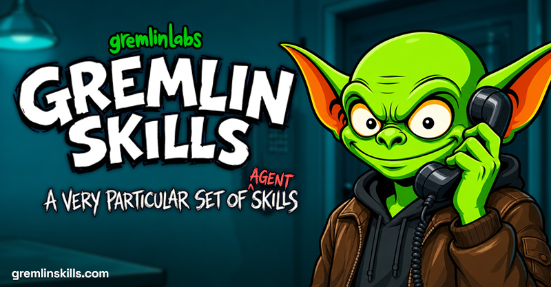

# Gremlin Skills



We don't know who you are. We don't know what you're building. But we do have a very particular set of agent skills—skills for planning, designing, testing, and shipping great apps and websites. Put them to work, and you may become a nightmare for your competitors.

Gremlin Skills is an evidence-heavy collection of agent workflows for software planning, audits, product and design direction, growth systems, and verified execution. Each skill is built to produce durable evidence, respect explicit authority, and carry ambitious work all the way through Plan→Do→Verify.

With thanks to Matt Pocock and the other people and projects listed in our [acknowledgements](ACKNOWLEDGEMENTS.md).

## Install

Install from the public Git repository with the standard Skills CLI:

```bash
npx skills add gremlin-labs/gremlin-skills
```

The installer presents the available skills and projects the selected skills into the host's flat skill directory as `{install-root}/{skill-name}/`. Repository categories never become part of an installed or invoked skill name. To opt out of the installer's anonymous telemetry, set `DISABLE_TELEMETRY=1` as documented by Skills CLI.

For maintainers working from a checkout, the repository is the source of truth. Preview a managed repository-to-host synchronization without writing anything:

```bash
python3 scripts/sync_installed_skills.py --target "$HOME/.agents/skills" --dry-run
```

Applying requires an explicit skill selection or `--all`, plus `--apply`. The synchronizer refuses foreign paths and locally modified owned skills, writes an ownership manifest, updates atomically per skill, retains backups, and supports journaled rollback. Global installation remains an external action: inspect the dry run and obtain the required authority before applying it.

Build independently installable archives with deterministic metadata:

```bash
python3 scripts/package_skills.py planpro goalpro
```

Manual copying is a limited fallback for one exact skill directory. Never copy `skills/*`: that glob includes package metadata, bypasses dependency closure, and cannot distinguish Gremlin-owned paths from foreign skills.

Invocation policy is independent from authority. Auto-discoverable skills can also be named explicitly. Explicit-invocation-only skills remain available through `$skill-name` or the host's equivalent command, but the model does not select them on its own. See the [invocation architecture](docs/architecture/invocation.md).

## Catalog

| Skill | Description |
|---|---|
| [audit-compare](docs/skills/audit-compare.md) | Audit a reference project's codebase against an existing project to propose optimizations — unique code patterns, efficiencies, memory management, smart strategies, and more. |
| [audit-plan](docs/skills/audit-plan.md) | Audit one or more reference projects and create a proposal for a new project implementation — rewrites, ports, or combinations of features from multiple projects into one new codebase. |
| [brainstormpro](docs/skills/brainstormpro.md) | Audit a codebase through the lens of a user's outcome, propose distinct evidence-grounded ideas with trade-offs and validation experiments, let the user choose, and hand the approved proposal to Planpro or Goalpro. |
| [brandstorm](docs/skills/brandstorm.md) | Audits product evidence, develops user-directed naming territories and 20-name candidate rounds, and browser-researches competitors, trademark and patent signals, app-store collisions, Google results, and Porkbun domain availability before a user chooses a product brand. |
| [compact-history](docs/skills/compact-history.md) | Audits, verifies, summarizes, and archives accumulated agent-work history while preserving unfinished initiatives and extracting actionable follow-up work. |
| [design-direction](docs/skills/design-direction.md) | Defines and documents an evidence-backed visual and interaction direction for a new product, major new surface, or intentional redesign before implementation. |
| [design-review](docs/skills/design-review.md) | Reviews a bounded UI or motion change—such as a diff, pull request, route, component, or completed implementation slice—against approved design intent, semantic tokens, component recipes, accessibility, responsive behavior, and perceptual motion quality, then returns an evidence-backed verdict. |
| [designpro](docs/skills/designpro.md) | Audits a web application's visual craft, design-system consistency, accessibility, token architecture, component usage, themes, and automated enforcement, then produces a detailed Goalpro-ready remediation plan. |
| [documentation-audit](docs/skills/documentation-audit.md) | Deeply audits project documentation, verifies it against implementation and history, classifies drift and implementation state, and produces a Goalpro-ready cleanup and restructuring plan. |
| [email-lifecycle-audit](docs/skills/email-lifecycle-audit.md) | Audits an implemented post-signup lifecycle email system against product outcomes, campaign logic, data integrity, consent, deliverability, accessibility, copy, operations, and incremental measurement, then produces a prioritized report and canonical input for Email Lifecycle Strategy. |
| [email-lifecycle-strategy](docs/skills/email-lifecycle-strategy.md) | Defines and documents an evidence-backed post-signup lifecycle email strategy that advances activation, repeated value, adoption, retention, and respectful re-engagement while protecting consent, deliverability, accessibility, and inbox trust before implementation. |
| [feature-clone](docs/skills/feature-clone.md) | Extract a feature from an existing app into transposable documentation — a stack-agnostic spec plus reference-implementation notes — that lets another agent implement the same feature in a different project. |
| [feature-goal](docs/skills/feature-goal.md) | Drive implementation of a feature from a Feature Clone stage using a Plan→Do→Verify loop with Jira-style acceptance criteria, looping until every criterion is met. |
| [gamepro](docs/skills/gamepro.md) | Builds or resumes a game through visible playable milestones, from First Playable to MVP, V1, and an optional Release Candidate, using a persistent Plan→Do→Verify loop. |
| [goalpro](docs/skills/goalpro.md) | Relentlessly drive toward a goal from a plan or instruction set through a Plan→Do→Verify loop with Jira-style acceptance criteria, looping until every criterion is met. |
| [landing-page](docs/skills/landing-page.md) | Designs conversion-focused landing pages and optionally implements an approved preview through product-truth discovery, messaging approval, adaptive HTML previews, humanized copy, SEO, purposeful TurbulenceJS motion, and integrated verification. |
| [migratepro](docs/skills/migratepro.md) | Rewrite an existing codebase in a new stack one module at a time, keeping the app shippable throughout. |
| [motion-audit](docs/skills/motion-audit.md) | Audits an existing application's motion and interaction system for purpose, frequency, response, spatial continuity, interruption, gesture physics, performance, accessibility, cohesion, tokens, missed opportunities, and TurbulenceJS migration, then produces an evidence-backed remediation handoff. |
| [motion-direction](docs/skills/motion-direction.md) | Art-directs a TurbulenceJS-first motion language for an application, compares two or three coherent animation directions in an interactive synthetic Motion Direction Studio, and turns the approved direction into an enforceable policy for current and future pages, components, and states. |
| [onboarding-audit](docs/skills/onboarding-audit.md) | Audits an existing web or mobile onboarding experience against product evidence, activation goals, platform-specific UX, accessibility, trust, copy, measurement, and user-success principles, then produces a prioritized report and canonical input for Onboarding Direction. |
| [onboarding-direction](docs/skills/onboarding-direction.md) | Defines and documents an evidence-backed onboarding direction for web, native mobile, or cross-platform products, optimizing activation, time-to-value, user success, trust, and progressive mastery before implementation. |
| [planpro](docs/skills/planpro.md) | Take a simple feature request, do a deep dive on the existing codebase, and write a detailed phased plan with project-specific implementation notes. |
| [prose-humanizer](docs/skills/prose-humanizer.md) | Rewrites user-facing prose to sound natural, specific, and human while preserving facts, meaning, voice, markup, and code behavior. |
| [releasepro](docs/skills/releasepro.md) | Prepare a release by classifying changes, selecting a repository-compatible version, verifying the exact release state, updating release artifacts, committing, tagging, and optionally pushing exact refs. |
| [restructure](docs/skills/restructure.md) | Reorganize a project's filesystem to be coherent and logical — aligning naming, locations, and module boundaries to detected conventions plus language/framework best practices. Includes a minor opportunistic refactor pass (splits, re-homing functions) required by the moves. |
| [seo-content](docs/skills/seo-content.md) | Benchmarks, challenges, briefs, and executes one SEO-targeted editorial page at a time by combining page-specific competitive research, editorial judgment, primary-source truth, approval, implementation, and comparative verification. |
| [seo-foundation](docs/skills/seo-foundation.md) | Builds an evidence-backed SEO foundation by discovering and confirming business and organic competitors, inspecting representative pages, sampling Google and Bing results, combining first-party queries with Google Ads Keyword Planner demand, and assigning keyword clusters to page owners without prescribing page content. |
| [seo-indexing](docs/skills/seo-indexing.md) | Runs a guarded post-publication indexing-assistance loop that discovers new or materially updated canonical pages, verifies live crawl and index readiness, prioritizes an approved batch, requests Google indexing through supported signed-in computer use or an eligible restricted API, and records immutable receipts. |
| [seo-monitor](docs/skills/seo-monitor.md) | Runs a read-only SEO learning loop by collecting compatible GA4, Google Search Console, Bing, crawl/index, content-receipt, and page-ownership evidence; comparing approved baselines and mature windows; protecting winners; and routing measured exceptions without reactive rewrites. |
| [seo-setup](docs/skills/seo-setup.md) | Establishes and verifies the technical, analytics, search-console, and keyword-research prerequisites required by an SEO program through guarded source changes, APIs, or signed-in computer use. |
| [seo-strategy](docs/skills/seo-strategy.md) | Turns verified SEO setup and an approved competitive, keyword-demand, cluster, and page-ownership foundation into a prioritized, non-cannibalizing portfolio plan without prescribing page-level content. |
| [stripe-audit](docs/skills/stripe-audit.md) | Audits Stripe Billing and subscription implementations in Next.js applications and produces a goalpro-ready remediation package. |
| [testpro](docs/skills/testpro.md) | Audits an existing test suite and, only when improvement is explicitly requested or approved, builds missing test infrastructure and closes gaps through a Plan→Do→Verify loop. |
| [theme-library](docs/skills/theme-library.md) | Selects and creatively adapts bundled Gremlin palette families into product-fit theme briefs without requiring a full visual-direction exercise. |
| [turbulencejs-integration](docs/skills/turbulencejs-integration.md) | Selects and integrates TurbulenceJS motion into web and Electron projects, including entrypoints, visual style, intensity, accessibility, lifecycle, and verification. |
| [turbulencejs-presentation](docs/skills/turbulencejs-presentation.md) | Plans, art-directs, builds, and verifies browser-native TurbulenceJS presentations that deliberately support 16:9 and 9:16. |
| [workspacepro](docs/skills/workspacepro.md) | Audits and codifies a master software workspace containing multiple related repositories, shared knowledge, references, utilities, and agent guidance, then produces a detailed Goalpro-ready reorganization plan. |

The [full skill catalog](docs/skills/README.md) adds categories, authority, prerequisites, outputs, visible success, and adjacent workflows.

## Lifecycle and composition

Planning and audit skills investigate first and retain read-only project boundaries. Approved work can hand off with the same slug to Goalpro or another specialist executor. Execution skills use Plan→Do→Verify, project-specific gates, explicit self-judgment, and integrated quality evidence.

Generated work is slug-first and skill-scoped at `agent-work/{slug}/{skill-name}/`, indexed by `agent-work/{slug}/WORK.md`. Compact History alone owns the reserved `agent-work/• compact-history/` namespace. Release preparation never implies push, upload, marketplace mutation, or publication.

See:

- [Package terminology and boundaries](CONTEXT.md)
- [Invocation architecture](docs/architecture/invocation.md)
- [Skill lifecycle](docs/architecture/lifecycle.md)
- [Packaging architecture](docs/architecture/packaging.md)
- [Work-artifact contract](contracts/work-artifacts.md)
- [Incubating skill ideas](docs/incubator.md)

## Validate

Run the deterministic local gate:

```bash
python3 scripts/run_validation.py
```

This runs the root and skill-local test suites, generated-document and contract checks, package build and extraction, evaluation fixtures, coexistence checks, migration preflights, and whitespace validation.

## Contribute

Read [CONTRIBUTING.md](CONTRIBUTING.md) and [AGENTS.md](AGENTS.md) before creating or updating a skill. Register every managed skill exactly once, keep public names and output roots stable, update curated human docs, declare applicable evals and tests, and run the full repository gate. Report vulnerabilities through the private process in [SECURITY.md](SECURITY.md).

The registry-as-package-API decision is recorded in [ADR 0001](docs/adr/0001-registry-as-package-api.md). Third-party license notices are indexed in [THIRD-PARTY-NOTICES.md](THIRD-PARTY-NOTICES.md).
