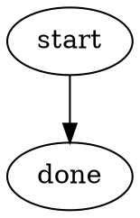

# Sample skill

See [REFERENCE.md](REFERENCE.md).
See [work-artifact contract](contracts/work-artifacts.md).

Write to `agent-work/{slug}/sample-skill/`.

## Optional shared Theme Library

Discover an independently installed Theme Library through the host registry or sibling skill directory.
