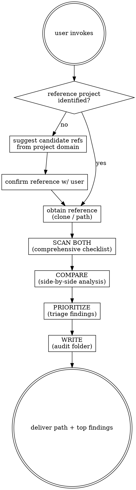

# Audit-compare

Compare a reference project against the existing project (current repo) and produce a prioritized audit of optimizations the existing project could adopt. Read-only — never edits source. Output lives under `agent-work/{slug}/audit-compare/`.

Resolve the owning work root and maintain the slug index using [the canonical work-artifact contract](contracts/work-artifacts.md).

## Decision tree

## Phase 1 — Identify the reference

1. If the user named a reference (local path, git URL, repo spec), use it.
2. Apply [Planpro's product-research lens](contracts/product-research.md) to understand the target project's users, product intent, desired outcome, guardrails, operating constraints, and explicit simplicity/complexity trade-offs before selecting or judging a reference.
3. If no reference was named, inspect the current project's domain and product constraints, then suggest 2-3 candidate reference projects whose strengths are relevant to that outcome. Ask the user to confirm or supply their own.
4. Obtain the reference: read from the supplied local path, or create a fresh operating-system temporary directory (for example with `mktemp -d`) and clone there. Never clone into the user's repository, a persistent shared cache, or a fixed machine-specific path.

## Phase 2 — Scan both (comprehensive)

Run the full audit checklist against BOTH codebases. See [REFERENCE.md](REFERENCE.md) for the authoritative dimension list and what to look for in each. Carry the target product context from [PRODUCT-RESEARCH.md](contracts/product-research.md) into every judgment. Cover every dimension — don't skip because it "looks fine." Track concrete file:line citations for every observation.

## Phase 3 — Compare

For each audit dimension, write a side-by-side:

- **Reference approach:** what the reference does, with file:line.
- **Existing approach:** what the current project does, with file:line.
- **Gap:** what the reference does that the existing project doesn't (or does worse).
- **Adoption fit:** which target user/product outcome it advances, which guardrail it risks, and whether the reference's complexity belongs in this project.
- **Adoption effort:** small (touch a few files), medium (new module/pattern), large (architectural shift).

Only flag gaps where the reference is genuinely stronger **for the target product and operating constraints**. Sophistication alone is not a win. Don't manufacture differences. If the existing project is already as good, simpler for its needs, or better on a dimension, say so and move on.

## Phase 4 — Prioritize

Triage every finding into:

- **High impact / low risk** — adopt now. Safe wins.
- **High impact / high risk** — worth it but needs care. Architectural.
- **Low impact / low risk** — nice-to-have polish.
- **Low impact / high risk** — skip. Not worth the disruption.

Rank within each bucket by estimated impact. Present the top 5-10 in the chat as a prioritized list with one-line rationale each.

## Phase 5 — Write

Slug the audit kebab-case (e.g. `vs-redis-optimizer`). Create `agent-work/{slug}/audit-compare/`:

- `AUDIT.md` — product context, prioritized findings, verified strengths, adoption fit, product outcome, guardrails, and effort tags.
- `COMPARE.md` — the side-by-side analysis from Phase 3, one section per dimension with adoption fit.
- `REFERENCE-ID.md` — reference project identity (URL/path, commit hash, date scanned) so the audit is reproducible.
- `GOALPRO-INPUT.md` (conditional) — selected, user-approved findings prepared under [Goalpro's direct handoff contract](contracts/goalpro-handoff.md).
- `NOTES.md` (optional) — decisions, links, scratch.

Deliver the folder path + top 5 findings in chat. Do NOT implement changes — this is an audit, not an edit. If the user wants implementation, ask which findings to include, surface dependency order, and confirm the selection. Write `GOALPRO-INPUT.md` with evidence links, ordered slices, acceptance criteria, quality applicability, project gates, adoption constraints, and approval provenance; then invoke Goalpro with that file. If the selection is too broad or underspecified to be `READY`, recommend Planpro instead.

## Scope guide

- One reference per invocation. If the user wants to audit against multiple references, run the skill per reference.
- Read-only on the existing project. Never edit, never run migrations, never push.
- If the reference can't be obtained (bad URL, private repo, no access), say so in Phase 1 and ask the user for an alternative.
- If the two projects are in different languages/frameworks, focus on transferable patterns and strategies — not syntax. Note the stack gap in COMPARE.md.

See [REFERENCE.md](REFERENCE.md) for the comprehensive audit checklist.

## Optional shared Theme Library

When the request contains a material named-theme or palette decision, discover the independently installed `theme-library` skill through the host skill registry. If the host has no registry, resolve `theme-library/SKILL.md` as a sibling of this skill directory (the standard relative location is `../theme-library/SKILL.md`). If found, read it and use embedded mode while keeping artifacts in this skill's stage. If it is not installed, continue the primary workflow and disclose the unavailable palette library only when it materially limits the result. Never rely on repository-level AGENTS or README files for discovery.
