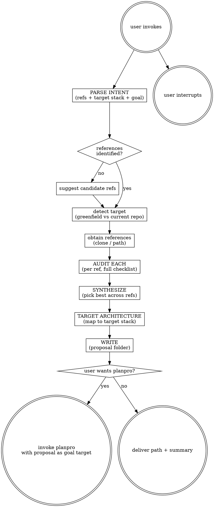

# Audit-plan

Audit one or more reference projects and produce a proposal for a new project implementation. Proposal covers pitch, architecture, and inputs ready for `planpro` to deepen into a phased plan. Output lives under `agent-work/{slug}/audit-plan/`.

Resolve the owning work root and maintain the slug index using [the canonical work-artifact contract](contracts/work-artifacts.md).

## Decision tree

## Phase 1 — Parse intent

1. Identify: **reference project(s)** the user wants to audit, **target stack** for the new project (e.g. Rust, TypeScript), and the **goal** (rewrite for perf, port to new stack, combine features from multiple refs).
2. Apply [Planpro's product-research lens](contracts/product-research.md): identify target users, job-to-be-done, v1 outcome and guardrail, operating environment, quality attributes, delivery model, success/failure signals, and material unknowns before architecture synthesis.
3. If the user didn't name references, suggest 2-3 candidate OSS in the source domain whose strengths fit the target product outcome — same as audit-compare. Confirm with the user.
4. Determine the target: is the current repo empty/trivial → greenfield. Substantial → the new project lives inside it. Record deployment, integration, migration, and operational constraints explicitly.
5. Slug the new project kebab-case (e.g. `rust-port-of-py-optimizer`, `combined-feature-platform`). Create `agent-work/{slug}/audit-plan/`.

## Phase 2 — Audit each reference (separately)

Run the full comprehensive audit checklist (see [audit-compare REFERENCE.md](../audit-compare/REFERENCE.md)) against EACH reference project independently. Track file:line citations. Don't cross-compare yet — each ref gets its own honest audit. Save per-ref findings inside `agent-work/{slug}/audit-plan/refs/{ref-slug}-AUDIT.md`.

If reference is in a different language/stack than the target, note it: audit transferable patterns and strategies, not syntax.

## Phase 3 — Synthesize

For each audit dimension, pick the best approach across all references and resolve conflicts: use Reference A's caching strategy but Reference B's error taxonomy; if two refs conflict on the same dimension, state the trade-off and pick one with rationale tied to the target stack's idioms. Side-by-side synthesis matrix in `SYNTHESIS.md` — one row per dimension, columns per reference + a "Target recommendation" column.

## Phase 4 — Target architecture

Map the synthesized design onto the target stack and product: **Users and v1 outcome**, **Modules/structure**, **Data representations**, **User or operator journey**, **Quality attributes**, **Performance/memory opportunities**, **Security and abuse boundaries**, **Deployment and operating model**, **Observability**, **Rollout/rollback**, **Trade-offs vs source**, and **Scope boundary**. Prefer the simplest architecture that satisfies evidenced product and operating constraints.

## Phase 5 — Write

`agent-work/{slug}/audit-plan/`:

- `PROPOSAL.md` — target users, problem, v1 outcome, guardrail, target stack rationale, scope, journey, quality attributes, architecture sketch, delivery/operating model, trade-offs, validation, and open questions.
- `SYNTHESIS.md` — the dimension matrix from Phase 3.
- `ARCHITECTURE.md` — target-stack architecture from Phase 4.
- `refs/{ref-slug}-AUDIT.md` — one file per reference with the full audit findings.
- `PLANPRO-INPUT.md` — product context and inputs for Planpro: users, outcome, guardrails, v1 scope, acceptance criteria, quality attributes, delivery constraints, architecture decisions, unknowns, and path to this folder.
- `REFERENCE-IDS.md` — every reference's identity (URL/path, commit hash, date scanned) for reproducibility.
- `NOTES.md` (optional) — links, decisions, scratch.

## Phase 6 — Optional handoff

1. Show the user the proposal folder path and a brief summary (refs audited, key synthesis decisions, target stack rationale).
2. Ask: "Want me to turn this into a detailed phased plan with planpro?"
3. If yes → invoke `planpro` with `agent-work/{slug}/audit-plan/PLANPRO-INPUT.md` as the goal target. Planpro writes the same slug's `planpro/` sibling stage with full phased steps grounded in the proposal's architecture decisions.
4. If no → done. Deliver the path and stop.

## Scope guide

- One new project per invocation. If the user wants multiple separate projects, run per project.
- Read-only on the current repo — never edit, never scaffold code, never run migrations. Proposal only.
- If a reference is unreachable (private repo, dead URL), say so in Phase 1 and either ask for an alternative or proceed with the remaining refs and flag the gap.
- If two refs are fundamentally incompatible (e.g. one is event-driven, one is request/response), surface the tension in PROPOSAL.md and let the user pick — don't paper over it.

See [audit-compare REFERENCE.md](../audit-compare/REFERENCE.md) for the comprehensive audit checklist.

## Optional shared Theme Library

When the request contains a material named-theme or palette decision, discover the independently installed `theme-library` skill through the host skill registry. If the host has no registry, resolve `theme-library/SKILL.md` as a sibling of this skill directory (the standard relative location is `../theme-library/SKILL.md`). If found, read it and use embedded mode while keeping artifacts in this skill's stage. If it is not installed, continue the primary workflow and disclose the unavailable palette library only when it materially limits the result. Never rely on repository-level AGENTS or README files for discovery.
