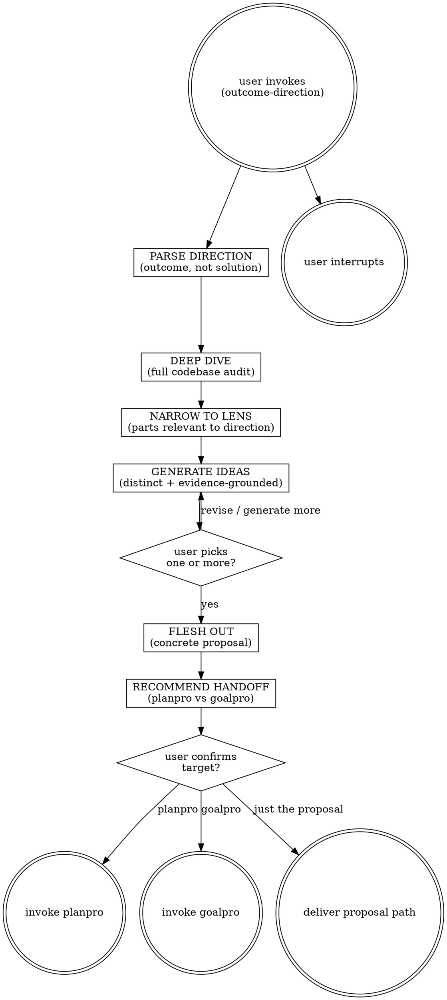

# Brainstormpro

An optimization precursor: the user knows the *outcome* they want but not the *solution*. Agent does a full deep dive on the codebase, narrows to the lens of the user's direction, generates 3-7 distinct ideas with trade-offs, the user picks one, the agent fleshes it out into a concrete proposal, and hands off to `planpro` (complex/multi-phase) or `goalpro` (simple/well-scoped). Output lives under `agent-work/{slug}/brainstormpro/`.

Resolve the owning work root and maintain the slug index using [the canonical work-artifact contract](contracts/work-artifacts.md).

## Decision tree



## Phase 1 — Parse direction

1. Identify the user's **outcome** (what they want to be true after the work), NOT a solution. Example: "reduce sync overhead" is the outcome; "batch the sync API calls" is a solution — don't lock in solutions at this phase.
2. Apply [Planpro's product-research lens](contracts/product-research.md) enough to identify the user/problem, observable success signal, guardrail, and failure signal. Do not invent numeric targets.
3. If a material outcome decision remains, ask **one** clarifying question. Don't ask about solutions.
4. Slug the brainstorm kebab-case (e.g. `reduce-sync-overhead`, `consolidate-redundant-screens`). Create `agent-work/{slug}/brainstormpro/`.

## Phase 2 — Deep dive & narrow

Full Planpro-style deep dive (manifest and toolchain, architecture, conventions, neighbor code, data layer, tests, prior art, gaps and risks — see [Planpro SKILL.md](../planpro/SKILL.md) Phase 2 and [PRODUCT-RESEARCH.md](contracts/product-research.md)). Record product evidence, outcome signals, and technical findings in `agent-work/{slug}/brainstormpro/AUDIT.md`.

Then **narrow to the lens**: tag each finding `IN-LENS` (directly relevant to the outcome), `ADJACENT` (relevant context), or `OUT-OF-SCOPE` (noted, not pursued). The narrowing drives which code the ideas engage with.

## Phase 3 — Generate ideas

Generate only genuinely distinct ideas, not cosmetic variations. One or two strong ideas are better than padding; use up to seven when the solution space supports it. For each include: **one-sentence pitch**, **user/problem evidence**, **mechanism**, **expected outcome and guardrail**, **cheapest useful validation experiment**, **trade-offs and failure modes**, **effort**, **reversibility**, and **codebase engagement** with AUDIT.md citations. Rank by evidence-adjusted user value and feasibility, not novelty alone.

## Phase 4 — Present & pick

Present the ideas in chat as a numbered list (pitch + effort + rank each). Ask: "Which would you like to pursue? Pick one or more, or ask for more ideas." If the user asks for more, generate 2-3 additional distinct ideas. If the user rejects all and wants a different direction, restart at Phase 1 with the refined direction.

## Phase 5 — Flesh out

For each chosen idea, flesh out a concrete proposal in `agent-work/{slug}/brainstormpro/PROPOSAL.md`: **Goal and user outcome**, **Evidence**, **What changes** (high-level, not phased steps), **Why this idea**, **Scope**, **Risks and failure modes**, **Validation experiment**, **Success signal and guardrail**, **Abandonment evidence**, **Success criteria** (verifiable “Done when …” items), and **Open questions**. Show it to the user. Ask: "Does this match your intent? Revise or proceed to handoff?"

## Phase 6 — Recommend & hand off

Recommend a handoff target: **planpro** if scope is large / multi-phase / touches many modules / needs phased gates. **goalpro** only if the approved proposal is a single coherent goal and can satisfy [Goalpro's direct handoff contract](contracts/goalpro-handoff.md) without recreating a detailed plan. State the recommendation with rationale. Ask: "Hand off to planpro, goalpro, or just leave the proposal?" If planpro → invoke `planpro` with `agent-work/{slug}/brainstormpro/PROPOSAL.md` as the request. If goalpro → write an approved `agent-work/{slug}/brainstormpro/GOALPRO-INPUT.md` linking the proposal, validate it as `READY`, then invoke Goalpro with that file. If it cannot be `READY`, route through Planpro. Preserve the same slug.

## Stopping

- **Handed off:** planpro or goalpro invoked with the proposal. Stop.
- **User keeps the proposal:** deliver `agent-work/{slug}/brainstormpro/PROPOSAL.md` path. Stop.
- **User rejects all ideas twice:** the direction may be unclear. Ask the user to restate the outcome and restart Phase 1.
- **User interrupts:** stop, note state in a `PROGRESS.md` if mid-flesh-out.

## Folder layout

```
agent-work/
  {slug}/
    brainstormpro/
      AUDIT.md         # deep dive findings, with IN-LENS / ADJACENT / OUT-OF-SCOPE tags
      IDEAS.md         # all generated ideas with trade-offs (preserved even after picking)
      PROPOSAL.md      # fleshed-out chosen idea, handoff-ready
      GOALPRO-INPUT.md # conditional: only for an approved direct Goalpro handoff
      NOTES.md         # optional
```

IDEAS.md is preserved even after picking — the user may want to revisit rejected ideas later.

## What brainstormpro is NOT

- Not `brainstorming` (superpowers): that designs a specific feature/spec. brainstormpro starts before the solution is known.
- Not `planpro`: that writes a phased plan for a known solution. brainstormpro finds the solution.
- Not `audit-compare`: that audits against a reference project. brainstormpro audits the codebase against the user's outcome-direction.
- Not `improve` (superpowers): that surveys for any improvements. brainstormpro is scoped to a specific outcome the user named.


## Optional shared Theme Library

When the request contains a material named-theme or palette decision, discover the independently installed `theme-library` skill through the host skill registry. If the host has no registry, resolve `theme-library/SKILL.md` as a sibling of this skill directory (the standard relative location is `../theme-library/SKILL.md`). If found, read it and use embedded mode while keeping artifacts in this skill's stage. If it is not installed, continue the primary workflow and disclose the unavailable palette library only when it materially limits the result. Never rely on repository-level AGENTS or README files for discovery.
