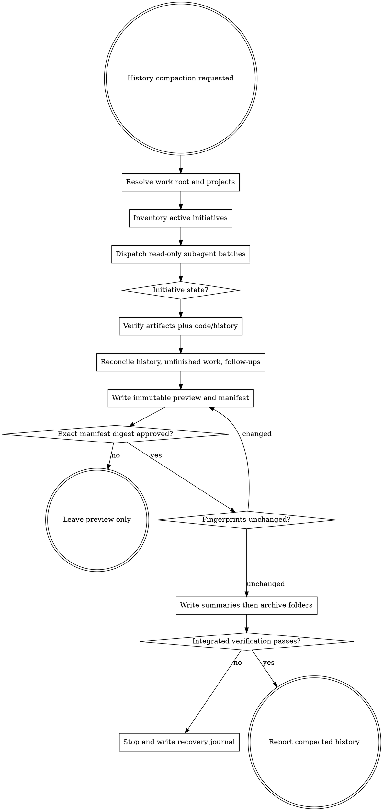

# Compact History

Clean accumulated Gremlin work history without losing evidence, hiding unfinished work, or falsely reporting implementation as complete. Operate only in the resolved `agent-work/` root and through read-only inspection of relevant repositories. Directly create housekeeping artifacts and move verified completed initiatives only after an exact preview is explicitly confirmed. Do not invoke Goalpro.

Read [the canonical work-artifact contract](contracts/work-artifacts.md). Compact History is its sole archival exception and the sole owner of `agent-work/• compact-history/`.

## Decision tree



## Authority and boundaries

Compact History may read initiative artifacts, source, tests, configuration, Git history, manifests, and repository status; write only under `agent-work/• compact-history/`; and move confirmed `VERIFIED_COMPLETE` initiative folders into its archive.

Never modify source, durable documentation, Git state, workspace locks, or active initiative contents. Never implement unfinished work. Never archive from a status label alone, delete evidence, overwrite/merge/suffix collisions, or let subagents write or move files. Any material input change after confirmation invalidates approval.

## Reserved layout

```text
agent-work/
  • compact-history/
    changelog/
      CHANGELOG.md             # single-project root
      {project-key}.md         # multi-project workspace
      workspace.md
    in-progress/
      IN-PROGRESS.md
      {project-key}.md
      workspace.md
    todo/
      follow-up.md
      {project-key}.md
      workspace.md
    archive/
      {project-key}/{slug}/    # multi-project workspace
      {slug}/                  # single-project root
    runs/{run-id}/
      INVENTORY.json
      PREVIEW.md
      MANIFEST.json
      ROLLBACK.json
      RESULT.md                # after apply only
```

Do not create empty project files. Use NFC U+2022 in the reserved folder name and reject normalization/case-fold aliases. Finder grouping order varies by locale; promise grouping, not a specific top/bottom position.

## 1. Resolve scope

Read applicable instructions and workspace manifests. Resolve the owning work root using the shared contract. Record canonical project keys and paths. Use `workspace` for root-owned orchestration, shared docs, manifests, and cross-project policy. Never infer ownership solely from a slug; ambiguity blocks archival.

## 2. Inventory

Run:

```bash
python3 scripts/inventory_history.py --agent-work-root {root}/agent-work --output {run-dir}/INVENTORY.json
```

The inventory excludes the reserved namespace and captures each top-level initiative's tree digest, stages, statuses, evidence files, and timestamps. Treat it as candidate evidence, not classification.

## 3. Investigate with subagents

When more than one independent project or a substantial initiative set exists, dispatch multiple read-only subagents. Partition by canonical project, then bounded cross-project batches. Each returns one dossier per slug: intended terminal stage, claimed/latest state, project attribution, artifact evidence, code/Git/test verification, dated outcomes, deferred candidates, classification, confidence, blockers, and fingerprints.

No subagent writes or moves. The coordinator independently reconciles every dossier, spot-checks every archive candidate, and alone owns preview and execution. Use a separate verifier pass for archive candidates when capacity permits.

## 4. Determine intended terminal state

Do not assume every initiative requires Goalpro. An audit, feature extraction, or approved plan-only request can be terminal. An approved implementation handoff normally expects execution. Superseded, rejected, or abandoned plans are not implemented. Reopened work overrides an earlier completion claim. `MIGRATED` describes layout provenance only.

## 5. Classify every initiative

- `VERIFIED_COMPLETE`: intended execution completed; applicable criteria and final evidence agree; latest state does not reopen it; implementation exists in current code or a reachable revision; ownership and archive links are known.
- `UNFINISHED`: approved/unapproved desired implementation remains, including partial, active, blocked, abandoned-but-still-desired, or unverified execution.
- `TERMINAL_NON_IMPLEMENTATION`: completed audit, rejected proposal, superseded plan, or other deliberately closed non-implementation outcome.
- `AMBIGUOUS`: intent, state, ownership, or evidence conflicts.

Keep every non-`VERIFIED_COMPLETE` folder at the actionable top level. Read [REFERENCE.md](REFERENCE.md) for evidence precedence, reopen rules, timestamps, attribution, and confidence.

## 6. Verify completion conservatively

For each candidate, read its plan/handoff, criteria, full progress, quality report, notes, and later related initiatives. Require two-source evidence where practical: terminal artifact evidence plus code/test/Git evidence. Confirm commits are reachable, inspect current implementation, distinguish scoped success from unrelated workspace failures, and flag dirty/uncommitted evidence. A checked criterion, commit SHA, quality report, or `COMPLETE` label is high signal but never sufficient alone.

## 7. Build compact project history

Append at most ten outcome bullets per completed initiative across affected changelogs. Each bullet includes its own `YYYY-MM-DD` when work spans days, outcome, slug, and stable event ID. Prefer progress timestamps, then verified commit dates, then Git file history; use mtime only as approximate provenance. A cross-project initiative may add distinct bullets to multiple project files and `workspace.md`. Never duplicate an event ID or silently rewrite prior history; append corrections/supersession markers.

## 8. Summarize unfinished work

Maintain current-state entries under `in-progress/` using stable managed-block IDs while preserving user text outside managed blocks. Include slug, state, intended outcome, verified state, remaining criteria, last activity, blockers, projects, next action, and evidence. Leave the initiative at the top level.

## 9. Extract future work

Search plans, out-of-scope sections, progress, quality reports, notes, audits, skipped work, and refactor candidates. Classify findings `ACTIONABLE`, `ACCEPTED_DEBT`, `NEEDS_DECISION`, `REJECTED`, `ALREADY_ADDRESSED`, or `NON_ACTIONABLE`. Create active follow-ups only for the first three. Deduplicate against later initiatives and current code.

Each follow-up is a self-contained planning prompt with desired outcome, current gap, why deferred, evidence, likely locations, constraints, non-goals, risks, unresolved decisions, and “Done for planning when …” checks. Preserve source locators and a stable finding ID.

## 10. Reconcile and preview

Account for every top-level initiative exactly once. Resolve subagent conflicts; downgrade unresolved cases to `AMBIGUOUS`. Preflight inbound and internal links. Archive moves preserve each whole slug subtree byte-for-byte so sibling-stage links remain intact.

Create `runs/{run-id}/`, where `{run-id}` is UTC timestamp plus short inventory digest. Write:

- `PREVIEW.md`: scope, classifications, dated bullets, in-progress changes, follow-up dispositions, exact moves, warnings, blockers, verification, and digest.
- `MANIFEST.json`: schema version, root identity, source/destination tree hashes, file prior hashes, managed item IDs, evidence, exact operations, and confirmation digest.
- `ROLLBACK.json`: inverse moves and exact managed writes.

Validate with `scripts/validate_manifest.py`. Present the preview and require approval naming the exact SHA-256 manifest digest. The run ID is descriptive and never authorizes execution. General approval is insufficient. Exclusions require a regenerated manifest.

## 11. Revalidate and apply

Immediately recompute fingerprints, prior file hashes, Git identities, link state, and destination absence. On drift, invalidate approval and regenerate preview.

Apply in order: create missing housekeeping paths; update managed changelog/in-progress/follow-up blocks; verify IDs and hashes; move initiatives one at a time; journal every operation; write `RESULT.md`; run integrated verification. Use same-filesystem atomic renames. For cross-device moves, copy to temporary, verify bytes, atomically rename, then remove source. Never continue after a failed move or digest.

The bundled `apply_compaction.py` validates the confirmed manifest digest, preflights every declared archive move, and records a recovery journal under the run directory before mutation. It refuses run-ID confirmation and can roll back only unchanged completed moves whose sources remain absent. Summary writes remain coordinator-owned and must match manifest prior/post hashes before moves begin.

## 12. Recover and finish

On partial failure stop, preserve successful operations, record last success and pending work, and provide verified reverse operations. Roll back a folder only when the original is absent and archived digest matches. Never truncate append-only history blindly; remove only exact managed blocks/files whose expected hashes still match, otherwise append a correction.

Done requires: exhaustive disposition; every archive candidate independently verified; exact unchanged preview approved; no overwrite/path escape; summaries idempotent; no more than ten dated bullets per initiative; follow-ups prompt-shaped and deduplicated; unfinished/ambiguous folders still top-level; archived digests and links valid; no source/Git mutation; `RESULT.md` complete; and a rerun proposes no duplicate work.

Report counts by classification and project, changelog events, follow-up dispositions, archive paths, dirty-state warnings, skips, run ID/digest, final gates, and recovery needs.


## Optional shared Theme Library

When the request contains a material named-theme or palette decision, discover the independently installed `theme-library` skill through the host skill registry. If the host has no registry, resolve `theme-library/SKILL.md` as a sibling of this skill directory (the standard relative location is `../theme-library/SKILL.md`). If found, read it and use embedded mode while keeping artifacts in this skill's stage. If it is not installed, continue the primary workflow and disclose the unavailable palette library only when it materially limits the result. Never rely on repository-level AGENTS or README files for discovery.
