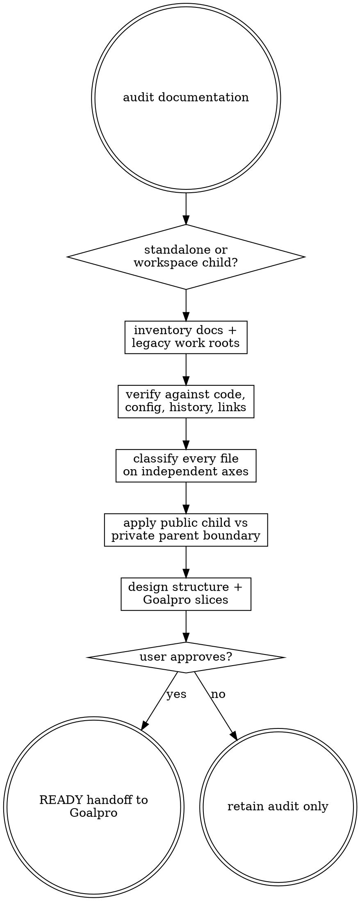

# Documentation Audit

Audit first; never mutate project documentation or source. Write evidence and the approved remediation handoff only to `agent-work/{slug}/documentation-audit/` at the root resolved by [the canonical work-artifact contract](contracts/work-artifacts.md).

## Decision tree



## Scope and safety

- Remain read-only outside the skill stage. Do not move, rewrite, archive, delete, or generate durable project docs.
- Audit Markdown, MDX, text, AsciiDoc, reStructuredText, READMEs, ADRs, runbooks, generated reference docs, plans, tickets, style guides, diagrams, and documentation configuration. Include non-doc artifacts only when they establish truth.
- Treat Git history as evidence, not authority. Current behavior, configuration, tests, schemas, published contracts, and explicit policy outrank old prose.
- Never infer `IMPLEMENTED` from a checked box or merged branch alone. Verify observable implementation and tests.
- Never propose deletion without a retained authoritative replacement, historical value assessment, and link/backlink impact.

## Workflow

### 1. Resolve ownership and policy

Read applicable `AGENTS.md`, README, workspace manifests, contribution/publication rules, ignore files, and [WORK-ARTIFACTS.md](contracts/work-artifacts.md). In a Workspacepro-managed hierarchy, write the audit at the parent root and inspect registered children read-only.

Apply this publication test:

- Child repository: documentation needed to understand, use, build, test, contribute to, secure, operate, or release that repository independently.
- Parent workspace: internal plans, goals, tasks, audits, product research, style guides, cross-project knowledge, private operational context, and all `agent-work/` artifacts.
- A child-required workflow must never depend on inaccessible parent-only documentation.

### 2. Build the inventory

Run `scripts/documentation_inventory.py --root {target-root} --output {stage}/INVENTORY.json`. Review exclusions and add registered child roots when applicable. Inventory every candidate with path, repository owner, format, size, modification evidence, links, headings, and detected generated-work roots.

Create:

- `RESEARCH.md` — repository/workspace topology, doc tooling, authority sources, user audiences, publication constraints, exclusions, unknowns.
- `DOCUMENTATION-CATALOG.md` — one row per file; never summarize a whole folder into one classification.

### 3. Verify each document

For every file, trace its material claims to code, configuration, schemas, tests, CI, package metadata, current APIs, and relevant Git history. Sampled verification is allowed only for mechanically generated homogeneous sets; record the generator and sample rationale.

Read [REFERENCE.md](REFERENCE.md) for the complete taxonomy and evidence rules. Assign independently:

- kind
- freshness
- implementation state
- authority
- structural condition
- recommended action
- confidence and evidence

Unknown is a valid result. Use `UNVERIFIED`; do not guess.

### 4. Detect systemic drift

Analyze duplicates, conflicting authorities, broken links, orphaned docs, missing owners, implicit navigation, mixed public/private material, legacy generated roots, generated files without provenance, plans masquerading as current architecture, and canonical docs whose claims lack executable verification.

Create `DRIFT-REPORT.md` with prioritized findings, blast radius, evidence, and verified strengths.

### 5. Design the target structure

Create `INFORMATION-ARCHITECTURE.md` defining:

- canonical folders and index/navigation rules
- document kind, owner, audience, authority, lifecycle, and review trigger
- parent/child placement matrix
- archive policy and redirects/link rewrites
- generated-reference provenance
- `agent-work/{slug}/{skill-name}/` isolation from durable docs
- legacy-root migration using the repository migration utility when present

Prefer a small stable durable structure such as `docs/architecture/`, `docs/guides/`, `docs/reference/`, `docs/operations/`, `docs/decisions/`, and `docs/archive/`; adapt names to established ecosystem conventions. Do not force empty folders or move conventional root files such as README, LICENSE, SECURITY, CONTRIBUTING, or CODE_OF_CONDUCT.

Create `GOVERNANCE.md` specifying owners, review triggers, freshness metadata only where maintainable, link checking, generated-doc checks, plan closeout, archive rules, CI gates, and agent instructions. Recommend custom tooling only when existing linters/checkers cannot deterministically enforce a material rule.

### 6. Produce the implementation plan

Write `PLAN.md` as reversible, ordered phases. Each phase includes files moved/rewritten/archived, link and navigation changes, public/private boundary checks, verification commands, rollback notes, and independently verifiable “Done when …” criteria.

Write `GOALPRO-INPUT.md` using [Goalpro's handoff contract](contracts/goalpro-handoff.md). Goalpro owns all mutations. Slices should normally cover:

1. establish indexes, authority markers, and tooling without breaking links;
2. promote verified current docs and repair drift;
3. move parent-only material out of children;
4. archive/supersede historical material with redirects where useful;
5. migrate legacy generated roots into canonical `agent-work/`;
6. add governance, AGENTS rules, and CI gates;
7. run integrated link, build, publication-boundary, and open-source-readiness verification.

Classify handoff readiness as `READY`, `NEEDS DELTA CONFIRMATION`, or `BLOCKED`. Preserve the same slug for Goalpro.

## Required output

```text
agent-work/{slug}/
  WORK.md
  documentation-audit/
    RESEARCH.md
    INVENTORY.json
    DOCUMENTATION-CATALOG.md
    DRIFT-REPORT.md
    INFORMATION-ARCHITECTURE.md
    GOVERNANCE.md
    PLAN.md
    GOALPRO-INPUT.md
    NOTES.md                  # optional
```

Validate catalog row structure, enum values, unique paths, and required evidence fields with `scripts/validate_documentation_catalog.py`. That helper does not prove claim truth, destination collision safety, link closure, parent/child publication boundaries, or Goalpro readiness; verify those separately with repository inspection and project-specific gates. The audit is complete only when every in-scope file has exactly one valid row, claims have inspected evidence or `UNVERIFIED`, proposed destinations are collision-free, legacy roots are explicitly handled, required links remain satisfiable, and the handoff meets Goalpro's contract.


## Optional shared Theme Library

When the request contains a material named-theme or palette decision, discover the independently installed `theme-library` skill through the host skill registry. If the host has no registry, resolve `theme-library/SKILL.md` as a sibling of this skill directory (the standard relative location is `../theme-library/SKILL.md`). If found, read it and use embedded mode while keeping artifacts in this skill's stage. If it is not installed, continue the primary workflow and disclose the unavailable palette library only when it materially limits the result. Never rely on repository-level AGENTS or README files for discovery.
