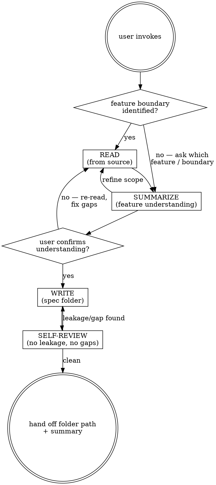

# Feature-clone

Produce a self-contained feature spec folder that captures everything needed to reimplement a feature in a different project, without leaking the source project's incidental details.

Write the spec to `agent-work/{slug}/feature-clone/` after resolving the owning root and slug index through [the canonical work-artifact contract](contracts/work-artifacts.md).

## Decision tree

## Phase 1 — Read

1. Ask the user which feature to clone if not stated; agree on a boundary before reading.
2. Apply [Planpro's product-research lens](contracts/product-research.md) proportionally: identify users, job-to-be-done, current journey, product rules, success and failure signals, quality attributes, and delivery constraints evidenced by the source.
3. Map the feature in source: components/entry points, data shapes, state transitions, external integrations, visible UX states, permissions, error/recovery paths, tests that pin behavior, and essential platform constraints. Use grep/glob/read liberally.
4. Note anything you cannot infer from source — these become interview gaps in Phase 2. Do not convert missing product evidence into a requirement.

## Phase 2 — Summarize & confirm

Write a SHORT feature-understanding summary in the chat (not yet a file):

- **One-sentence purpose** of the feature.
- **Users, problem, and product outcome** with source evidence.
- **Behavior bullet list** — what the user/code can do, what happens on each path.
- **User journey and UX states** — entry, happy path, loading, empty, validation, permission, error, degraded, and recovery states where applicable.
- **Data shapes** — entities, fields, relationships.
- **State transitions** — lifecycle of the feature.
- **Quality attributes and delivery constraints** — security, accessibility, performance, compatibility, observability, migration, or rollback that define the feature.
- **Edge cases & error paths** found in source.
- **Open questions** — things source didn't make clear, asked as a numbered list.

Show it. Ask: "Is this accurate? Anything missing or wrong? Please answer the open questions." Wait for one round of user response. If the response reveals real gaps, re-read source for them before writing.

## Phase 3 — Write

Slug the feature (kebab-case). Create `agent-work/{slug}/feature-clone/` in the repo root:

- `SPEC.md` — the stack-agnostic feature spec (see below).
- `COMPONENTS.md` — structural contract: components/modules and their responsibilities, interfaces, data flow. Stack-agnostic — describe roles, not framework class names.
- `TESTS.md` — acceptance tests as plain-language criteria ("Done when …"), plus key edge cases the ported version must handle.
- `REFERENCE.md` — how the original project implements it, marked clearly as illustrative: stack name, key libraries, notable patterns, gotchas. Separate so a reader can ignore it when porting.
- `NOTES.md` (optional) — decisions, links, scratch.

### SPEC.md contents

- **Feature:** one-paragraph purpose.
- **Users and product outcome:** job-to-be-done, intended result, and guardrails.
- **Acceptance criteria:** checklist, each "Done when …".
- **Behavior:** numbered user/programmatic flows.
- **Journey and states:** observable success, loading, empty, validation, permission, error, degraded, and recovery behavior that applies.
- **Data shapes:** entities/fields/relationships (stack-agnostic — say "ordered list" not "array", "record" not "object").
- **State transitions:** lifecycle diagram or table.
- **Quality attributes:** applicable accessibility, security/privacy, abuse, performance, reliability, auditability, compatibility, and operability requirements.
- **Essential platform constraints:** protocol or runtime behavior intrinsic to the feature, separated from incidental source implementation.
- **Edge cases & errors:** enumerated.
- **Out of scope:** explicit non-goals.

## Stack-agnosticism rules

- Exclude framework names, library names, and language-specific constructs from `SPEC.md` / `COMPONENTS.md` / `TESTS.md` when they are incidental implementation choices.
- Say "ordered list" not "array", "async task" not "Promise", "UI region" not "Component", "field" not "column".
- Preserve an essential platform, protocol, browser, device, accessibility, or external-system constraint when removing it would change the feature. Describe the behavior neutrally; explain source-specific mechanics in `REFERENCE.md`.
- The original stack lives ONLY in `REFERENCE.md`, framed as "the reference implementation does X" — never as "the feature requires X".

## Phase 4 — Self-review

Re-read every file in `agent-work/{slug}/feature-clone/` with fresh eyes:

1. **Leakage scan**: did any project-specific name, idiom, or framework leak into SPEC/COMPONENTS/TESTS? Move it to REFERENCE or generalize it.
2. **Completeness**: can another agent reimplement the feature from these files alone, without reading the source project? If not, fill the gaps.
3. **Acceptance criteria**: each criterion independently verifiable? If vague, sharpen it.
4. **Product fidelity**: do users, journey states, product rules, quality attributes, and essential platform constraints remain intact without leaking incidental code?
5. **Open questions resolved**: nothing material left unanswered from Phase 2; otherwise record it explicitly instead of guessing.

Fix inline. Then deliver: report the folder path, summarize what was captured, surface anything still ambiguous.

## Scope guide

- One feature per invocation. If the user wants more, run the skill per feature.
- A feature is "clonable" if it has a coherent boundary. If the feature is tangled with the host app, say so in Phase 2 and propose a smaller boundary before writing.
- Don't refactor the source project. Don't fix its bugs. You're documenting, not editing.

## Optional shared Theme Library

When the request contains a material named-theme or palette decision, discover the independently installed `theme-library` skill through the host skill registry. If the host has no registry, resolve `theme-library/SKILL.md` as a sibling of this skill directory (the standard relative location is `../theme-library/SKILL.md`). If found, read it and use embedded mode while keeping artifacts in this skill's stage. If it is not installed, continue the primary workflow and disclose the unavailable palette library only when it materially limits the result. Never rely on repository-level AGENTS or README files for discovery.
