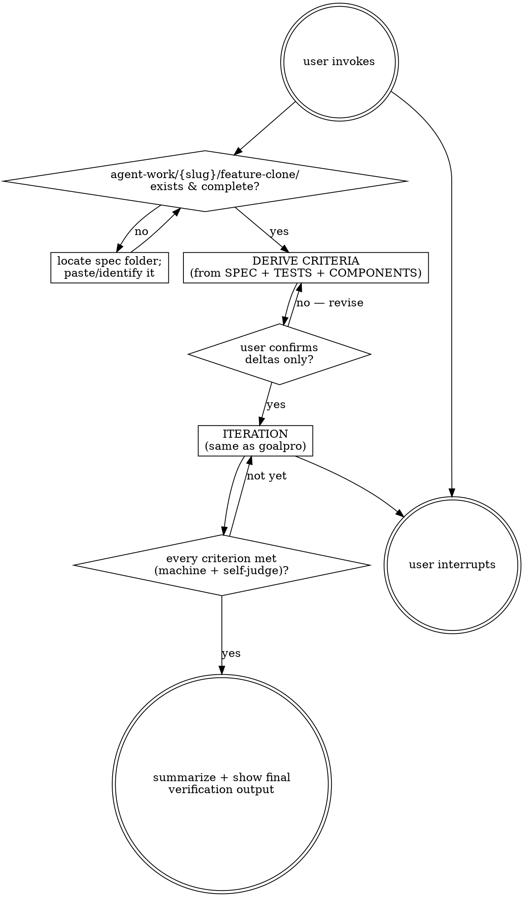

# Feature-goal

Same relentless Plan→Do→Verify loop as `goalpro`, but the goal target is the output of the `feature-clone` skill: an `agent-work/{slug}/feature-clone/` folder containing stack-agnostic spec, component contract, and acceptance tests. The agent implements that spec in the current/target project and records execution in the `feature-goal/` sibling stage.

Resolve the owning work root and maintain the slug index using [the canonical work-artifact contract](contracts/work-artifacts.md).

## Decision tree



## Phase 1 — Locate & validate the spec

1. If not given, ask the user which Feature Clone stage to implement. If they do not know, search canonical `agent-work/*/feature-clone/SPEC.md` paths, then inspect legacy locations only for compatibility.
2. Read `SPEC.md`, `COMPONENTS.md`, `TESTS.md`, and (for porting guidance) `REFERENCE.md`. Confirm the spec is complete enough to implement from. If it is missing key sections, ask the user to re-run feature-clone or fill gaps before proceeding.

## Phase 2 — Derive criteria (with delta confirmation)

1. Preserve the exact spec slug: `agent-work/{slug}/feature-goal/`. If that stage already exists, inspect its sources and progress. Resume or reconcile when it implements the same Feature Clone stage; stop on a conflicting goal. Never suffix the shared slug or overwrite existing state.
2. Determine target stack by inspecting the repo (manifest files). This is the project the feature will be implemented IN — distinct from `REFERENCE.md`'s source-project notes.
3. Read feature-clone's `TESTS.md` — its "Done when ..." items are the **functional acceptance criteria**, already user-confirmed during feature-clone.
4. Derive the **implementation criteria** (the deltas): code structure mirrors `COMPONENTS.md`'s role/responsibility split; spec's data shapes are represented in target-stack idioms; spec's state transitions are implemented and reachable; spec's edge cases & error paths each have a test; target-appropriate suite green (per [goalpro REFERENCE.md](../goalpro/REFERENCE.md)); `REFERENCE.md`'s gotchas are not violated.
5. Classify the dimensions in [goalpro QUALITY.md](contracts/execution-quality.md). Presume product intent, user journey, spec fidelity, error behavior, target-stack maintainability, and accessibility for user interfaces are applicable until evidence shows otherwise.
6. Show the user: the functional criteria (from feature-clone's TESTS.md, already confirmed) AND the implementation deltas (only these are new — "Here's what I'd additionally need to verify. OK?"). User confirms the **deltas**. Write both and the quality applicability to `agent-work/{slug}/feature-goal/CRITERIA.md`. If the user revises deltas, fold in and re-confirm.

## Phase 3 — The loop (same as goalpro)

Each iteration = Plan → Do → Verify → Self-judge → Log → Repeat. See the [goalpro SKILL.md](../goalpro/SKILL.md) for the authoritative text. Key invariants:

- **Plan:** Re-read `CRITERIA.md`, `PROGRESS.md`, and (frequently) the spec folder — re-read SPEC/COMPONENTS/TESTS each iteration so the port stays faithful. The spec is the source of truth, not your memory of it.
- **Do:** Implement in the target stack, idiomatic to it. `REFERENCE.md` shows how the source project does it — translate, don't copy.
- **Verify:** Run target-project gates (tests/typecheck/lint/build per [goalpro REFERENCE.md](../goalpro/REFERENCE.md)) and the applicable per-step review in [goalpro QUALITY.md](contracts/execution-quality.md).
- **Self-judge:** State "I am satisfied step X is complete because …". Add: "and because it matches spec section Y" when a criterion maps to a SPEC.md/TESTS.md line.
- **Log:** Append to `agent-work/{slug}/feature-goal/PROGRESS.md` in goalpro's format. Add a column/citation when a verification step maps back to a spec line (e.g. "DONE step 3 (SPEC.md §2.3, TESTS.md #4) — satisfied: …").

## Stopping

- **Goal met:** every functional **and** implementation criterion is machine-verified (where a gate exists) **and** self-judged satisfied. Complete Goalpro's final integrated review and `QUALITY-REPORT.md`, then mark the goal complete in `PROGRESS.md`. Stop.
- **User interrupts:** stop, note last state in `PROGRESS.md`.
- A failing gate = not met, keep looping.

## If the spec is wrong mid-implementation

If the loop reveals the feature-clone spec is itself wrong, **don't silently rewrite the spec or work around it**. Stop, say so explicitly, and either:
- Ask the user: fix the spec (re-run feature-clone for the gap) then resume, or
- Classify the deviation as `BLOCKED` in `PROGRESS.md` with what's wrong, and ask the user how to proceed.

Never paper over a spec defect by "implementing what was probably meant."

## Three-attempts rule (same as goalpro)

Same gate fails 3 substantive fixes in a row → state hypothesis in `PROGRESS.md`, classify blocker-vs-local, then BLOCK+ask the user OR skip to the next unmet criterion and keep looping. The loop does not stop on local failures.

## Goal folder layout

```
agent-work/
  {slug}/
    feature-goal/
      CRITERIA.md      # functional (from feature-clone TESTS.md) + implementation deltas
      PROGRESS.md      # append-only iteration log
      QUALITY-REPORT.md # quality matrix + final integrated verification
      NOTES.md         # optional
      spec-link.md     # pointer to agent-work/{slug}/feature-clone/ it implements
```

`spec-link.md` is a one-line pointer: `Implements: agent-work/{slug}/feature-clone/`. Keeps tracking self-contained even if the spec folder moves later.

See the [goalpro SKILL.md](../goalpro/SKILL.md), [goalpro REFERENCE.md](../goalpro/REFERENCE.md), and [goalpro QUALITY.md](contracts/execution-quality.md) for the authoritative loop, verification toolbox, and execution-quality contract — this skill does not duplicate them, it inherits them.


## Optional shared Theme Library

When the request contains a material named-theme or palette decision, discover the independently installed `theme-library` skill through the host skill registry. If the host has no registry, resolve `theme-library/SKILL.md` as a sibling of this skill directory (the standard relative location is `../theme-library/SKILL.md`). If found, read it and use embedded mode while keeping artifacts in this skill's stage. If it is not installed, continue the primary workflow and disclose the unavailable palette library only when it materially limits the result. Never rely on repository-level AGENTS or README files for discovery.
