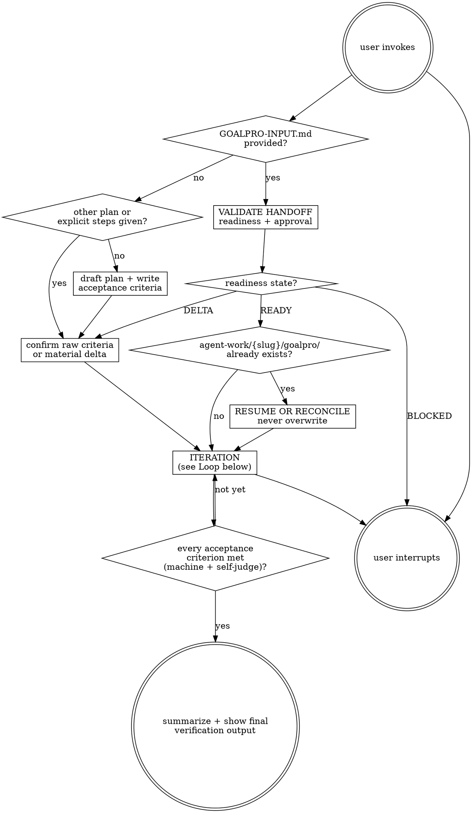

# Goalpro

Drive a goal to completion through a self-correcting loop with explicit acceptance criteria — like a one-agent agile process. Works from either a plan file or a goal statement. Tracks all work under `agent-work/{slug}/goalpro/` in the repo.

Resolve the owning work root, same-slug upstream stages, and shared index using [the canonical work-artifact contract](contracts/work-artifacts.md).

## Decision tree



## Before the loop — handoff and acceptance criteria

Set up or reconcile the goal folder and write the criteria **before** doing any work.

1. **Inspect the input.** If `GOALPRO-INPUT.md` is supplied, validate it against [HANDOFF.md](contracts/goalpro-handoff.md) and classify it `READY`, `NEEDS DELTA CONFIRMATION`, or `BLOCKED`. Otherwise treat the request as a raw goal or unapproved plan.
   When approved criteria include a named or derived theme, consult the independently discovered `theme-library` skill as embedded evidence. Preserve the approved interpretation mode and anchors while implementing product-specific semantic ramps; do not silently switch to exact fidelity or literal catalog role copying.
2. **Slug the goal.** Preserve the handoff's kebab-case slug. For a raw goal, derive a human-readable slug such as `add-rate-limit-retries`.
3. **Reconcile existing state.** If `agent-work/{slug}/goalpro/` exists, read its criteria, sources, and progress. Resume when it is the same goal; reconcile source changes as a visible delta; stop on a conflicting goal. Never overwrite or silently suffix the slug.
4. **Create `agent-work/{slug}/goalpro/CRITERIA.md`** with:
   - **Goal:** one-paragraph statement of what done looks like.
   - **Sources and approval:** handoff/source paths, approval status, and any post-approval delta.
   - **Acceptance criteria:** a checklist. Each item must be independently verifiable — by a test, a command exit code, a file existing, or a concrete observable. Phrase each as "Done when …".
   - **Out of scope:** explicit non-goals.
   - **Quality applicability:** classify every dimension in [QUALITY.md](contracts/execution-quality.md) as `APPLICABLE`, `NOT APPLICABLE`, or `UNKNOWN`, with the evidence expected for applicable dimensions.
   - Optionally a **Plan** section with ordered steps, or a path to an external plan file the user supplied.
5. **Apply the right confirmation gate.** A `READY`, explicitly approved handoff begins without re-approving unchanged criteria. For `NEEDS DELTA CONFIRMATION`, show only the material delta and ask one focused question. For `BLOCKED`, stop before mutation. For a raw goal or unapproved plan, show the full criteria and require explicit approval.

Never infer approval merely because an upstream skill completed. If a written source is stale or contradictory, expose the delta rather than barreling through.

## The loop (each iteration)

1. **Plan** — Re-read `CRITERIA.md` and `PROGRESS.md`. Pick the next unfinished step or the next unmet criterion. If the plan is stale, revise it before proceeding.
2. **Do** — Implement the step. Own the toolchain: write tests for the behavior, make the change, keep the diff scoped to the step.
3. **Verify** — Run project-appropriate checks (see REFERENCE.md) and the applicable per-step review in [QUALITY.md](contracts/execution-quality.md). Must include: the new tests pass, plus the project-wide gate (typecheck/lint/build). For compiled code: compile and run the binary. Do logical sanity checks: re-read your diff, confirm it actually achieves the step's intent, confirm no regressions in neighbors. Never advance on a failing gate.
4. **Self-judge** — In addition to machine gates, state explicitly: "I am satisfied that this step is completed because …". Cite the criterion and materially exercised quality dimensions. Both must hold: gates green **and** self-judgment satisfied. If gates pass but you're not satisfied, the step isn't done — say what's missing and keep working it.
5. **Log** — Append to `agent-work/{slug}/goalpro/PROGRESS.md`:
   ```
   - [2026-06-22 14:03] DONE   step 3: rate-limit retries (tests pass, tsc clean, oxlint clean, fallow clean) — satisfied: retries trip on 429 per spec
   - [2026-06-22 14:18] WIP    step 4: schema migration drafted; need to verify column order
   - [2026-06-22 14:31] BLOCKED step 5: need decision on backpressure policy — asked user
   ```
   Statuses: `DONE`, `WIP`, `BLOCKED`, `SKIP`. WIP/BLOCKED state the path forward.
6. **Repeat** — back to Plan. Continue until **every** acceptance criterion is met (machine gate green where one exists, **and** you are satisfied).

## Stopping

- **Goal met**: every acceptance criterion passes its machine gate where one exists, **and** you are satisfied each is met. Run the final integrated review in [QUALITY.md](contracts/execution-quality.md), write `QUALITY-REPORT.md`, and reconcile every dimension to `VERIFIED`, `NOT APPLICABLE`, or explicitly approved `WAIVED`. Summarize what was done, show the final verify output, mark the goal complete in `PROGRESS.md`. Stop.
- **User interrupts**: stop immediately, note where you left off in `PROGRESS.md`.
- A failing gate counts as "not met" — keep it in the loop, not a stop.

## If blocked

Prefer to unblock yourself: read verify output, check docs, fix root cause. Only stop and ask the user when: a missing decision only the user can make, an external dependency you cannot install, or a contradiction in the goal itself. Log `BLOCKED` with the specific question, then stop and ask.

## Three-attempts rule (does NOT stop the loop)

If the same verify gate fails on three consecutive iterations after substantive fixes:
1. Re-read the failing output in full.
2. State your current hypothesis out loud in `PROGRESS.md`.
3. **Decide**: is this failure a **blocker to remaining steps**, or just **this step's** problem?
   - If it blocks downstream criteria → `BLOCKED`, ask user, stop.
   - If it only blocks this step → mark the step `WIP` with a note, **move to the next unfinished criterion**, keep looping.

Don't retry/revert blindly, and don't let one stuck step stall the whole goal when other criteria can still advance.

## Goal folder layout

```
agent-work/
  {goal-slug}/
    goalpro/
      CRITERIA.md      # goal, acceptance criteria, out-of-scope, plan
      PROGRESS.md      # append-only iteration log (timestamped, status-coded)
      QUALITY-REPORT.md # quality matrix + final integrated verification
      NOTES.md         # optional: decisions, external links, scratch
      plan.md          # optional: if you imported a user-supplied plan
```

Never put Goalpro tracking files anywhere except the resolved `agent-work/{slug}/goalpro/` stage.

See [HANDOFF.md](contracts/goalpro-handoff.md) for direct inputs, [REFERENCE.md](REFERENCE.md) for the verification toolbox, and [QUALITY.md](contracts/execution-quality.md) for the authoritative execution-quality contract.


## Optional shared Theme Library

When the request contains a material named-theme or palette decision, discover the independently installed `theme-library` skill through the host skill registry. If the host has no registry, resolve `theme-library/SKILL.md` as a sibling of this skill directory (the standard relative location is `../theme-library/SKILL.md`). If found, read it and use embedded mode while keeping artifacts in this skill's stage. If it is not installed, continue the primary workflow and disclose the unavailable palette library only when it materially limits the result. Never rely on repository-level AGENTS or README files for discovery.
