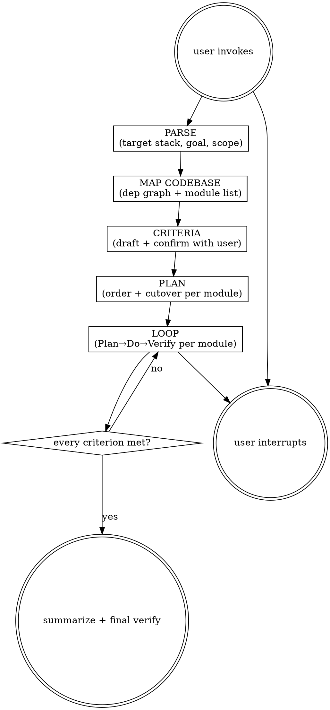

# Migratepro

Incrementally rewrite an existing codebase in a new target stack. Agent decides migration order per dependency graph and picks the cheapest per-module cutover that keeps the app shippable. All-in-one: plans the migration, then executes it through a Plan→Do→Verify loop until the user's acceptance criteria are met. Output lives under `agent-work/{slug}/migratepro/`.

Resolve the owning work root and maintain the slug index using [the canonical work-artifact contract](contracts/work-artifacts.md).

## Decision tree



## Phase 1 — Parse & map

1. Identify **source stack** (detect from codebase), **target stack** (from user), and **goal** (full rewrite, partial split-stack, or perf-driven).
2. Slug the migration kebab-case. Create `agent-work/{slug}/migratepro/`.
3. Map the codebase as a dependency graph: list all modules with public interfaces and callers; find leaf modules (no internal callers break) and root entry points; note each module's dependencies, test coverage, and risk. Record in `agent-work/{slug}/migratepro/MAP.md`.

## Phase 2 — Criteria & confirm

Draft acceptance criteria with the user. Ask the user to define "done" — common criteria include behavior parity (old tests ported and passing), old code fully deleted, perf/memory targets met (if perf-driven), all callers migrated, and target-stack suite green. Do not impose criteria — let the user pick. Classify [Goalpro's quality dimensions](contracts/execution-quality.md), presuming behavior parity, data integrity, compatibility, performance, coexistence, rollout, rollback, and observability are applicable until verified otherwise. Confirm before the loop. Write to `agent-work/{slug}/migratepro/CRITERIA.md` with "Done when ..." items and the quality applicability.

## Phase 3 — Plan

Pick migration order from the dependency graph (agent decides per codebase): safe leaves first, compose upward, root entry points last. For each module, pick the cheapest **cutover strategy** that keeps the app shippable:

- **Feature flag**: new impl behind a flag, migrate callers one at a time, delete old when done.
- **Atomic swap**: write new, swap all callers in one commit, delete old. For small isolated modules.
- **Routing/interface layer**: extract an interface, new impl pluggable, switch per module.
- **Strangler-fig**: new module intercepts at boundary, delegates to old until all callers migrated.

Write to `agent-work/{slug}/migratepro/PLAN.md`: one migration step per module with cutover strategy, files touched, verification gate, risks. Create `PROGRESS.md` for the loop.

## The loop (per module)

1. **Plan** — Re-read `CRITERIA.md`, `PROGRESS.md`, `MAP.md`. Pick next module. If the dep graph shifted, re-derive callers before starting.
2. **Do** — Implement in target stack per the cutover strategy. Write tests for the new impl. Keep app shippable — no step breaks it.
3. **Verify** — Run target-stack gates (see [REFERENCE.md](REFERENCE.md)) and the applicable per-step review in [Goalpro's quality contract](contracts/execution-quality.md). New tests pass. App still works (build/run smoke check). Perf-driven: run benchmark, record delta. Re-read diff: behavior reproduced? Any caller still on old impl? Never advance on a failing gate or broken app.
4. **Self-judge** — "I am satisfied this module is migrated because …". Gates green AND self-judgment satisfied.
5. **Log** — Append to `PROGRESS.md`:
   ```
   - [2026-06-22 14:03] DONE  module: auth/session (new tests pass, tsc clean, callers migrated, old deleted) — satisfied: behavior parity, 15% faster
   - [2026-06-22 14:30] WIP   module: api/router (interface extracted, new impl behind flag, 3/8 callers migrated)
   - [2026-06-22 15:10] BLOCKED module: db/queries — needs schema decision; asked user
   ```
6. **Repeat** until every criterion met.

## Stopping

- **Goal met**: every criterion verified AND self-judged satisfied. Complete Goalpro's final integrated review and `QUALITY-REPORT.md`, then mark complete in `PROGRESS.md`. Stop.
- **User interrupts**: stop, note state in `PROGRESS.md`. Resume by re-reading `PROGRESS.md` + `MAP.md`.
- **Module can't migrate cleanly** (missing language feature, untranslatable pattern): log `BLOCKED` with the gap and what you tried. Ask the user to adjust behavior, find an equivalent, or descope. Don't silently drop functionality.
- **Three-attempts rule**: same gate fails 3 substantive fixes in a row → write hypothesis to `PROGRESS.md`, classify blocker-vs-local, then BLOCK+ask or skip to next migratable module and keep looping.

## Folder layout

```
agent-work/
  {slug}/
    migratepro/
      MAP.md           # dependency graph + module list
      CRITERIA.md      # user-defined acceptance criteria
      PLAN.md          # ordered migration steps with cutover strategy
      PROGRESS.md      # append-only iteration log
      QUALITY-REPORT.md # quality matrix + final integrated verification
      NOTES.md         # optional: decisions, gotchas, benchmark records
```

See [REFERENCE.md](REFERENCE.md) for the verification toolbox by stack and migration-specific gotchas.


## Optional shared Theme Library

When the request contains a material named-theme or palette decision, discover the independently installed `theme-library` skill through the host skill registry. If the host has no registry, resolve `theme-library/SKILL.md` as a sibling of this skill directory (the standard relative location is `../theme-library/SKILL.md`). If found, read it and use embedded mode while keeping artifacts in this skill's stage. If it is not installed, continue the primary workflow and disclose the unavailable palette library only when it materially limits the result. Never rely on repository-level AGENTS or README files for discovery.
