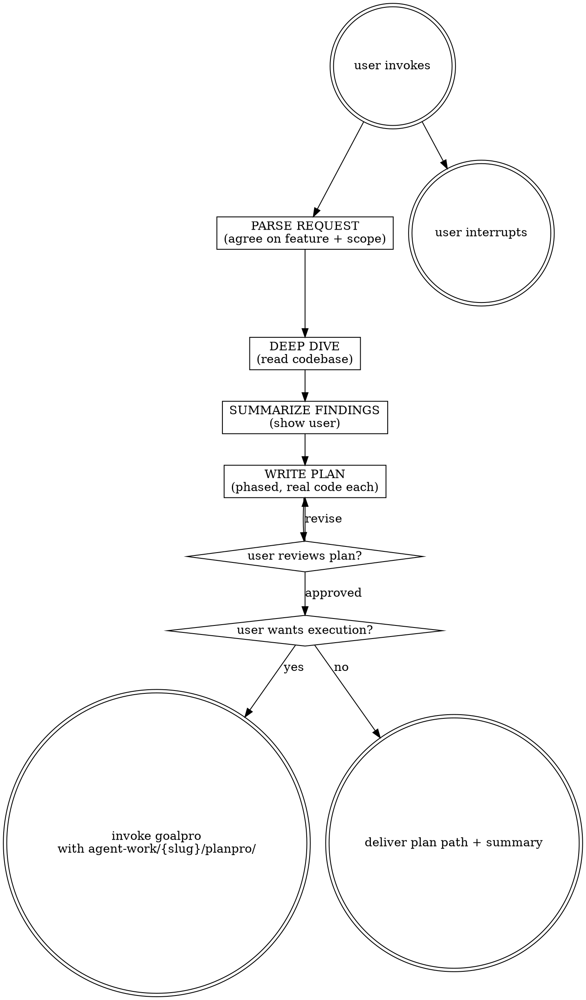

# Planpro

Turn a one-line request into a detailed, phased implementation plan grounded in the actual codebase. Output lives under `agent-work/{slug}/planpro/`. After writing, optionally hand off to `goalpro` for execution.

Resolve the owning work root, same-slug upstream stages, and shared index using [the canonical work-artifact contract](contracts/work-artifacts.md).

## Decision tree

## Phase 1 — Parse request

1. If the request is ambiguous, ask **one** clarifying question about scope (not details). Example: "By 'add auth' do you mean login+signup+session, or just the gated-route check?"
2. Slug the feature kebab-case, e.g. `add-rate-limit-retries`. Create `agent-work/{slug}/planpro/`.
3. State back the request in one sentence and the agreed scope. Then move on — no further questions until the plan is written.

## Phase 2 — Deep dive

Read the codebase systematically. Cover ALL where present: **Manifest & toolchain** (`package.json`/`Cargo.toml`/`go.mod`/`pyproject.toml` — scripts, deps, version), **Architecture** (directory layout, entry points, routing, module boundaries), **Conventions** (naming, error handling, logging, test framework/style), **Neighbor code** (files the feature will touch or sit next to — read in full), **Data layer** (schemas/migrations, models, stores, how state lives), **Tests** (where they live, structure, coverage of neighbors), **Existing similar features** (prior art the new feature should mirror), **Gaps & risks** (where the new feature will conflict with or stretch patterns). Track every file you read; you'll cite them in the plan.

Apply [PRODUCT-RESEARCH.md](contracts/product-research.md): inspect intent sources, users and problem, current user journey, desired outcome and guardrails, applicable quality attributes, delivery constraints, alternatives, and unknowns. Browse current primary documentation for version-sensitive external behavior. Classify each dimension `RELEVANT`, `NOT APPLICABLE`, or `UNKNOWN`; do not invent product evidence.

If the request names, selects, or asks to add a palette/theme family, consult the independently discovered `theme-library` skill in embedded mode. Carry its palette DNA, interpretation mode, creative derivations, additions, accessibility hypotheses, and fidelity requirements into the plan. Do not escalate to full Design Direction when the visual language is otherwise settled.

**Ask the user mid-dive ONLY if** something is VERY unclear or is a potential concern — security implications, data-loss risk, or an intent question code cannot answer. Otherwise stay silent and flag assumptions in the plan's Open Questions.

## Phase 3 — Summarize findings

Write a **Codebase findings** section to the chat (goes into `RESEARCH.md` in Phase 4). Cover: **Stack** (language, framework(s), toolchain, test runner, linter(s)), **Where the feature fits** (which files/modules it touches and why), **Conventions to follow** (3-6 specific patterns the new code must match), **Product context** (user/problem, current journey, desired outcome and guardrail), **Quality attributes**, **Delivery constraints**, **Alternatives**, and **Risks/unknowns**. State findings, then proceed to write the plan. Resolve discoverable unknowns; ask one focused question only for a material user decision.

## Phase 4 — Write the plan

Write to `agent-work/{slug}/planpro/`: `PLAN.md` (the phased plan), `RESEARCH.md` (Phase 3 findings), `GOALPRO-INPUT.md` (the execution index conforming to [Goalpro's handoff contract](contracts/goalpro-handoff.md)), and `NOTES.md` (optional — open questions, links, scratch).

Write the handoff initially with approval status `NOT APPROVED`. Link rather than duplicate the detailed plan and research. Include ordered slices, final acceptance, quality applicability, project gates, boundaries, delivery requirements, manual actions, and unverified assumptions.

### PLAN.md contents

- **Feature:** one-paragraph restatement of the request and agreed scope.
- **Product outcome:** primary user/operator, observable result, success signal, and guardrail from RESEARCH.md.
- **Slug:** the kebab-case slug.
- **Stack summary:** 2-3 lines citing RESEARCH.md's key facts.
- **Quality attributes and delivery constraints:** applicable requirements, rollout/rollback, observability, compatibility, and concise `NOT APPLICABLE` classifications.
- **Phases:** number chosen based on complexity — aim for under 10, but go higher if the feature genuinely requires it. Not a rigid cap. Each phase is real working code (see Phase rules).
- Per phase: **Goal** (one sentence), **Files touched** (concrete paths from RESEARCH.md), **Ordered steps** (numbered, actionable), **Verification gate** (runnable command — tests/build/typecheck per RESEARCH.md), **Project-specific notes** (conventions/patterns to follow, with file:line references), **Risks** (phase-specific gotchas with file:line if any).
- Per phase: **Product outcome advanced** and the applicable quality/delivery evidence. UI work covers loading, empty, validation, error, degraded, recovery, responsive, and accessibility states that can occur. Backend/data work covers failure, concurrency, migration, compatibility, rollback, and observability where relevant.
- **Open questions:** assumptions you made during the dive. For each: "Assumed X because Y; user confirm or revise."
- **Final acceptance:** what the complete feature looks like when all phases pass — user-observable behavior, guardrails, integrated verification, delivery evidence, and mapping to [Goalpro's quality contract](contracts/execution-quality.md).

### Phase rules

- **Real code every phase.** Each phase delivers working functionality — not scaffolding, not placeholders, not stubs. Avoid placeholder work unless the functionality is strictly dependent on a following phase (and if so, call that out explicitly in the phase).
- **Self-contained & shippable.** After every phase the app is in a working state. No phase leaves the app broken.
- Phases build on each other. The first phase delivers the thinnest end-to-end vertical slice that's shippable. Subsequent phases deepen/extend it.

## Phase 5 — Review & optional handoff

1. Show the user the plan folder path and a brief summary (phases count, total steps, user outcome, key risks, delivery constraints) and ask for revisions or approval. Confirm material product decisions; keep discoverable technical details agent-owned.
2. If the user approves the plan, update `GOALPRO-INPUT.md` approval provenance without changing its scope.
3. Ask: "Want me to drive this to completion with Goalpro, or just leave the approved plan?"
4. If yes → invoke `goalpro` with `agent-work/{slug}/planpro/GOALPRO-INPUT.md`. Goalpro preserves the same slug and does not re-confirm unchanged approved criteria.
5. If no → done. Deliver the path and stop.

## Scope guide

- One feature per invocation. If the request spans multiple, decompose and pick the first.
- Plan only — do not write feature code, do not run migrations, do not edit source. The plan is the output.
- If the deep dive reveals the request is too big for one plan, say so in Phase 3 and propose decomposition before writing `PLAN.md`.

## Optional shared Theme Library

When the request contains a material named-theme or palette decision, discover the independently installed `theme-library` skill through the host skill registry. If the host has no registry, resolve `theme-library/SKILL.md` as a sibling of this skill directory (the standard relative location is `../theme-library/SKILL.md`). If found, read it and use embedded mode while keeping artifacts in this skill's stage. If it is not installed, continue the primary workflow and disclose the unavailable palette library only when it materially limits the result. Never rely on repository-level AGENTS or README files for discovery.
