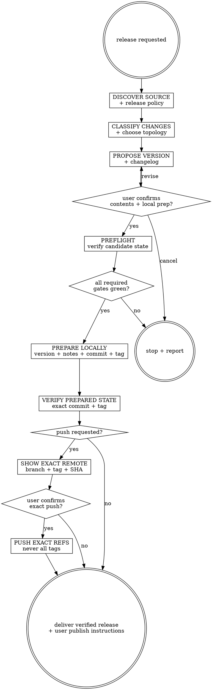

# Releasepro

Prepare and verify a versioned release. Local preparation, remote pushing, and registry or GitHub publication are separate authority gates. Never publish to a registry or create a hosted release.

Write release evidence to `agent-work/release-v{version-slug}/releasepro/` after resolving ownership through [the canonical work-artifact contract](contracts/work-artifacts.md). Derive `{version-slug}` by replacing non-alphanumeric version separators with hyphens while preserving the exact release version inside `RELEASE.md`.

## Decision tree



## Phase 1 — Discover source and policy

1. Require a clean working tree at invocation. Record `HEAD`, branch, upstream, remotes, and existing tag convention.
2. If the user named a goal, read its `CRITERIA.md`, `PROGRESS.md`, and `QUALITY-REPORT.md`. Abort if any criterion or final quality evidence is incomplete.
3. Otherwise, identify the last relevant release tag and inspect commits and diffs since it. If no tag exists, treat this as the first release and say so.
4. Inventory every release unit and detect the repository's release policy, version topology, changelog format, CI, packaging commands, and existing release tooling. Follow [REFERENCE.md](REFERENCE.md); stop if topology or policy is ambiguous.

## Phase 2 — Classify and propose

Classify every user-visible and internal change as breaking, feature, fix, documentation, dependency, or internal. Cite a goal artifact line or commit SHA. Follow the repository's version policy; use generic SemVer only when the repository has no stronger policy. Never choose a lower bump while breaking-change status is uncertain.

Present:

- Source range and exact candidate `HEAD`.
- Release unit or units and independent versus lockstep topology.
- Current → proposed version per release unit.
- Changelog and release-note draft.
- Local mutations that preparation will perform.
- Whether pushing was requested; publication is always excluded.

Ask the user to confirm the contents and local preparation. No mutation before confirmation.

## Phase 3 — Preflight candidate state

Run the complete configured project gate at the exact candidate commit: tests, typecheck, lint, build, package/dry-run, generated-file checks, and relevant smoke tests. Inspect CI status when accessible and label it `UNVERIFIED` rather than implying success when it cannot be checked.

Also verify:

- Working tree is still clean and `HEAD` did not move.
- Target versions and tags do not already exist locally or remotely.
- Branch, upstream, and remote are unambiguous.
- Package contents and registry metadata contain no unintended files or secrets.
- Applicable release dimensions in [Goalpro's quality contract](contracts/execution-quality.md) are satisfied.

Abort on a failing or missing required gate. An earlier Goalpro sign-off does not replace current preflight.

## Phase 4 — Prepare and verify locally

1. Update each release unit using its detected topology and ecosystem-safe mechanism. Update lockfiles and generated version sources that belong to the release.
2. Update `CHANGELOG.md` without rewriting history. Write `agent-work/release-v{version-slug}/releasepro/RELEASE.md` with source range, rationale, changes, preflight evidence, release units, and publication boundary. For independent versions, use a non-ambiguous folder name documented in the file.
3. Re-run manifest, lockfile, package/dry-run, and relevant project gates after mutation.
4. Commit only the intended version and release artifacts using repository convention.
5. Create the repository-compatible annotated or signed tag on the release commit.
6. Verify the tree is clean, the tag is unique, and both the tag and release commit resolve to the exact expected SHA.

If prepared-state verification fails, remove only unpushed local release artifacts created by this run and report. Never rewrite or delete a pushed tag automatically.

## Phase 5 — Optional exact-ref push

If pushing was requested, display the exact remote, branch ref, tag ref, and commit SHA. Ask for explicit confirmation of those refs after local verification.

Push only the intended branch ref and `refs/tags/{tag}` to the chosen remote. Never push all tags, use a force push, or rely on an implicit remote/upstream. Verify the remote refs resolve to the expected SHA.

If one ref succeeds and another fails, report the exact partial state. Do not delete, overwrite, or force-update remote refs; provide safe operator choices.

## Phase 6 — Deliver

Report local and remote state separately, the exact verified commit and tag, release units, gate evidence, and what remains unpublished. Show the user the detected registry or hosted-release command as an operator instruction only. Do not run it.

## Abort conditions

- Dirty tree, moving `HEAD`, ambiguous source range, branch, upstream, remote, release policy, or version topology.
- Incomplete Goalpro criteria or quality report.
- Failing required gate, package dry run, manifest/lockfile validation, or prepared-state verification.
- Existing local or remote target version/tag.
- No changes since the relevant release.
- Any request to silently under-bump a suspected breaking change, force a tag, push unrelated refs, or publish from this skill.

## Folder layout

```text
agent-work/
  release-v{version-slug}/
    releasepro/
      RELEASE.md       # scope, rationale, changes, verification, exact refs, publication boundary
      NOTES.md         # optional decisions and external links
```

See [REFERENCE.md](REFERENCE.md) for release topology, policy detection, preflight, ecosystem versioning, exact-ref push, and partial-failure guidance.


## Optional shared Theme Library

When the request contains a material named-theme or palette decision, discover the independently installed `theme-library` skill through the host skill registry. If the host has no registry, resolve `theme-library/SKILL.md` as a sibling of this skill directory (the standard relative location is `../theme-library/SKILL.md`). If found, read it and use embedded mode while keeping artifacts in this skill's stage. If it is not installed, continue the primary workflow and disclose the unavailable palette library only when it materially limits the result. Never rely on repository-level AGENTS or README files for discovery.
