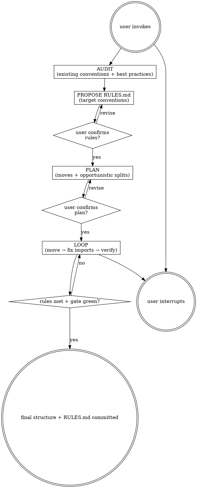

# Restructure

Reorganize a project's filesystem: audit existing conventions, compare against language/framework best practices, propose a `RULES.md` (the target conventions), confirm with the user, then execute a move+verify loop that also does opportunistic splits and re-homing of code that the moves surface. Output lives under `agent-work/{slug}/restructure/`.

Resolve the owning work root and maintain the slug index using [the canonical work-artifact contract](contracts/work-artifacts.md).

## Decision tree



## Phase 1 — Audit

Read the codebase and produce a findings summary (in chat, written to `agent-work/{slug}/restructure/AUDIT.md` after Phase 2): **Detected conventions** (where types/components/routes/services/tests live today; naming patterns; colocated vs separate tests). **Inconsistencies** (files breaking the dominant pattern — e.g. one route under `app/`, another under `routes/`; `UserModel.ts` next to `user_model.ts`). **Framework/language best practices** (the detected stack's canonical layout — see [REFERENCE.md](REFERENCE.md)). **Gaps vs best practice** (where the project deviates; intentional vs accidental). **Refactor candidates** (obvious splits/re-homings the moves will surface — e.g. `utils.ts` with 4 unrelated concerns).

## Phase 2 — Propose RULES.md

Write `agent-work/{slug}/restructure/RULES.md` — the target conventions the codebase will conform to. Cover: **Directory layout** (where each kind of file lives), **Naming rules** (file/folder/test naming), **Colocation rules** (what lives next to what), **Module boundary rules** (when to split/merge, what belongs in `utils/` vs `services/`), **Explicit exceptions** (intentional deviations from best practice and why). Show to the user. Ask: "Confirm these rules, or revise?" Do not proceed until the user signs off — the rules govern every move.

## Phase 3 — Plan

Produce a move plan in `agent-work/{slug}/restructure/PLAN.md`: **Ordered moves** — each entry is one file or cohesive group, with source → target path, which rule it satisfies, import-path impact (callers needing updates), and any opportunistic split/re-homing the move triggers. **Move order:** leaves first → compose upward → entry points last (same logic as migratepro). **Refactor opportunities inline:** fold splits/re-homings into the move's step; if a split is large enough to be its own phase, defer to REFACTOR-CANDIDATES.md. **Verification gate per move:** the command proving nothing broke (per [REFERENCE.md](REFERENCE.md)). Classify [Goalpro's quality dimensions](contracts/execution-quality.md), presuming behavior parity, public-interface compatibility, reviewability, and maintainability are applicable. Show the plan and quality applicability to the user. Ask: "Confirm this plan, or revise?" Do not execute until the user signs off.

## The loop (per move)

1. **Plan** — Re-read `RULES.md`, `PLAN.md`, `PROGRESS.md`. Pick the next move. If prior moves changed the import graph, re-derive callers before starting.
2. **Do** — Move the file(s) to the target location (`git mv` to preserve history). Update all import paths. If the move triggers an opportunistic split or re-homing, do it in the same step. Run the gate.
3. **Verify** — Gate green (per [REFERENCE.md](REFERENCE.md)) and complete the applicable per-step review in [Goalpro's quality contract](contracts/execution-quality.md). Re-read the diff: did the file land in its rule-compliant location? Are all callers updated? Did the opportunistic split actually improve cohesion? Revert splits that don't help.
4. **Self-judge** — "I am satisfied this move is complete because …". Cite which rule it satisfies and that the gate is green.
5. **Log** — Append to `agent-work/{slug}/restructure/PROGRESS.md`:
   ```
   - [2026-06-22 14:03] DONE  move: components/user/UserModel.ts → models/user.ts (rule: models live under models/) + split: utils/auth.ts → services/auth/session.ts + services/auth/tokens.ts — tsc clean, tests green
   - [2026-06-22 14:30] WIP   move: routes/admin.ts → app/admin/routes.ts (8 callers updated, 2 stubs to verify)
   - [2026-06-22 15:10] BLOCKED move: db/queries.ts — needs schema refactor first; asked user
   ```
6. **Repeat** until rules met and gate green.

## Stopping

- **Done:** every file is in its rule-compliant location (or explicitly excepted in RULES.md), naming is consistent, gate is green, and Goalpro's final integrated review is recorded in `QUALITY-REPORT.md`. Copy RULES.md to the repo root as the lasting convention. Summarize moves, splits, exceptions. Stop.
- **User interrupts:** stop, note state in `PROGRESS.md`. Resume by re-reading `PROGRESS.md` + `PLAN.md`.
- **Split too large:** if an opportunistic split turns into its own architectural project, revert it, note in `agent-work/{slug}/restructure/REFACTOR-CANDIDATES.md`, continue the move without the split. Don't let a split stall the restructure.
- **Three-attempts rule:** same gate failing 3 substantive fixes in a row → state hypothesis, classify blocker-vs-local, BLOCK+ask or skip-to-next-move and keep looping.

## Rules-of-thumb for splits

Split when ≥2 unrelated concerns or exceeds ~300 lines (per stack). Re-home a function when its file's primary purpose is unrelated to it. Merge when each file has <50 lines and they're tightly coupled. Never split just to hit a line count — split when cohesion improves.

## Folder layout

```
agent-work/
  {slug}/
    restructure/
      AUDIT.md                # Phase 1 findings
      RULES.md                # Phase 2 target conventions (also committed to repo root at the end)
      PLAN.md                 # Phase 3 ordered moves
      PROGRESS.md             # loop log
      QUALITY-REPORT.md       # quality matrix + final integrated verification
      REFACTOR-CANDIDATES.md  # splits too large to do inline, deferred
      NOTES.md                # optional
```

RULES.md gets copied to the repo root at the end so it survives the tracking folder.

See [REFERENCE.md](REFERENCE.md) for stack-specific best-practice layouts, import-path update patterns, and gate commands.


## Optional shared Theme Library

When the request contains a material named-theme or palette decision, discover the independently installed `theme-library` skill through the host skill registry. If the host has no registry, resolve `theme-library/SKILL.md` as a sibling of this skill directory (the standard relative location is `../theme-library/SKILL.md`). If found, read it and use embedded mode while keeping artifacts in this skill's stage. If it is not installed, continue the primary workflow and disclose the unavailable palette library only when it materially limits the result. Never rely on repository-level AGENTS or README files for discovery.
