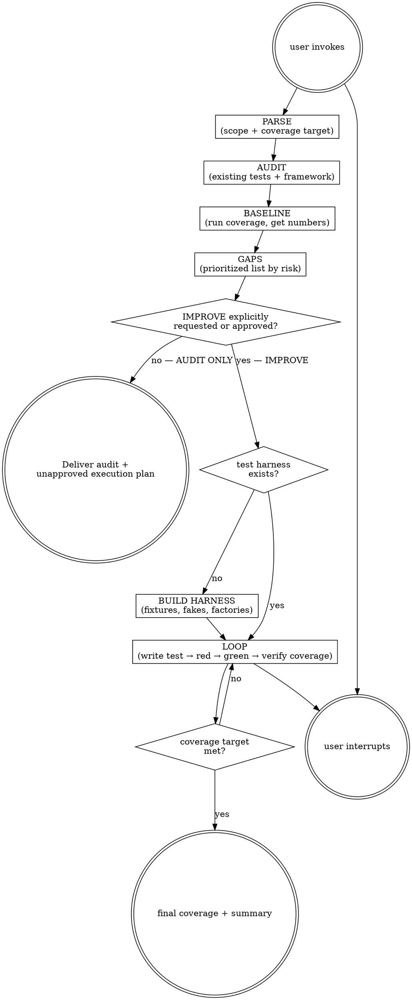

# Testpro

Backward-looking test assessment and improvement with two explicit modes. `AUDIT ONLY` inventories the existing suite, records coverage and risk-ranked gaps, and stops without editing application or test source. `IMPROVE` continues only when the request explicitly asks to add, backfill, strengthen, or close tests, or when the user approves the audit's execution plan. Distinct from `tdd` (forward-looking: write tests as a feature is built). Output lives under `agent-work/{slug}/testpro/`.

Resolve the owning work root and maintain the slug index using [the canonical work-artifact contract](contracts/work-artifacts.md).

## Decision tree



## Phase 1 — Parse

1. Identify **scope**: a module path, a feature slug, or "whole codebase". If unclear, ask one question.
2. Classify the mode from explicit authority. "Audit," "review," "assess," or "find gaps" without an instruction to change source means `AUDIT ONLY`. "Improve," "backfill," "add," "strengthen," "close gaps," or approval of an existing execution plan means `IMPROVE`. When mixed or ambiguous, default to `AUDIT ONLY` and record what would require approval.
3. For `IMPROVE`, identify a coverage target: use the existing project gate when present; otherwise the user supplies or approves the target. Do not invent an 80% target. For `AUDIT ONLY`, report the current gate and baseline without requiring a target.
4. Slug the run kebab-case (e.g. `harden-auth-module`, `coverage-bump-q2`). Create or reconcile `agent-work/{slug}/testpro/` without suffixing a conflicting slug.
5. Detect the test framework and coverage tool from manifest/config (see [REFERENCE.md](REFERENCE.md)).
6. Classify [Goalpro's quality dimensions](contracts/execution-quality.md), presuming critical-path risk, test validity, determinism, suite performance, and maintainability are applicable until verified otherwise.

## Phase 2 — Audit & baseline

1. List all existing test files in scope. For each: what it tests, assertion quality (strong/weak/flaky), what paths it covers.
2. Run the coverage tool. Record the baseline numbers (line + branch + function coverage) in `agent-work/{slug}/testpro/AUDIT.md` with the exact command + output excerpt.
3. Note weak tests: tests that pass but don't assert meaningful behavior (e.g. `expect(result).toBeTruthy()` on a function that always returns truthy). Flag for strengthening.

## Phase 3 — Gaps

Produce a prioritized gap list in `agent-work/{slug}/testpro/GAPS.md`. Prioritize by risk, not by line count: **Critical** (entry points, public API, security boundaries, error handling on external calls, auth/authz paths), **High** (state transitions, data mutations, edge cases on core logic), **Medium** (validation branches, fallback paths, config-driven behavior), **Low** (internal helpers, pure display logic, dead code — skip and propose deletion instead). Each gap entry: file:line range, what's untested, why it matters, estimated test complexity. Don't list every uncovered line — list the meaningful ones.

Write `EXECUTION-PLAN.md` with the mode, current/project coverage target, ordered gaps, independently verifiable acceptance criteria, source boundaries, expected gates, and approval status. In `AUDIT ONLY`, set approval to `NOT APPROVED`, deliver `AUDIT.md`, `GAPS.md`, and `EXECUTION-PLAN.md`, update `WORK.md`, and stop. Do not create a harness, write tests, edit source, or treat the audit request itself as implementation approval.

## Phase 4 — Harness (IMPROVE only, if missing)

If the project has no test infrastructure in scope, build it first: install/configure the test framework (see [REFERENCE.md](REFERENCE.md)); set up fixtures, fakes, factories for the module's dependencies; add a single smoke test proving the harness runs green. If a harness already exists, skip this phase and note it in `PROGRESS.md`.

## The loop (per gap)

1. **Plan** — Re-read `AUDIT.md`, `GAPS.md`, `PROGRESS.md`. Pick the next gap by priority (critical first). Re-derive the gap if prior tests changed the coverage map.
2. **Do** — Write a failing test for the gap. Run it. Confirm it fails for the right reason (red), not for a setup error. Implement or adjust code only if the gap reveals a bug — otherwise the code is correct, the test was missing.
3. **Verify** — Run the test (green). Run the full suite (no regressions). Run coverage (gap closed, overall number up). Complete the applicable per-step review in [Goalpro's quality contract](contracts/execution-quality.md). Re-read the test: does it actually assert the behavior, or is it a tautology? Strengthen if weak.
4. **Self-judge** — "I am satisfied this gap is closed because …". Cite what behavior is now asserted that wasn't before.
5. **Log** — Append to `agent-work/{slug}/testpro/PROGRESS.md`:
   ```
   - [2026-06-22 14:03] DONE  gap: auth/session.ts:42-58 — refresh token rotation (1 test added, coverage +2.1%) — satisfied: rotation + invalidation both asserted
   - [2026-06-22 14:30] WIP   gap: api/router.ts:120 — POST /users validation branch (test drafted, failing on missing stub)
   - [2026-06-22 15:10] BLOCKED gap: db/queries.ts:88 — needs a fake db; asked user for factory
   ```
6. **Repeat** until the coverage target is met.

## Stopping

- **Audit-only complete:** the current suite and applicable coverage are evidenced; risk-ranked gaps and weak tests are traceable; `EXECUTION-PLAN.md` is `NOT APPROVED`; no application or test source changed. State: "I am satisfied this test audit is complete because …" and stop.
- **Target met**: overall coverage ≥ the user-set target. Complete Goalpro's final integrated review and `QUALITY-REPORT.md`. Summarize: starting %, ending %, tests added, gaps closed, gaps intentionally skipped (with rationale). Mark complete. Stop.
- **User interrupts**: stop, note state in `PROGRESS.md`. Resume by re-reading `PROGRESS.md` + `GAPS.md`.
- **Critical-path carve-out**: if the target is met but any **Critical** gap from GAPS.md is still uncovered, do not declare done. Surface the critical gap and ask the user whether to keep going or accept the gap explicitly.
- **Three-attempts rule**: same test failing 3 substantive fixes in a row → state hypothesis, classify (test bug vs code bug vs harness issue), BLOCK+ask or skip-to-next-gap.
- **Strengthening weak tests**: if the audit found weak tests, the loop can pick these as gaps. Rewrite to assert real behavior, verify it still passes (and would fail if the code broke). Log as `STRENGTHENED`.

## Folder layout

```
agent-work/
  {slug}/
    testpro/
      AUDIT.md          # baseline coverage + existing test inventory + weak-test flags
      GAPS.md           # prioritized gap list (critical/high/medium/low)
      EXECUTION-PLAN.md # mode, criteria, target, gates, and approval
      PROGRESS.md       # only after approved IMPROVE execution begins
      QUALITY-REPORT.md # only after approved IMPROVE execution begins
      NOTES.md          # optional: harness decisions, fixture patterns, flake notes
```

Tests themselves go in the project's standard test directory (colocated or `__tests__/` / `tests/` per convention), NOT under `agent-work/{slug}/testpro/`. The tracking folder is for the audit + loop only.

See [REFERENCE.md](REFERENCE.md) for framework/coverage-tool detection by ecosystem, harness setup patterns, and tautology-prevention rules.


## Optional shared Theme Library

When the request contains a material named-theme or palette decision, discover the independently installed `theme-library` skill through the host skill registry. If the host has no registry, resolve `theme-library/SKILL.md` as a sibling of this skill directory (the standard relative location is `../theme-library/SKILL.md`). If found, read it and use embedded mode while keeping artifacts in this skill's stage. If it is not installed, continue the primary workflow and disclose the unavailable palette library only when it materially limits the result. Never rely on repository-level AGENTS or README files for discovery.
