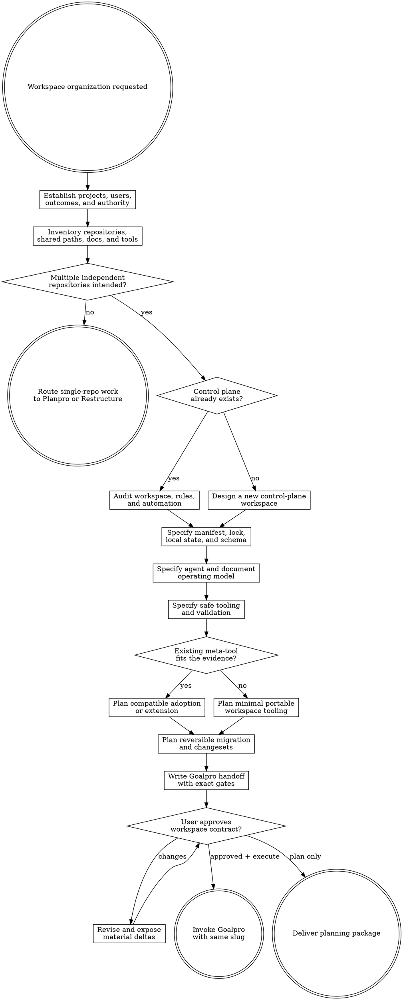

# Workspacepro

Audit related software projects and design a coherent master workspace around them. Produce an evidence-backed package under `agent-work/{slug}/workspacepro/`. Remain read-only outside that folder and hand every filesystem, Git, documentation, configuration, and tooling mutation to Goalpro with the same slug.

Resolve the parent-owned work root and maintain the slug index using [the canonical work-artifact contract](contracts/work-artifacts.md).

Treat the workspace root as a control plane. Child projects retain independent source ownership, Git histories, builds, tests, releases, and local instructions unless the user explicitly approves another topology. Use reference workspaces as evidence, not templates whose product-specific paths or toolchains should be copied.

## Decision tree



## Boundaries

- Remain read-only on source, child repositories, Git state, remotes, branches, worktrees, documentation, manifests, locks, local configuration, external services, and generated artifacts.
- Write only under `agent-work/{slug}/workspacepro/`; do not move repositories, initialize Git, add remotes, fetch, pull, clone, check out, install, update locks, or rewrite ignore files.
- Use read-only Git and filesystem inspection. Never assume parent Git status represents child state.
- Preserve dirty worktrees and user-owned changes. Sanitize authenticated remote URLs and never record secrets or unnecessary absolute local paths.
- Never execute tasks from untrusted reference repositories.
- Goalpro owns every approved mutation. Preserve the kebab-case slug through audit, approval, and execution.

## 1. Establish scope and outcome

1. Identify the proposed workspace root and create `agent-work/{slug}/workspacepro/` there.
2. Apply [Planpro's product-research lens](contracts/product-research.md).
3. Identify primary developers, agents, operators, and automation consumers; projects in scope; owned versus reference or generated material; current pain; desired outcome, signal, guardrail, and failure signal; portability and platform requirements; and whether projects remain independently releasable.
4. Separate discoverable facts from decisions about topology, ownership, remotes, history, or external authority.
5. Ask one focused question only when a material decision cannot be discovered safely.

Route a single repository's internal filesystem cleanup to Restructure and ordinary feature planning to Planpro. Workspacepro owns the control plane spanning multiple related projects.

## 2. Inventory the workspace

Run `scripts/workspace_inventory.py` where useful and verify its candidate results manually. Follow [REFERENCE.md](REFERENCE.md) for discovery and sanitization.

Classify every path as control plane, app, service, library, tool, experiment, reference, vendor, shared documentation, shared utility, shared asset, generated/cache, local state, or unknown.

For every Git repository record workspace-relative path; role and owner; Git top level and common directory; main checkout, linked worktree, submodule, or independent clone; sanitized remotes; branch or detached state; commit; dirty and untracked counts; upstream and locally discoverable ahead/behind state; manifest/lock registration; toolchain and stable gates; instruction and architecture entry points; public outputs and consumers; sibling dependencies; and platform constraints.

Discover through Git commands rather than requiring `.git` to be a directory. Account for gitfiles, worktrees, submodules, symlinks, nested or missing repositories, and external paths. For shared/generated paths record ownership, authority, consumers, retention, portability, and Git policy. Read source context before promoting a scanner candidate into a finding.

## 3. Audit the operating model

Read root and child README and AGENTS files, contributor guidance, architecture docs, ADRs, tasks, setup and health scripts, lock logic, reference manifests, CI, ignore rules, editor configuration, and relevant history.

Audit whether:

- The root is a control plane rather than accidental product source.
- Children own source, tests, builds, commits, releases, and local guidance.
- Shared resources have clear placement, ownership, and authority.
- Instructions distinguish root, child, reference, vendor, generated, and local scopes.
- Commands are discoverable without duplicated catalogs that drift.
- Documentation distinguishes authoritative, informational, generated, historical, and superseded content.
- Setup and sync protect dirty, detached, divergent, or unpushed repositories.
- Lock state is reproducible, portable, and never points at uncommitted work.
- Committed state excludes machine-local paths, credentials, and caches.
- References are pinned, attributable, appropriately licensed, and read-only by policy.
- Dependencies, groups, verification order, lifecycle operations, and supported profiles are explicit.
- Agents can search registered projects without mutating tracked ignore configuration.
- Tools support worktrees and submodules and root CI can reconstruct the workspace.

Treat documentation as evidence rather than infallible truth. Record contradictions among docs, manifests, scripts, actual Git state, and practice.

## 4. Define the workspace contract

By default, the root owns desired manifest, generated lock, ignored local overrides, schema and validators, cross-repo instructions, workspace navigation, shared cross-project docs and ADRs, reference registry, cross-project utilities and integration tasks, status/health/search tooling, changesets, shared assets, and explicitly ignored artifacts.

Child repositories own product/package source, tests, builds, package configuration, local scripts, child docs and instructions, commits, releases, CI, app-specific assets, and public contracts.

Do not move shared code into the root merely because multiple projects use it. Code needing a public API, tests, versioning, or releases normally belongs in a child library or tool. Specify evidence-backed exceptions.

## 5. Define roles and lifecycle

Give every project one primary role: `app`, `service`, `library`, `tool`, `experiment`, `reference`, or `vendor`. Give it an applicable lifecycle: `active`, `optional`, `incubating`, `deprecated`, `archived`, `local-only`, or `planned`.

Roles and lifecycle determine edit authority, default groups, setup and sync, integration participation, lock and documentation requirements, dependency permissions, releases, reference updates, and archival/removal. They never replace exact revision, ownership, or trust information.

## 6. Specify manifest, lock, local state, and schema

When no established equivalent exists, prefer:

```text
workspace.manifest.json       # human-authored desired structure
workspace.schema.json         # deterministic validation contract
workspace.lock.json           # generated exact resolved state
.workspace/local.json         # ignored machine-local overrides
```

Retain an established West, Repo, mise, or equivalent manifest when it satisfies the contract; do not create competing sources of truth.

The desired manifest defines version, workspace name/topology, relative paths, roles, lifecycle, ownership, sanitized remotes, default refs, groups, dependencies, shared paths, references, stable tasks, verification profiles, platforms, instruction/document entry points, generated/local paths, and trust policy. It excludes exact local checkout state, credentials, and machine-specific absolute paths.

The generated lock records manifest digest or source revision, exact project/reference commits, canonical remote identity, necessary resolved state, format version, and generator version. Require deliberate lock updates after verified child commits.

Ignored local state contains alternate checkout paths, local-only repositories, selected profiles, tool/cache/artifact locations, optional group overrides, private remote aliases, and resource settings. It must not silently change identity, trust, or locked revisions.

Run `scripts/validate_workspace_manifest.py` for proposed JSON inputs or specify an equivalent validator for an adopted format. The bundled helper verifies its core schema: unique portable project names and paths, roles and lifecycle values, groups, dependency kinds and acyclicity, reference boundaries, shared paths, required lock entries, commit IDs, and manifest/lock digest agreement. It does not validate project-specific tasks, profiles, entry points, remote reachability, ownership policy, or runtime health; define and run separate gates for those before claiming them verified.

## 7. Define groups, dependencies, and tasks

Derive useful groups such as core, apps, services, libraries, tools, experiments, references, optional, platform, CI, or benchmarks. Model sibling dependencies as a DAG and classify each as build, runtime, development, integration-test, documentation/reference, process/binary, package/API, or local override.

Stable task names remain owned by the project implementing them; root commands are thin orchestration. Specify repository/group selection, dependency closure, topological order, bounded concurrency, fail-fast/continue behavior, timeout, environment contract names without values, JSON output, exit aggregation, trust, and profile applicability.

Evaluate existing Make, Just, Task, mise, package scripts, West, Repo, or custom tooling. Preserve compatible tools and recommend dependencies only when evidence justifies the operating cost.

## 8. Define the agent operating model

`AGENT-OPERATING-MODEL.md` specifies layered guidance:

```text
AGENTS.md
docs/agents/WORKSPACE.md
docs/agents/CROSS-REPO-CHANGES.md
docs/agents/REFERENCES.md
docs/agents/DOCUMENTATION.md
{child-repo}/AGENTS.md
```

Keep root AGENTS concise and universal. Require agents to identify workspace and target child; read root and scoped child guidance; classify path ownership; inspect root and child Git state separately; commit in the owning repository; treat references as read-only; discover via the manifest; search without ignore mutation; record coordinated work in a changeset; run child and integration gates; update locks only after verified commits; and report every changed repository, final SHA, remaining dirtiness, and unverified external action.

Child guidance remains authoritative for child implementation; root guidance governs cross-workspace safety and integration. Surface contradictions rather than silently choosing.

## 9. Define information architecture

Classify durable information as authoritative specification, ADR, product/domain context, contributor/operator guide, research, reference note, generated report, or historical/superseded material. Where useful record status, owner, scope, related projects, authority, supersession, evidence revision, and review condition.

Specify a discoverable structure adapted to existing conventions, with one workspace index; explicit shared concepts; child-specific docs kept with children; cross-project docs naming affected repos; reference provenance; generated reports separated from guidance; superseded material marked; and broken-link/entry-point validation. Avoid duplicated command catalogs.

## 10. Define shared resources

Specify placement and ownership for cross-project utilities, reusable assets, references, models/large resources, artifacts, fixture corpora, schemas/protocols, generated indexes, and tracking artifacts. Root utilities operate across projects or maintain the control plane; product scripts stay with their child.

References record source, pinned revision or update policy, purpose, license considerations, edit policy, and update command. Do not update every reference to arbitrary latest state during unrelated setup.

## 11. Specify safe tooling

Consider only justified commands: inventory, validate, status, doctor, search, graph, exec, sync, lock check/update, and docs check.

Require read-only defaults; `--dry-run` planning and explicit `--apply`; refusal to switch/remove/overwrite dirty repos; detection of local commits, detached state, worktrees, submodules, symlinks, and drift; previous-state capture; per-repo results; partial-failure recovery; stable JSON; clear exits; timeouts and bounded concurrency; portable paths; sanitized logs; no ignore mutation; and no untrusted task execution.

For custom tools define invariant, inputs/outputs, parser, algorithm, authority, failures, false-positive risk, fixtures, performance expectation, and owner. Cover clean, dirty, missing, detached, worktree, submodule, symlink, remote-drift, cycle, malformed-manifest, and path-escape fixtures.

## 12. Define profiles and changesets

Use profile-aware health rather than one hardcoded environment. Define minimal-integrity, developer, CI, platform, benchmark, or full-integration profiles only as evidence requires. Each names groups, tools, paths/services, child and integrated gates, warnings versus blockers, resource class, and network behavior.

For coordinated work require an integration record, normally under Goalpro's `agent-work/{slug}/goalpro/`, equivalent to:

```text
workspace-changes/{slug}/
  CHANGESET.md
  REPOS.md
  DEPENDENCIES.md
  VERIFICATION.md
  ROLLBACK.md
```

Record goal, starting/ending revisions, authority, dependency/delivery order, compatibility window, partial-delivery behavior, per-repo and integrated gates, docs/lock changes, external review/merge/release actions, rollback, and final verified SHAs. Never imply atomicity across independent repositories; the root lock commit is an integration declaration made after child verification.

## 13. Plan lifecycle and migration

Cover adding/creating a repo, adding/pinning a reference, promoting an experiment, deprecating/archiving, renaming/relocating, splitting/merging, changing ownership/remotes, removal, lock updates, and partial-sync recovery. Separate filesystem work, history changes, remote creation, pushes, host settings, and external coordination into distinct authority gates. Never rewrite history merely for layout cleanliness.

Prefer reversible slices: inventory and target contract; manifest/schema in shadow mode; validation/status/docs indexes; concise agent guidance; one representative dependency chain; lock and integration proof; remaining groups/shared resources; safe sync/lifecycle tooling; changesets/CI; removal of legacy duplication. Do not move all projects before the control plane is proven.

## 14. Produce the planning package

Create:

- `RESEARCH.md` — users, operator journey, topology, intent, outcomes, constraints, alternatives, guidance, unknowns.
- `WORKSPACE-AUDIT.md` — methodology, strengths, contradictions, findings, safety risks, unverified checks.
- `REPO-INVENTORY.md` — projects/shared paths, Git state, role, lifecycle, ownership, toolchain, gates, docs, registration.
- `DEPENDENCY-MAP.md` — relationships, boundaries, groups, task order, compatibility, cycles.
- `INFORMATION-ARCHITECTURE.md` — document classes, indexes, authority, shared paths, archival policy.
- `MANIFEST-SPEC.md` — desired manifest, lock, local state, schema, examples, invariants, migration.
- `AGENT-OPERATING-MODEL.md` — instruction layering, scope protocol, references, Git, verification.
- `TOOLING-SPEC.md` — commands, safety, runner, profiles, validators, fixtures, CI.
- `GOVERNANCE.md` — ownership, lifecycle, changesets, exceptions, docs, lock policy.
- `PLAN.md` — phased project-specific implementation plan.
- `GOALPRO-INPUT.md` — canonical execution handoff.
- `NOTES.md` — optional sanitized evidence and decisions.

Use [REFERENCE.md](REFERENCE.md) for schemas and finding format.

## Finding format

```md
## WORKSPACE-001 — Repository discovery ignores linked worktrees

- Severity: HIGH
- Status: VERIFIED
- Dimension: Repository inventory
- Evidence: `scripts/workspace-status.sh:44`
- Expected invariant: Registered Git working trees are discovered through Git.
- Observed behavior: The script requires `{repo}/.git` to be a directory.
- Scope: Status, health, lock, and bootstrap tooling.
- Operator impact: Valid worktrees appear missing and escape verification.
- Recommendation: Centralize Git-aware repository detection.
- Done when: Main checkouts, worktrees, and submodules pass fixtures.
- Verification: Unit fixtures and a linked-worktree integration test.
```

Use `CRITICAL` for destructive/untrusted/secret/corruption risk, `HIGH` for systemic drift or unsafe sync, `MEDIUM` for bounded governance gaps, and `LOW` for discoverability or defense-in-depth. Assign each check `VERIFIED`, `FINDING`, `NOT APPLICABLE`, or `UNVERIFIED`.

## PLAN.md and Goalpro handoff

Follow Planpro conventions. Each phase names outcome, concrete root/child paths, repositories, steps, dependency/compatibility effects, Git/external boundaries, gates, rollout/rollback, quality dimensions, risks, assumptions, and “Done when …” criteria.

Write `GOALPRO-INPUT.md` according to [Goalpro's handoff contract](contracts/goalpro-handoff.md) and classify [Goalpro's quality dimensions](contracts/execution-quality.md). Include same slug, outcomes, sources, approval, reversible slices, starting state and dirty constraints, boundaries, manifest/lock/schema invariants, docs and agent requirements, fixtures, per-repo/integration gates, recovery, manual/external actions, remote/push/merge/release authority, assumptions, and sanitization.

Write it initially `NOT APPROVED`. Approval of the audit never implies permission to move repositories, rewrite history, create remotes, or push commits.

## Done

Finish only when every relevant repository/shared path is classified; Git/worktree state is accurate; outcomes and ownership are evidenced; manifest/lock/local/schema contracts are complete; dependencies/groups/tasks/gates are mapped; agent precedence and information authority are defined; sync/lifecycle has dry-run, dirty protection, rollback, and partial-failure behavior; changesets and final SHA reporting are specified; findings have evidence and criteria; custom tools have deterministic contracts/fixtures; and `PLAN.md` plus `GOALPRO-INPUT.md` can execute without rediscovery.

State: “I am satisfied this workspace plan is complete because …” with evidence. Deliver the folder and request review or approval.


## Optional shared Theme Library

When the request contains a material named-theme or palette decision, discover the independently installed `theme-library` skill through the host skill registry. If the host has no registry, resolve `theme-library/SKILL.md` as a sibling of this skill directory (the standard relative location is `../theme-library/SKILL.md`). If found, read it and use embedded mode while keeping artifacts in this skill's stage. If it is not installed, continue the primary workflow and disclose the unavailable palette library only when it materially limits the result. Never rely on repository-level AGENTS or README files for discovery.
