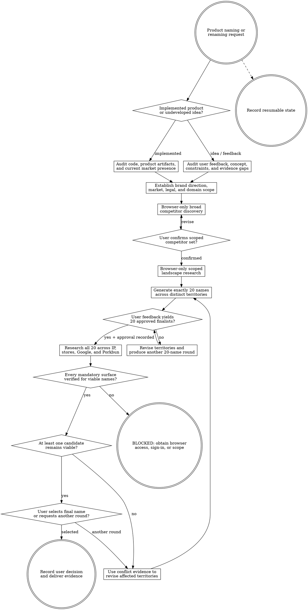

# Brandstorm

Turn product truth and user brand direction into a diverse, researched set of product-name candidates. Remain read-only outside `agent-work/{slug}/brandstorm/`; the user owns both finalist approval and the final naming decision.

Resolve the owning work root and maintain `agent-work/{slug}/WORK.md` using [the canonical work-artifact contract](contracts/work-artifacts.md). Read [REFERENCE.md](REFERENCE.md) completely before competitor discovery, candidate scoring, or clearance research.

## Decision tree

## Authority and browser boundary

- Inspect project files, product evidence, public web pages, and authorized signed-in browser state read-only. Write only Brandstorm artifacts and the shared `WORK.md` index.
- Never edit application source, rename an existing product, purchase or reserve a domain, file a trademark or patent, create a store listing, contact a rights holder, submit a form, or mutate an external account.
- Perform **every web operation** through the host agent's built-in browser or an agent-accessible Chrome extension. Do not use shell HTTP clients, scraping libraries, standalone browser automation, search connectors, direct APIs, or background scripts for web research.
- Respect an explicit browser choice. Otherwise use the built-in browser for public research and an accessible Chrome session when authentication or existing session state is required. Read and follow the available Browser or Chrome control skill before interaction.
- If neither permitted browser surface is available, or a required page is blocked by authentication, CAPTCHA, rate limits, or terms, mark the affected work `BLOCKED` and ask for the minimum user action. Never bypass the control or substitute a prohibited web surface.
- Treat research as preliminary naming-risk evidence, not legal advice or a guarantee of registration, exclusivity, store acceptance, or domain ownership.

## 1. Start the initiative and audit product truth

Choose a stable kebab-case slug and create `agent-work/{slug}/brandstorm/`. Record the stage as `ACTIVE` in `WORK.md`.

Apply [the product-research lens](contracts/product-research.md) proportionally.

For an implemented product, inspect the codebase and current product evidence: README and product docs, user-facing copy, routes and flows, feature names, audience, pricing or positioning, app identifiers, package names, existing domains, store links, feedback, issues, analytics definitions, and relevant history. Do not infer the product solely from repository or package names.

For an undeveloped idea, inspect the user's concept, interview notes, support or research feedback, intended users, problem, alternatives, promised outcome, platform, business model, and constraints. Separate observed feedback from founder assumptions and unknowns.

Write `BRAND-BRIEF.md` with:

- product type and naming object: company, product, app, game, service, or feature;
- primary users, job, problem, promise, proof, and differentiators;
- current or intended journey and platform surfaces;
- existing language, names, architecture, and protected equities;
- observed user language and material contradictions;
- launch markets, languages, legal jurisdictions, likely goods/services, and provisional trademark classes;
- domain policy: exact-name requirement, priority TLDs, acceptable modifiers, hyphens, and premium-price tolerance;
- evidence sources, unknowns, assumptions, exclusions, and risk posture.

Ask one focused question at a time only for a material user decision that cannot be discovered. Do not begin targeted clearance until jurisdiction and domain policy are explicit.

## 2. Establish user-directed brand criteria

Ask for and record direction on positioning, emotional character, memorability, descriptiveness versus suggestiveness, word length, pronunciation, spelling, language, cultural constraints, prohibited words or meanings, naming architecture, references the user likes or dislikes, and acceptable creative risk.

Translate that direction into reviewable criteria and failure signals in `BRAND-BRIEF.md`. Distinguish:

- `MUST` — a candidate cannot advance without it;
- `PREFER` — a ranked preference with trade-offs;
- `AVOID` — a material but potentially discussable concern;
- `DISQUALIFY` — an automatic rejection.

Reflect the user's direction; do not silently optimize for generic startup-name conventions.

## 3. Discover competitors broadly, then scope them

Use the permitted browser surface to perform a broad discovery sweep before asking the user to supply competitors. Search category language, user problems, direct products, adjacent substitutes, app stores or marketplaces relevant to the platform, and general Google results. Classify direct competitors, adjacent competitors, substitutes, publishers/directories, and unrelated lexical collisions separately.

Write the discovery set to `COMPETITOR-LANDSCAPE.md` with source URLs, access dates, observed positioning, naming patterns, recurring language, likely confusion risks, confidence, and proposed inclusion or exclusion.

Present the meaningful set to the user. Ask them to confirm additions, exclusions, and incorrectly classified products. Preserve rejected candidates and the reason.

After confirmation, run a scoped pass over representative official pages and store records. Identify saturated naming patterns, open semantic territory, category clichés, pronunciation or spelling traps, and differentiation opportunities. Do not copy competitor names, slogans, claims, or identity systems.

## 4. Generate exactly 20 candidates

Develop several genuinely distinct naming territories before individual names. A useful default is four territories with five candidates each, but vary the structure when the approved direction supports a better distribution. Avoid twenty cosmetic variants of one root.

Create exactly 20 candidates in `CANDIDATES.md`. For each record:

- candidate and pronunciation;
- naming territory and formation method;
- product rationale and brand promise;
- fit against `MUST`, `PREFER`, `AVOID`, and `DISQUALIFY` criteria;
- distinctiveness, memorability, spelling, spoken-word, localization, and expansion risks;
- known broad-discovery collision signals;
- preliminary domain shape, clearly labelled **unchecked**;
- confidence and the strongest reason to reject it.

Rank candidates by product fit and evidence, not personal novelty preference. Do not claim availability before targeted research.

## 5. Collect feedback and approve 20 finalists

Present all 20 candidates in chat grouped by territory. Make feedback easy: invite likes, dislikes, rankings, words or sounds to preserve, exclusions, combinations, and a request for a new territory.

Append each feedback round and its resulting changes to `CANDIDATES.md`; never erase rejected names or rationale. Regenerate and refine as needed, but every proposed round contains exactly 20 candidates.

Targeted clearance begins only when:

1. exactly 20 finalists are identified;
2. the user explicitly approves that finalist set for research;
3. the approved list and approval provenance are recorded in `CANDIDATES.md`; and
4. jurisdiction, goods/services scope, platforms, and domain policy are explicit.

Freeze the approved set with a content digest. A later name change invalidates the prior clearance matrix for that entry.

## 6. Run targeted browser research across every finalist

Research **all 20 finalists** across every mandatory surface below using the permitted browser. Follow [REFERENCE.md](REFERENCE.md) for queries, source precedence, evidence fields, and status rules.

1. **Trademarks:** official databases for every approved jurisdiction, including exact and plausibly confusing variants in relevant goods/services classes.
2. **Patents:** official patent databases for exact and close terminology relevant to the product territory. Treat this as technology/entity collision evidence, not name ownership or trademark clearance.
3. **Steam:** exact, close, and category-relevant product-title collisions.
4. **iOS App Store:** exact and close app-title or developer collisions.
5. **Google Play:** exact and close app-title or developer collisions.
6. **Mac App Store:** exact and close macOS app-title or developer collisions.
7. **Google Search:** quoted exact name, unquoted name, material spelling/spacing variants, and name plus category/product terms.
8. **Porkbun:** exact domains and every user-approved TLD or modifier. Record the domain string, displayed state, premium designation or price when shown, URL, and timestamp.

Use `CLEARANCE-MATRIX.md` as the complete candidate-by-surface matrix and `EVIDENCE-LEDGER.md` for detailed results, screenshots or page references, query scope, counterevidence, uncertainty, and access limitations.

Classify each individual check as:

- `CLEAR SIGNAL` — no obvious material conflict found within the recorded scope;
- `CONCERN` — a result needs user or legal review but is not automatically disqualifying;
- `BLOCKED` — a material conflict violates an approved rule;
- `UNAVAILABLE` — the required domain or equivalent scarce asset is observed unavailable;
- `UNVERIFIED` — the required search could not be completed or interpreted reliably.

Classify each candidate as `VIABLE`, `CONDITIONAL`, `NOT VIABLE`, or `UNVERIFIED`. A candidate is never `VIABLE` while any mandatory cell is `UNVERIFIED`, or when its domain requirement is not satisfied. “No obvious conflict found” is the strongest permitted legal phrasing; never say a mark is cleared or available for registration.

Porkbun observations are time-sensitive. State that availability can change immediately and that Brandstorm has not reserved or purchased the domain.

## 7. Loop until a viable decision set exists

If no candidate is `VIABLE` or acceptably `CONDITIONAL`, group the failure evidence by root cause: legal collision, crowded category, store confusion, search ambiguity, domain policy, language risk, or brand-direction mismatch. Return only to the affected naming territories and generation steps unless the evidence invalidates the product or market brief.

Generate another round of exactly 20 names, obtain explicit finalist approval, and rerun the complete targeted matrix for the new set. Never carry a prior candidate's result to a different name or treat a partial spot check as complete clearance.

If required checks are `UNVERIFIED`, do not call the list nonviable and do not start the creative loop. Record the blocked surface, preserve completed evidence, obtain browser access or user scope, and resume the missing checks.

If viable candidates exist but the user rejects them, treat that as new brand feedback and run another 20-candidate round. Continue until the user selects a name, abandons the initiative, or explicitly pauses it.

## 8. Present the final decision gate

Present the viable and conditional candidates with product fit, strongest evidence, material risks, domain observation, and legal-review needs. Keep model ranking advisory.

Ask the user to select the final name, request another round, pause, or abandon the initiative. Do not infer selection from ranking, enthusiasm, or prior finalist approval.

After explicit selection, write `DECISION.md` with:

- selected name and exact spelling;
- user decision provenance and date;
- product and brand rationale;
- observed domain state and timestamp;
- material trademark, patent, store, search, language, and competitor evidence;
- unresolved concerns and required professional review;
- rejected finalists and concise reasons;
- explicit statement that no registration, purchase, filing, or external mutation occurred.

Update `WORK.md` to `COMPLETE` only after this final gate. If paused, blocked, abandoned, or superseded, record that truthful state instead.

## Artifacts

- `BRAND-BRIEF.md` — audited product truth, brand direction, market/legal scope, and domain policy.
- `COMPETITOR-LANDSCAPE.md` — broad discovery, user-confirmed scope, and scoped findings.
- `CANDIDATES.md` — all 20-name rounds, feedback, rejections, finalists, approval provenance, and digest.
- `CLEARANCE-MATRIX.md` — all finalists by trademark, patent, stores, Google, and Porkbun surface.
- `EVIDENCE-LEDGER.md` — queries, URLs, timestamps, observations, counterevidence, and limitations.
- `QUALITY-REPORT.md` — integrated evidence coverage, browser compliance, decision integrity, and unresolved risk.
- `DECISION.md` — the user's final selected name and bounded conclusion.
- `PROGRESS.md` — conditional resumable state when interrupted or blocked.
- `NOTES.md` — optional sanitized research notes.

## Quality and done criteria

Apply [the execution-quality contract](contracts/execution-quality.md) proportionally to research quality and decision integrity. In `QUALITY-REPORT.md`, reconcile product intent, product-evidence coverage, candidate diversity, competitor classification, browser-only compliance, source authority, jurisdiction/class scope, mandatory-surface coverage, freshness, domain volatility, legal uncertainty, artifact integrity, and user approval provenance.

Brandstorm is complete only when:

- product truth and brand direction are evidence-backed and approved enough to generate names;
- the broad competitor set was discovered before the user-confirmed scoped pass;
- candidate history preserves exactly 20 names per round and feedback provenance;
- the user approved exactly 20 finalists before targeted research;
- every finalist has a result for every mandatory surface, with no `UNVERIFIED` cell hidden inside a viable classification;
- Porkbun was checked for the approved domain policy and every observation is timestamped;
- zero-viability rounds looped through new approved finalists and complete rechecks;
- preliminary legal evidence is not represented as professional clearance;
- the user explicitly selected the final name; and
- `WORK.md`, `DECISION.md`, and `QUALITY-REPORT.md` agree on the final state.

State: “I am satisfied Brandstorm is complete because …” and cite the approved finalist digest, complete matrix coverage, Porkbun timestamp, user decision, remaining uncertainty, and exact `DECISION.md` path.
