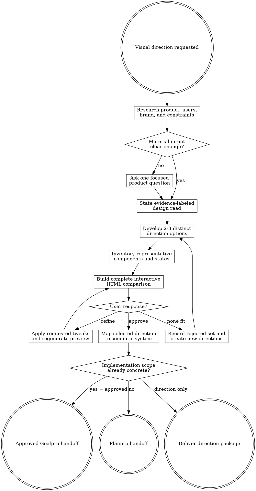

# Design Direction

Turn product intent into an approved visual language and semantic system map under `agent-work/{slug}/design-direction/`. Remain read-only outside that folder. Hand implementation to Planpro or Goalpro with the same slug.

Resolve the owning work root and maintain the slug index using [the canonical work-artifact contract](contracts/work-artifacts.md).

## Decision tree

## Boundaries

- Remain read-only on application source, configuration, manifests, docs, external services, and deployed environments.
- Write only under `agent-work/{slug}/design-direction/` plus the shared `WORK.md`.
- Do not generate images. Write an optional reference-board specification that an image-generation skill can consume.
- A self-contained HTML direction preview is a planning artifact, not application implementation. It may reproduce representative UI structure only inside `agent-work/{slug}/design-direction/`; never copy it into product source or present it as production-ready code.
- Do not audit an existing design system comprehensively; use Designpro for implemented-system drift and enforcement.
- Do not implement the direction. Goalpro owns mutations after approval; Planpro owns unresolved implementation architecture.
- Never turn a reference product into a copying instruction or invent brand intent from fashion.

## 1. Establish intent

Apply [Planpro's product-research lens](contracts/product-research.md). Read product, brand, audience, workflow, content, accessibility, platform, device, localization, theme, performance, and delivery evidence. Identify the job, emotion, trust posture, information density, existing identity assets, and qualities that must be preserved.

Write a one-line **design read** covering product, audience, job, personality, density, layout, material or imagery, and motion. Mark every statement `EVIDENCE`, `ASSUMPTION`, or `USER DECISION`. Ask one focused question only when a material direction cannot be discovered safely.

## 2. Develop distinct options

Create two or three directions that differ in design logic, not merely palette. Each option must specify:

- Product rationale and intended user response.
- Hierarchy, composition, density, typography, imagery, material, iconography, content voice, and motion posture.
- Accessibility, localization, responsive, theme, performance, and implementation implications.
- What it preserves, what it changes, failure modes, reversibility, and a cheap validation experiment.
- Anti-default choices justified by product fit, plus familiar patterns deliberately retained for learnability or task speed.

Recommend one option with evidence, but do not ask for selection until the interactive preview is complete and validated. Do not silently blend incompatible options.

Research and option artifacts may be written before selection so the decision is durable. Do not finalize `VISUAL-LANGUAGE.md`, `SYSTEM-MAP.md`, `PLAN.md`, or `GOALPRO-INPUT.md` until the user selects a direction. When the only evidence is the user's brief, a recommendation may still be useful, but label it provisional, expose every material assumption, and propose the cheapest validation experiment; do not present it as researched product truth.

## 3. Build the interactive direction preview

For every non-trivial visual-direction decision, create `DIRECTION-PREVIEW.html` before asking the user to choose. “Non-trivial” includes two or more options, a whole-product or major-surface reskin, a material typography/layout/theme change, or any decision whose quality cannot be judged responsibly from prose alone.

Inventory the target project's real components, surfaces, states, content density, and route patterns first, and preserve that inventory in `RESEARCH.md` under `Representative component and state inventory`. The preview must visualize the most representative set available: application shell/navigation; typography hierarchy; palette and semantic roles; nested surfaces; buttons and links; inputs and validation; cards or equivalent groupings; tables/lists/timelines/charts where present; status, loading, empty, error, disabled, and success states; responsive behavior; and motion posture. When no implementation exists, label inferred components and derive them from the proposed experience matrix.

Place all directions in one self-contained, responsive HTML file with an accessible keyboard-operable switcher. Use no remote scripts, stylesheets, fonts, or tracking. Include normal and reduced-motion behavior, representative realistic content, palette swatches, token-role labels, and a concise rationale/tradeoff panel. When themes are relevant, include light/dark or alternative family selectors that preserve the same semantic capabilities rather than showing palette-only recolors.

Read [PREVIEW.md](PREVIEW.md) completely before generating the preview. Run `python3 {design-direction-skill-root}/scripts/validate_direction_preview.py agent-work/{slug}/design-direction/DIRECTION-PREVIEW.html` and fix every failure before presenting it.

## 4. Iterate until the user loves a direction

After presenting the preview, accept one of three outcomes:

1. **Refine** — apply concrete feedback to one or more options, increment the preview revision, preserve unaffected distinctions, regenerate the HTML, validate it, and present it again.
2. **New set** — record the complete option set as rejected with the user's reasons, then create two or three genuinely new directions. Do not disguise palette swaps or renamed blends as new concepts.
3. **Approve** — record the selected direction and preview revision, then proceed to system mapping.

Maintain an append-only revision table in `DIRECTION-OPTIONS.md` with revision, options shown, feedback, disposition, and immutable snapshot path. Save each validated revision at `previews/DIRECTION-PREVIEW-R{n}.html`, then copy the current revision to `DIRECTION-PREVIEW.html` as the stable latest alias. Never pressure the user to choose the recommended option. Do not finalize system mapping or execution handoff while the user is still refining or while every option is rejected.

For theme-heavy products or users, consult the independently discovered `theme-library` skill in embedded mode. Treat its families as creative seeds: preserve palette DNA while freely evolving ramps, surfaces, borders, neutrals, statuses, complementary/contrasting colors, and mode-specific relationships for the selected direction. Use exact fidelity only when the user requests it. Record the interpretation and additions in `PALETTE-SHORTLIST.md`, then make them visible in the HTML preview. Never require an external repository or local filesystem path to access a palette.

## 5. Map the selected direction into a system

Translate qualities into:

- Primitive foundations and component-facing semantic roles.
- Typography, spacing, layout, geometry, elevation, imagery, icon, content, and motion roles.
- Component recipes and state behavior without theme-name branches.
- Theme-ready mappings, complete semantic parity, and accessible fallbacks.
- Asset/content rules, prohibited shortcuts, governed exceptions, and contributor guidance.
- Mechanical and rendered verification criteria.

The map specifies roles and relationships. Avoid inventing exact values without evidence; mark experiments and user decisions explicitly.

## 6. Produce artifacts

Create:

- `RESEARCH.md` — users, product, journey, intent sources, representative component/state inventory, constraints, quality, alternatives, and unknowns.
- `DIRECTION-OPTIONS.md` — distinct options, recommendation, tradeoffs, experiments, and decision status.
- `DIRECTION-PREVIEW.html` — required self-contained interactive comparison for non-trivial direction decisions, aliasing the latest immutable `previews/DIRECTION-PREVIEW-R{n}.html` snapshot.
- `PALETTE-SHORTLIST.md` — conditional family/variant comparison when palettes or multiple themes materially shape the direction.
- `VISUAL-LANGUAGE.md` — selected direction, design read, preservation rules, and craft posture.
- `SYSTEM-MAP.md` — semantic roles, token layers, recipes, themes, assets, content, motion, and enforcement targets.
- `EXPERIENCE-MATRIX.md` — routes or surfaces, states, viewports, inputs, accessibility, localization, content extremes, and intended behavior.
- `PLAN.md` — implementation slices when the direction can be planned without further architecture work.
- `GOALPRO-INPUT.md` — conditional direct handoff only when scope and criteria are concrete and approved.
- `REFERENCE-BOARD-SPEC.md` — optional image-generation brief.
- `NOTES.md` — optional sanitized decisions or sources.

Follow [REFERENCE.md](REFERENCE.md) for schemas, option tests, and handoff selection.

## Handoff

- Use Planpro when feature scope, architecture, data, or delivery remains unresolved.
- Use Goalpro only when the selected direction and implementation scope have explicit approval and the direct handoff satisfies [Goalpro's contract](contracts/goalpro-handoff.md).
- Leave the direction package terminal when the user wants design guidance only.

## Done

Finish when evidence and assumptions are separated; options are genuinely distinct and visually compared in a validated HTML preview; requested refinements or rejected sets are durably recorded; the selected preview revision has explicit user approval; every quality maps to semantic roles and verification; accessibility, localization, states, themes, and performance are classified; implementation shortcuts are prohibited; and the correct handoff is ready without rediscovering direction.

State: “I am satisfied this design direction is complete because …” and cite the selection, system map, and unresolved decisions.

## Optional shared Theme Library

When the request contains a material named-theme or palette decision, discover the independently installed `theme-library` skill through the host skill registry. If the host has no registry, resolve `theme-library/SKILL.md` as a sibling of this skill directory (the standard relative location is `../theme-library/SKILL.md`). If found, read it and use embedded mode while keeping artifacts in this skill's stage. If it is not installed, continue the primary workflow and disclose the unavailable palette library only when it materially limits the result. Never rely on repository-level AGENTS or README files for discovery.
