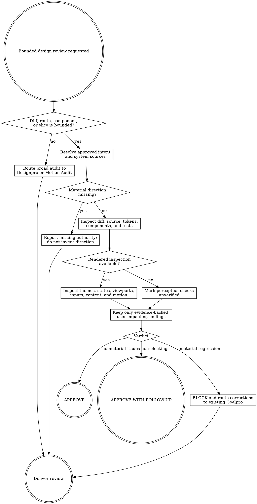

# Design Review

Review one bounded implementation surface and write evidence under `agent-work/{slug}/design-review/`. Remain read-only outside that folder. Return corrections to an existing Goalpro initiative rather than creating a competing execution plan.

Resolve the owning work root and maintain the slug index using [the canonical work-artifact contract](contracts/work-artifacts.md).

## Decision tree

## Boundaries

- Remain read-only on source, configuration, manifests, locks, browser data, external services, and deployed state.
- Write only `agent-work/{slug}/design-review/DESIGN-REVIEW.md` and optional sanitized `NOTES.md`, plus update the shared `WORK.md`.
- Review the bounded change; do not expand into a whole-codebase audit. Recommend Designpro or Motion Audit when systemic debt emerges.
- Do not invent a new aesthetic. Review against approved direction, style guide, Designpro/Motion Audit evidence, acceptance criteria, canonical tokens/components, and documented product intent in that order.
- Do not fix findings. Route blockers to the existing same-slug Goalpro criteria/progress; if none exists, recommend the appropriate planning/audit skill.

## 1. Establish scope and authority

Record the exact diff, commit, PR, route, component, or Goalpro slice under review. Resolve upstream artifacts and approved intent. If sources conflict, report the contradiction; do not select a direction based on reviewer taste.

Use this evidence precedence:

1. Approved direction and product decisions.
2. Applicable Theme Library interpretation, Designpro, Motion Audit, Motion Direction, Planpro, or feature criteria.
3. Canonical semantic tokens, components, and style guide.
4. Acceptance tests and documented accessibility/performance requirements.
5. Rendered behavior.
6. Repeated implementation as weak evidence only.

## 2. Run two passes

### Static pass

Inspect changed source and representative callers for semantic-token usage, theme-name branches, raw or arbitrary design values, primitive bypasses, component recipes, variants/states, markup semantics, focus behavior, responsive/localization behavior, motion roles, reduced-motion handling, tests, and documentation.

When a Theme Library family informed the work, review against its approved palette DNA and documented creative transformations—not literal equality with catalog hex values unless fidelity was explicitly required.

### Rendered pass

When safely available, inspect affected happy, loading, empty, validation, error, disabled, degraded, and recovery states; relevant themes and viewports; keyboard/focus; zoom and content expansion; touch/pointer modes; reduced motion; representative content; and animation at normal speed. Use slow motion only to diagnose sequencing, origin, interruption, or frame behavior.

Mark checks `UNVERIFIED` when runtime evidence is unavailable. A green build, scan, or screenshot alone cannot prove design quality.

## 3. Keep findings consequential

Report a finding only when it violates approved intent/system rules, harms comprehension or task completion, creates inconsistency likely to spread, regresses accessibility or performance, breaks responsive/theme/content behavior, or makes motion feel incorrect under relevant interaction.

Each finding includes priority, status, exact evidence, governing source, observed behavior, user impact, correction boundary, and verification. Do not block on personal preference or isolated polish without product/system impact.

## 4. Render a verdict

- `APPROVE` — no material issue; applicable evidence is verified.
- `APPROVE WITH FOLLOW-UP` — bounded non-blocking improvements with owner and verification.
- `BLOCK` — a material product, system, accessibility, responsive, theme, performance, or motion regression must be corrected before release.
- `UNVERIFIED` — not a final approval verdict; use when missing authority or runtime evidence prevents a responsible decision.

Follow [REFERENCE.md](REFERENCE.md) for severity and output schema.

## Correction routing

If the reviewed work belongs to an active same-slug Goalpro initiative, cite the affected criterion and append no new implementation scope. Goalpro performs and verifies corrections, then Design Review may re-review. If the issue is broader than the bounded change, recommend Designpro or Motion Audit with a new or reconciled slug; never hide scope expansion inside review notes. If the implemented result lacks an approved creative motion language rather than merely violating one, route that choice to Motion Direction.

## Done

Finish when scope and authority are explicit, static and rendered passes are complete or honestly unverified, every finding has user/system impact and correction evidence, the verdict follows the contract, and correction routing preserves Goalpro ownership.

State: “I am satisfied this design review is complete because …” and cite the bounded evidence and verdict basis.

## Optional shared Theme Library

When the request contains a material named-theme or palette decision, discover the independently installed `theme-library` skill through the host skill registry. If the host has no registry, resolve `theme-library/SKILL.md` as a sibling of this skill directory (the standard relative location is `../theme-library/SKILL.md`). If found, read it and use embedded mode while keeping artifacts in this skill's stage. If it is not installed, continue the primary workflow and disclose the unavailable palette library only when it materially limits the result. Never rely on repository-level AGENTS or README files for discovery.
