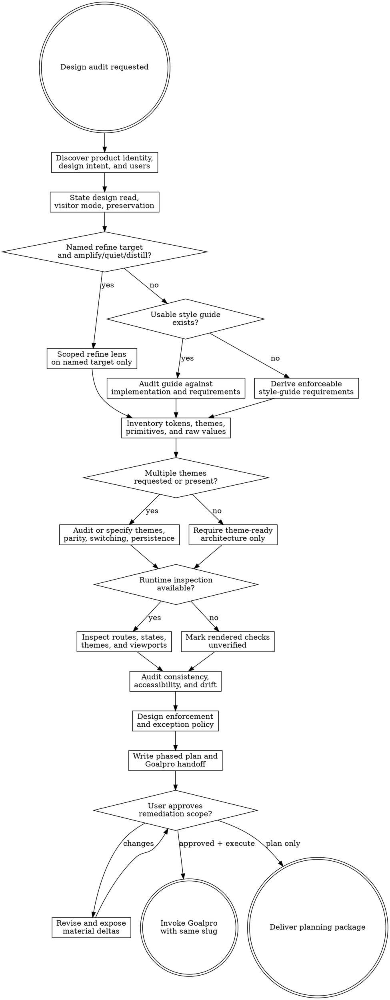

# Designpro

Audit an application's implemented design system and produce an evidence-backed implementation plan under `agent-work/{slug}/designpro/`. Remain read-only outside that folder. Hand all application changes to Goalpro with the same slug.

Resolve the owning work root and maintain the slug index using [the canonical work-artifact contract](contracts/work-artifacts.md).

Be strict about consistency, accessibility, token discipline, documentation, theme readiness, and automated enforcement. Do not impose one universal visual aesthetic: derive the appropriate language from the product, its users, approved intent, and strongest existing patterns.

## Decision tree

## Boundaries

- Remain read-only on application source, configuration, documentation, manifests, lockfiles, external services, and deployed environments.
- Write only under `agent-work/{slug}/designpro/`; do not install packages, initialize project tools, update snapshots, accept fixes, or modify browser data intentionally.
- Use safe read-only browser inspection and existing non-mutating verification commands when available. Warn before a command may create caches or reports outside the plan folder.
- Never treat a green build or lint result as proof of visual consistency, or a common implementation pattern as automatically correct.
- Never implement remediation. Goalpro owns every mutation after approval.
- Preserve the kebab-case slug through audit, approval, and execution.

## 1. Establish intent and scope

1. Create `agent-work/{slug}/designpro/`.
2. Apply [Planpro's product-research lens](contracts/product-research.md). Read README and AGENTS files, product and brand documentation, design guides, ADRs, component documentation, screenshots, tests, relevant issues, and recent relevant history.
3. Identify primary users, accessibility needs, product personality, density, hierarchy, supported devices and inputs, themes, locales, viewports, desired outcome, success signal, guardrail, and failure signal.
4. Record contradictions between documented intent, style guides, tokens, shared components, and rendered behavior.
5. Use this evidence precedence: explicit current product decisions; approved design guide; canonical tokens and components; repeated implementation; framework defaults. Treat each as evidence rather than infallible truth and never silently resolve a higher-level contradiction.
6. Ask one focused question only when a material visual or product decision cannot be discovered. Carry other unknowns into the plan.

When the user requests a named palette or a new family from the shared catalog, consult the independently discovered `theme-library` skill in embedded mode. Treat its catalog as creative evidence, not a rigid surface/border recipe, unless exact fidelity is explicitly required. Preserve the resulting interpretation as approved intent or a clearly labeled hypothesis before auditing implementation against it.

Before judging aesthetics, write a one-line **design read** that states the product, audience, job, personality, density, layout posture, material or imagery posture, and motion posture. Classify **visitor mode** from the requested surface (`Persuade`, `Operate`, `Read`, or `Experience`). Mode changes craft judgment: Operate may correctly be dense and familiar. Label each part `EVIDENCE`, `ASSUMPTION`, or `USER DECISION`. This makes taste reviewable rather than an unspoken model default.

If the user named a refine intent (`amplify`, `quiet`, or `distill`) and a target, take the **scoped refine** branch: inventory only that target and its neighbors, apply the matching lens in [REFERENCE.md](REFERENCE.md), and still run accessibility and contrast on the touched surface. Do not restyle the rest of the product. A greenfield “make the new product quieter than SaaS” request belongs to Design Direction.

For redesigns, define a preservation and change budget:

- **Preserve** identity-bearing choices, settled product constraints, recognizable workflows, and approved accessibility behavior.
- **Strengthen** coherent but underdeveloped patterns through the existing token and component system.
- **Replace** verified system debt, generic defaults that conflict with product intent, and inaccessible or misleading patterns.
- **Confirm first** any change to brand identity, information architecture, core workflows, or intentionally distinctive behavior.

## 2. Map implementation and tooling

Inspect framework and versions; routes and layouts; CSS, Tailwind, modules, preprocessors, CSS-in-JS, and component libraries; token declarations and theme providers; primitives and compound components; variant and class-merging helpers; fonts, icons, charts, rich text, assets, and third-party widgets; OXLint, ESLint, Stylelint, tests, Storybook, browser tests, accessibility scans, screenshots, visual regression, CI gates, exemptions, generated files, and safelists.

Trace representative user journeys from route to shared components, styles, and rendered states. Cite concrete `file:line` evidence. Follow [REFERENCE.md](REFERENCE.md) for sampling, evidence statuses, matrices, and framework inspection guidance.

## 3. Inventory the design system

Build a normalized inventory of:

- Primitive and semantic colors; foreground/background and nested-surface pairs; borders, overlays, scrims, shadows, and elevation.
- Typography families, roles, sizes, weights, line heights, tracking, readable measure, truncation, and wrapping.
- Spacing scale and contextual recipes; dimensions, density, containers, breakpoints, safe areas, and responsive behavior.
- Border widths, radius roles, icons, motion, z-index, component variants, states, and composition rules.
- Every supported theme and mode.

Separate declared, used, unused, missing, duplicated, ambiguous, raw, and implementation-owned values. Resolve aliases before judging values. Run `scripts/design_value_inventory.py` for candidate evidence where useful; manually verify every candidate before turning it into a finding.

## 4. Require theme readiness

Theme readiness is mandatory even when multiple themes are out of scope. Require:

- Component-facing semantic tokens such as surface, foreground, border, accent, focus, success, warning, and danger.
- Separation between primitive palette values and semantic role tokens.
- Scoped token overrides instead of theme-specific conditionals in components.
- No component knowledge of theme names and no inline theme-dependent design values.
- Explicit fallback and missing-token behavior.
- Theme-aware browser chrome, illustrations, charts, syntax highlighting, generated assets, and third-party widgets where applicable.
- A documented path for adding a theme primarily by defining another complete semantic mapping rather than rewriting components.

Do not require speculative theme-switching UI or unused palettes for a single-theme product.

## 5. Apply the conditional multi-theme branch

Create `MULTI-THEME-SPEC.md` when the user requests themes, themes already exist, product evidence requires theme choice, or themes are an established expectation for the product family. For the current user's Gremlin Labs applications, presume this branch `APPLICABLE` unless the user opts out.

Audit or specify:

- Theme names, product intent, audience, visual character, and complete primitive-to-semantic mappings.
- Surface ladders, valid nesting, text, icons, borders, controls, focus, states, elevation, glow, shadows, overlays, and translucent layers.
- Illustration, logo, chart, syntax, and data-visualization palettes.
- System preference, explicit choice, defaults, anonymous and authenticated persistence, cross-tab or cross-device sync where relevant.
- Server rendering, hydration, flash-of-incorrect-theme prevention, browser `color-scheme`, and theme metadata.
- Accessible theme selection, reduced-motion transitions, third-party surfaces, versioning, deprecation, and fallback behavior.
- Full component, state, route, viewport, and contrast parity across themes.

When Theme Library supplies the starting family, distinguish its identity anchors from product-specific derived ramps and deliberate additions. Audit whether those creative transformations are coherent and governed; do not flag a departure from source hex values merely because it is a departure.

Prohibit component branches on theme names, scattered theme-specific utilities, incomplete mappings that silently fall back, accent-only recolors that break semantic roles, and default-theme-only accessibility checks. Theme parity means equal semantic capability and accessibility, not identical appearance.

## 6. Audit implementation consistency

Evaluate representative instances and variants, not isolated components.

### Visual craft and anti-default analysis

Audit hierarchy, composition, typography, imagery and asset direction, content authenticity, materiality, interaction feedback, coherence, responsive expression, localization resilience, and strategic omissions. Ask whether repeated patterns are intentional and appropriate for this product, not whether they appear on a universal ban list.

Flag a generic pattern only when evidence shows it weakens hierarchy, comprehension, identity, task efficiency, credibility, accessibility, or product fit. Never require dark mode, asymmetry, unusual fonts, fewer cards, a particular radius, a saturation cap, or decorative motion without contextual evidence. Familiar patterns are often correct for high-frequency, data-dense, regulated, or accessibility-critical interfaces.

For each craft recommendation, define its **system landing point**: an existing or new semantic token, component recipe or variant, asset or content rule, motion token, documentation rule, automated check, or narrow governed exception. A taste finding that can only be implemented as scattered bespoke component styling is incomplete.

### Copy

Audit labels, errors, empty states, and helper text with the message hierarchy in [REFERENCE.md](REFERENCE.md): one fact, next action, supporting context, tone. Controls name the action; errors name the problem and the recovery; empty states distinguish first-use, no results, filters, permissions, and failure. Placeholders are not labels. Record findings here; route rewrites to `prose-humanizer`.

### Hardening

On representative forms and lists, check overflow and wrapping, a 30–40% translation budget, logical properties or RTL when locales exist, extreme content, network/permission/concurrency/offline, and the 16px web input floor that prevents iOS Safari focus-zoom. Expand sampling rather than inventing a new artifact.

### Scoped refine lenses

- **Amplify** — raise the named target to the system's own strongest moves. No new color, font, or primitive unless asked. Skeleton-test the structure without copy.
- **Quiet** — reduce intensity by visitor mode. Never collapse to generic grayscale. Preserve hierarchy.
- **Distill** — one primary action; remove unearned containers and repeated information.

Scope is sovereign: everything outside the named target stays.

### Browser chrome, skeleton, and first viewport

Verify theme-aware text selection, caret, scrollbars, focus rings, underline offset, and tabular numerals where the product owns them. On marketing or first-run surfaces, the first viewport is a thesis. Note whether a copy-stripped skeleton still communicates the section's job. These are craft-matrix rows, not automatic bans.

### Layout and spacing

Check page and viewport padding, gutters, content widths, space around headers, header/action alignment, card exterior and interior spacing, sections, grids, lists, forms, fields, dialogs, drawers, menus, tooltips, conditional elements, safe areas, and responsive collapse, wrapping, ordering, and overflow. A spacing token is compliant only when its contextual role is correct.

### Components and geometry

Check button and icon-button sizes, padding, icon gaps, targets; form controls, tabs, badges; border width and color; radius roles; icons; shared variants; disabled, pressed, selected, hovered, focused, busy, invalid, destructive, loading, empty, success, error, degraded, and recovery states. Prefer primitives and declared variants over repeated class recipes.

### Typography

Check heading hierarchy and semantics; body, label, caption, metadata, code, and numeric roles; families, weights, line height, tracking, readable measure, truncation, wrapping, responsive behavior, zoom, and user text-spacing overrides. Do not infer semantic hierarchy from visual size alone.

### Style separation

Flag inline colors, fonts, radii, borders, shadows, spacing, typography, or reusable design values; raw color values outside approved token sources; unapproved framework palettes; design-bearing arbitrary utilities; repeated recipes; duplicate local variables; and hardcoded z-index, breakpoints, shadows, or motion. Permit dynamic geometry, runtime positioning, and data visualization only through a narrow documented exception when tokenization is not appropriate.

## 7. Audit accessibility

Use current WCAG 2.2 Level AA as the minimum web baseline and classify enhanced practices separately. Research current primary guidance before making version-sensitive claims.

Audit text and non-text contrast; actual alpha-composited nested surfaces; every theme and material state; focus visibility, order, persistence, and obstruction; keyboard behavior; semantics, names, descriptions, errors, and status messages; non-color cues; targets; reflow, zoom, orientation, and text-spacing resilience; reduced motion; hover/focus content; and touch, mouse, keyboard, and assistive-technology interaction.

For contrast, resolve aliases, composite layers in actual render order, evaluate the displayed foreground against the final background, and record ratio, threshold, theme, state, evidence, and status. Use `scripts/contrast_matrix.py` for explicit token/layer models, then verify representative rendered output when possible.

Treat automated accessibility scans as partial evidence. Require manual keyboard, focus, zoom, responsive, semantics, and assistive-technology review where automation cannot prove behavior. Prefer 44 by 44 CSS pixel touch targets; when a dense interface uses a smaller WCAG-permitted target, require documented spacing, input-mode, usability, and product justification.

## 8. Design layered enforcement

Map each proposed rule to the narrowest reliable layer:

- Stylelint for CSS syntax, raw values, allowed properties and units, selectors, and custom-property validation.
- OXLint or ESLint for JSX/TSX inline design values, forbidden utilities, primitive bypasses, and variant usage.
- Framework configuration and type systems for exposed tokens, component variants, and token-name unions.
- Unit and component tests for contracts and states; browser accessibility tests for rendered journeys; Storybook or equivalent for matrices; screenshots or visual regression for drift.
- Project-specific custom checks for semantic, contextual, cross-file, theme, or repository-specific invariants standard tools cannot express reliably.

Prefer compatible existing tools. Do not recommend replacing a linter without evidence. For every custom tool define the invariant, inputs, syntax, algorithm, exceptions, error cases, fixtures, CLI and exit codes, CI integration, false-positive and false-negative risk, owner, and maintenance boundary.

Define governed exceptions with rule ID, narrow scope, reason, evidence, owner, approval, and expiry or review condition. Reject anonymous disable comments, broad ignored directories, and permanent unowned baselines.

## 9. Specify durable documentation

`STYLE-GUIDE-SPEC.md` must require product philosophy; source-of-truth paths; token architecture; themes and surfaces; typography; contextual spacing; layout and responsive rules; geometry, elevation, icons, motion; components, variants, and states; accessibility; prohibited patterns; enforcement commands; exceptions; and a contributor checklist. Use concrete application evidence and never copy another product's values without justification.

Plan changes to the correctly scoped `AGENTS.md` requiring agents to read the guide, use tokens and primitives, avoid prohibited values, cover affected states, run design gates, inspect representative themes and viewports, document exceptions, and update the guide when adding a reusable rule. Strengthen existing instructions rather than duplicating them.

Plan concise README links to the guide, AGENTS instructions, source-of-truth files, UI verification commands, and strict consistency policy. Do not duplicate the guide in the README.

## 10. Produce the planning package

Create:

- `RESEARCH.md` — stack, intent, users, journey, visitor mode, outcome, quality, constraints, alternatives, unknowns, and current primary sources.
- `DESIGN-AUDIT.md` — methodology, strengths, contradictions, prioritized findings, and evidence.
- `CRAFT-MATRIX.md` — design read, visitor mode, preservation budget, hierarchy, composition, typography, content, copy, hardening, imagery, materiality, interaction feedback, coherence, browser chrome and first viewport, responsive and localization behavior, and anti-default findings.
- `VISUAL-DIRECTION.md` — conditional approved or derived direction when the current direction is absent, contradictory, or materially changing.
- `TOKEN-INVENTORY.md` — normalized tokens, aliases, themes, raw values, duplication, omissions, and locations.
- `COMPONENT-MATRIX.md` — sizes, variants, states, spacing, typography, geometry, responsiveness, and drift.
- `ACCESSIBILITY-MATRIX.md` — routes, components, themes, states, contrast, keyboard/focus, automated evidence, manual evidence, and gaps.
- `ENFORCEMENT-STRATEGY.md` — rule-to-tool mapping, configuration, custom tool contracts, rollout, baselines, exceptions, and CI gates.
- `STYLE-GUIDE-SPEC.md` — exact new or revised guide requirements.
- `MULTI-THEME-SPEC.md` — conditional multi-theme contract from section 5.
- `PLAN.md` — phased, project-specific implementation plan.
- `GOALPRO-INPUT.md` — canonical direct handoff.
- `NOTES.md` — optional sanitized research and decisions.

Use the schemas and finding format in [REFERENCE.md](REFERENCE.md).

## PLAN.md requirements

Follow Planpro's planning conventions. Each phase names its goal, user or contributor outcome, concrete files, ordered steps, quality dimensions, runnable gates, rollout and rollback, evidence, risks, dependencies, and independently verifiable “Done when …” criteria.

Prefer reversible vertical slices: establish source of truth and safety net; strengthen tokens and primitives; migrate one representative journey; prove enforcement; expand by component or feature boundary; complete documentation and CI ratcheting; run integrated theme, viewport, accessibility, and visual verification. Adapt to the repository. Do not enable a blocking gate before governed violations are fixed or explicitly staged, and do not leave the final policy weakened by a permanent baseline.

## Goalpro handoff

Write `GOALPRO-INPUT.md` according to [Goalpro's direct handoff contract](contracts/goalpro-handoff.md) and classify [Goalpro's quality dimensions](contracts/execution-quality.md). Link detailed artifacts instead of copying them.

Include the same slug, product and contributor outcomes, approval provenance, ordered slices, “Done when …” criteria, design and accessibility invariants, exact gates, rollout and rollback, baseline removal, manual checks, documentation, exceptions, assumptions, and sensitive/external boundaries. When themes apply, require complete mappings, missing-token detection, no component theme branches, per-theme contrast and screenshots, persistence and hydration tests, accessible selection, and fallback behavior.

Write the handoff initially `NOT APPROVED`. After user approval, update approval provenance and expose material deltas. Offer Goalpro execution; never infer approval from audit completion.

## Done

Finish only when every audit dimension is `VERIFIED`, `FINDING`, `NOT APPLICABLE`, or `UNVERIFIED`; findings cite evidence and enforceable completion criteria; supported themes and representative states are covered or explicitly unverified; layer composition is modeled for contrast; guide and implementation contradictions are reconciled; documentation is fully specified; every rule maps to enforcement or review; custom tools have testable contracts; and the plan and handoff are executable without rediscovering the audit.

Runtime craft evidence must use representative content and applicable themes, states, and viewports. Review interactions at normal speed; use slow motion or frame-by-frame inspection only when timing, sequencing, origin, or interruption cannot be judged otherwise. Never present a build, static scan, token count, or isolated screenshot as proof that the interface feels coherent.

State: “I am satisfied this design plan is complete because …” with the evidence summary. Deliver the folder and request review or approval.

## Optional shared Theme Library

When the request contains a material named-theme or palette decision, discover the independently installed `theme-library` skill through the host skill registry. If the host has no registry, resolve `theme-library/SKILL.md` as a sibling of this skill directory (the standard relative location is `../theme-library/SKILL.md`). If found, read it and use embedded mode while keeping artifacts in this skill's stage. If it is not installed, continue the primary workflow and disclose the unavailable palette library only when it materially limits the result. Never rely on repository-level AGENTS or README files for discovery.
