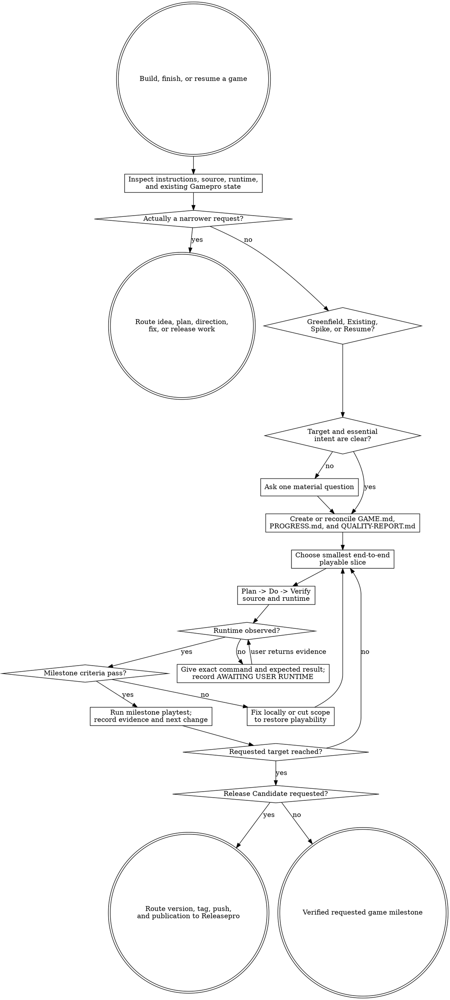

# Gamepro

Build the game now, keep it playable, and make the distance to the requested finish line visible. Gamepro is one direct executor, not a simulated studio or document-first pipeline.



Resolve the owning work root and maintain `agent-work/{slug}/WORK.md` using [the canonical work-artifact contract](contracts/work-artifacts.md). Write Gamepro state only under `agent-work/{slug}/gamepro/`; place game source and reader-facing documentation wherever the target project already expects them.

Read [REFERENCE.md](REFERENCE.md) before defining the milestone contract or runtime gates. Apply [Goalpro's quality contract](contracts/execution-quality.md) proportionally throughout execution.

## Boundaries and routing

Gamepro owns requests to build, finish, continue, or resume a game through a playable milestone. A bounded build request authorizes normal source edits and local verification; do not ask for per-file approval.

- Route idea-only exploration with no request to build to `brainstormpro`.
- Route a plan-only request to `planpro`.
- Route visual-language or art-direction work without implementation to `design-direction`.
- Route one bounded defect in an otherwise scoped project to the host's diagnostic workflow or `goalpro` when the user asks for persistent execution.
- Route versioning, changelog, commit, tag, push, store upload, or publication of an already finished game to `releasepro`.
- Keep actual release operations out of Gamepro. Gamepro may prepare and verify an optional Release Candidate, then hand the unchanged game state to Releasepro.
- Do not require a full design document, architecture package, ADR set, backlog, story breakdown, sprint, named expert, subagent, hook, or fixed repository layout.
- Do not change external services, production data, credentials, paid resources, legal text, store listings, or remote repositories without the authority that action normally requires.

## 1. Inspect before asking

Read applicable instructions, manifests, project files, existing commands, source, tests, docs, assets, version control state, and prior Gamepro artifacts. Determine the mode from evidence:

- `GREENFIELD` — no game implementation exists; preserve the user's chosen runtime or infer the lightest suitable option from local evidence.
- `EXISTING` — extend the current game in its established engine, architecture, and conventions.
- `SPIKE` — prove a risky mechanic or runtime question quickly; its terminal target is First Playable unless the user expands it.
- `RESUME` — reconcile recorded state with current source and continue at the first unmet criterion.

Ask at most one focused question at a time, and only when the answer materially changes fantasy, platform/input, engine, target milestone, content boundary, safety, cost, or release authority. Prefer a reversible assumption when it does not threaten the user's intent. Record assumptions in `GAME.md` and keep moving.

## 2. Set the finish line and state contract

Infer the requested target from the user's words:

- “prototype,” “prove this mechanic,” or “make it playable” → `FIRST PLAYABLE`.
- “MVP” or “minimal complete game” → `MVP`.
- “finish,” “complete,” “V1,” or an unqualified request to build the game end to end → `V1`.
- “release candidate,” “ready to ship,” or platform packaging requested as part of the build → `RELEASE CANDIDATE`; actual release operations still route to Releasepro.

Create only these required runtime artifacts:

- `GAME.md` — durable intent, target, milestone ladder, launch path, decisions, non-goals, evidence, and next playable slice.
- `PROGRESS.md` — append-only Plan→Do→Verify log, playtests, self-judgment, blockers, pivots, and resume state.
- `QUALITY-REPORT.md` — proportional quality classifications and final integrated evidence.

`NOTES.md` is optional when sanitized links or scratch decisions add durable value. Do not create additional Gamepro documents merely to mirror teams, phases, or project-management units. Use the schemas in [REFERENCE.md](REFERENCE.md).

## 3. Build First Playable first

First Playable is mandatory even when the requested target is MVP, V1, or Release Candidate. Define one production-thin vertical slice that proves:

1. the player can perform the core verb;
2. the game returns understandable audiovisual or state feedback;
3. the loop can be launched through one exact recorded command or documented interaction; and
4. the agent or user actually observed the result.

Prefer functional placeholders over premature content production. A gray box with a truthful loop beats polished menus around an unproven mechanic. Mark placeholder debt visibly; never let a placeholder silently become accepted final content.

If work accumulates without an executable loop, stop expanding foundations. Cut scope to the smallest playable path, stub only reversible dependencies, and restore a run-observe-adjust cycle. Treat long unplayable stretches as a sunk-cost signal rather than applying a universal clock.

## 4. Execute one playable slice at a time

For each slice:

1. **Plan** — select the smallest end-to-end player-visible or risk-reducing change that advances one unmet “Done when …” criterion.
2. **Do** — edit the actual game, tests, assets, configuration, and durable docs required by that slice.
3. **Verify** — run the narrowest useful gate, then the exact launch/build path. Exercise success plus affected boundary, failure, recovery, input, and accessibility states.
4. **Self-judge** — inspect the integrated result against intent and all applicable quality dimensions.
5. **Log** — append a status-coded entry to `PROGRESS.md`. Every `DONE` must include “I am satisfied this step is complete because …” and cite machine plus runtime or user-playtest evidence.

Use `DONE`, `WIP`, `BLOCKED`, `SKIP`, `STRENGTHENED`, or `FLAKE-FIXED`. When the same gate fails after three substantive fixes, classify it as local or external. Continue independent slices when safe; otherwise record the blocker and ask one focused question.

## 5. Verify runtime honestly

Use only evidence the current host can actually observe.

- If the runtime is available, launch the game, exercise the affected loop, inspect logs or console output, and record what was observed.
- If the runtime is unavailable, provide one exact project-specific command or interaction and the expected visible result. Mark the criterion `AWAITING USER RUNTIME`; do not claim it passed.
- When the user returns output or observations, record them as `USER-OBSERVED`, distinguish them from agent-observed evidence, and resume at the waiting gate.
- If neither party can run the game, mark `BLOCKED EXTERNAL` and continue only work whose correctness does not depend on pretending the runtime passed.
- A build, typecheck, imported scene, or generated file does not by itself prove gameplay.

## 6. Advance through the visible milestone ladder

Keep milestone definitions genre-specific except for these invariants:

### First Playable

The core verb and feedback loop run, the launch path is exact, and runtime evidence is observed.

### MVP

The player can complete a minimal start → play → resolution → restart loop. Verify the critical input, loading/empty, error or invalid-state, pause/cancel where applicable, and recovery behavior. Placeholders may remain only when listed as debt that does not invalidate the loop.

### V1

The user-approved content boundary is complete. Applicable game feel, UI/input, accessibility, audio/visual/content, persistence, performance, tests, documentation, and integrated playtest evidence pass. Do not invent a universal feature checklist.

### Release Candidate

Optional unless shipping readiness is requested. Verify applicable packaging, licenses, configuration, saves or migrations, online/security behavior, accessibility, performance, recovery, and known manual actions. Then route release mutations to Releasepro.

After First Playable, MVP, and V1, conduct a real playtest and append: best moment, worst or confusing moment, unexpected behavior, whether the current hypothesis held, and the next change. A failed hypothesis is evidence to pivot or cut scope, not a reason to defend sunk work.

## 7. Show progress after every meaningful loop

Keep user feedback compact and use this exact status shape:

```text
Target: {FIRST PLAYABLE | MVP | V1 | RELEASE CANDIDATE}
Current milestone: {number and name}
Playable now: {yes, no, or awaiting user runtime} — {exact launch path}
Last verified evidence: {concise evidence}
Next playable slice: {one end-to-end change}
Remaining milestones: {ordered names or none}
Blocker: {none or exact blocker}
Needs from user: {nothing or one action/question}
```

Do not hide progress behind file counts, percentage guesses, or internal role activity. If the target changes, record who changed it, why, and how the remaining milestones changed.

## 8. Resume and reconcile

On resume, read `GAME.md`, `PROGRESS.md`, `QUALITY-REPORT.md`, `WORK.md`, applicable instructions, current source, and current gates. Re-run the recorded launch path when possible. Compare recorded milestone evidence with current behavior:

- continue at the first unmet criterion when state agrees;
- append a drift entry and repair or re-scope when source invalidates recorded evidence;
- surface material product or target changes instead of silently redefining done;
- never restart the workflow or recreate approved decisions merely because the session changed.

## 9. Apply conditional game-development judgment

Classify the six lenses in [REFERENCE.md](REFERENCE.md) as `APPLICABLE`, `NOT APPLICABLE`, or `LATER MILESTONE` for the current slice. Use them as perspectives, never mandatory personas:

1. player and creative intent;
2. mechanics and systems;
3. technical runtime;
4. experience, content, and accessibility;
5. quality, playtest, performance, security, and privacy;
6. delivery and release.

Activate deeper checks when the game introduces saves, networking, user-generated content, telemetry, commerce, external services, localization, large content sets, or constrained platforms. Optional image, audio, browser, or parallel-agent capabilities may accelerate work but never alter artifacts or done criteria. Use declared placeholders, manual runtime checks, and single-agent execution when those capabilities are absent.

## 10. Finish with integrated evidence

Before completion, exercise a representative end-to-end flow across the requested milestone, re-run the full detected project gate, inspect the final diff, reconcile every quality dimension, and remove or document debug paths, temporary flags, hidden placeholder debt, and manual actions.

Finish only when every requested criterion is `VERIFIED`, `NOT APPLICABLE`, or explicitly `WAIVED`; `AWAITING USER RUNTIME`, `BLOCKED EXTERNAL`, and `UNKNOWN` are not completion states. Update `WORK.md` and `QUALITY-REPORT.md`, then state: “I am satisfied this game milestone is complete because …” with the launch, playtest, machine-gate, and remaining-debt evidence.

## Optional shared Theme Library

When a material palette decision exists, discover `theme-library` through the host skill registry or sibling directory. If found, read it and use embedded mode while keeping artifacts in this stage. If absent, continue with game, genre, brand, and accessibility evidence. Treat palette DNA as creative source material unless exact fidelity is explicitly requested.
