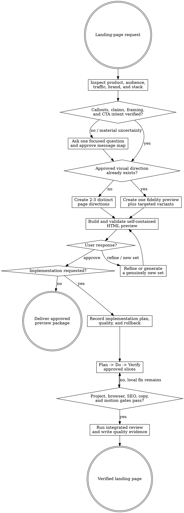

# Landing Page

Create an evidence-backed landing page, earn approval through a working HTML preview, then implement and verify it directly. This skill is a standalone executor and never requires Goalpro.



Resolve the owning work root and maintain `agent-work/{slug}/WORK.md` using [the canonical work-artifact contract](contracts/work-artifacts.md) when present, otherwise use the bundled [portable contract](contracts/work-artifacts.md). Write stage artifacts under `agent-work/{slug}/landing-page/`.

Read [REFERENCE.md](REFERENCE.md) before shaping the message, page, SEO, or implementation. Read [PREVIEW.md](PREVIEW.md) completely before generating HTML. For a search-targeted page, also apply [the SEO page-quality contract](contracts/seo-page-quality.md) and [the SEO change-control contract](contracts/seo-change-control.md).

## Boundaries

- Inspect freely, but do not mutate application source until the user approves a named preview revision. A user-provided approved preview or explicit instruction to implement an unchanged, already-approved direction satisfies the gate when provenance is recorded.
- Never invent product capabilities, customer quotes, logos, metrics, awards, integrations, pricing, urgency, scarcity, guarantees, or search demand. Mark missing proof plainly.
- Do not impose a universal hero-feature-proof-pricing-FAQ sequence. Choose persuasion order from visitor intent, objections, commitment, maturity, price, and traffic source.
- Do not use dark patterns, disguised controls, misleading countdowns, preselected consent, inaccessible urgency, or CTAs whose labels conceal the result.
- Keep preview code inside the skill stage. It is a decision artifact, not production code.
- Do not change live analytics, advertising, domains, production configuration, CMS content, or external services without separate authorization.
- When an approved SEO Stack opportunity exists, preserve its primary owner, search intent, protected winners, internal-link responsibilities, and measurement guardrails. Treat any upstream title, outline, modules, proof format, or page brief as a hypothesis. Landing Page owns page-specific benchmarking, persuasion, CTA, visual direction, preview, approval, and bounded page implementation—not SEO portfolio strategy.
- Classify search-facing language as factual, derived, comparative, persuasive, or navigational. Do not treat truthful persuasion or useful query language as an unsupported factual claim, and do not disguise a factual or comparative claim as persuasion.
- Improve before removing visible copy, FAQs, fallback sections, titles, descriptions, CTAs, or modules. Inspect available product facts, traits, taxonomy, relationships, and actions; compare retain, restore, rewrite, and reject options.
- Evaluate visible FAQ usefulness independently from FAQ structured-data eligibility. Repeated template framing is not automatically harmful duplication; judge the complete page and attempt an entity-specific improvement first.
- When a search-targeted canonical production page is newly published or materially updated, emit exact publication evidence for `seo-indexing`; do not request indexing inside Landing Page or claim the page is indexed.
- Do not invoke Goalpro. This skill owns its approved implementation loop.

## 1. Establish product truth and conversion intent

Inspect product docs, implementation, screenshots, routes, pricing, brand guidance, research, analytics evidence, current copy, search intent, and available proof. Separate `EVIDENCE`, `USER DECISION`, `ASSUMPTION`, and `UNKNOWN`.

For an explicitly search-targeted page or when same-slug SEO artifacts are supplied or discovered, follow the optional SEO Stack consultation below before shaping the message. An approved `seo-strategy` page opportunity establishes the portfolio owner and intent, but it does not establish a page title, structure, modules, proof format, or competitive quality. Material owner, URL, intent, or protected-winner conflicts return to Strategy rather than being resolved in the preview.

Before shaping the message, write `PAGE-BENCHMARK.md`, `PAGE-REQUIREMENTS.md`, and `EDITORIAL-REVIEW.md` under the shared page-quality contract. Inspect the current owner plus representative current results and full pages for the exact query scope. Set `PUBLISH`, `REVISE`, `NO PAGE`, or `BLOCKED`; only `PUBLISH` may proceed to message and preview approval.

Use the bundled `templates/` files for every matching artifact rather than recreating their structure. Write `RESEARCH.md` and `MESSAGE-MAP.md`. The message map must cover audience, arrival intent, problem, desired outcome, unique approach, prioritized product callouts, feature-to-benefit framing, differentiation, proof, objections, risk reversal, and CTA ladder.

Engage the user on material product truth. Ask one focused question at a time when callouts, benefits, claims, or framing cannot be verified. Before previewing, obtain approval for every material `USER DECISION` and claim that the page will emphasize. Do not make the user reconfirm facts already explicitly approved in the current request or a cited authoritative brief.

## 2. Build the copy and SEO strategy

Write `COPY-DECK.md` with headline hierarchy, supporting copy, product highlights, proof copy, objections, CTA labels, microcopy, and source evidence. Prefer outcome-describing CTA labels over generic verbs. Preserve a clear primary action and make secondary actions subordinate.

Discover `prose-humanizer` through the host skill registry or as the sibling `../prose-humanizer/SKILL.md`. When available, read it and use embedded mode; keep all evidence in this stage. If unavailable, use the humanization fallback in `REFERENCE.md`. Humanization must preserve approved claims, conversion intent, brand voice, markup, and product terminology.

Write `SEO-PLAN.md` with an explicit `INDEX`, `NOINDEX`, or `UNRESOLVED` disposition; upstream opportunity and owner when applicable; benchmark and editorial verdict; traffic/query intent; protected winners and overlap exclusions; title and description; canonical and crawl behavior; heading and information architecture; internal links; entities and structured data; social metadata; performance implications; and post-launch measurement. SEO must serve the visitor and never distort the approved message or silently change an upstream ownership decision.

For a search-targeted page, test the title for truth, appeal, differentiation, evergreen durability, and catalogue scalability. Removing an unsupported superlative is only a truth correction; the replacement must still give the user a concrete reason to choose the page.

For every proposed user-facing SEO change, write `SEO-CHANGE-LEDGER.json` from the shared change-control contract. For a new page, use an explicit `NO EXISTING PAGE` baseline rather than inventing prior copy. The ledger is mandatory for a shared template, more than one route, any deletion or suppression, and every title, description, FAQ, structured-data, CTA, module-visibility, or link-copy change. Record exact representative before/after values, terms gained and lost, persuasion and conversion mechanisms, unused evidence considered, canary, rollout, and rollback. The ledger is part of the proposed preview package, not evidence that the proposal is good.

## 3. Choose directions adaptively

Inventory existing brand assets, tokens, typography, imagery, components, responsive behavior, and approved visual-language artifacts.

- **Approved direction exists:** create one implementation-fidelity concept. Add targeted variants only for unresolved choices such as the hero, CTA treatment, product demonstration, proof, or page ending.
- **No approved direction exists:** create two or three options that differ in persuasion model and design logic, not merely color. Examples include product-first, narrative, technical deep dive, editorial, comparison, interactive demonstration, or visual showcase; treat these as possibilities, not templates.

Record options, recommendation, evidence, trade-offs, invalidation signals, and decision status in `PAGE-DIRECTIONS.md`. Consult Theme Library in embedded mode when a material palette decision exists and the skill is discoverable. Keep artifacts here.

## 4. Preview and iterate before implementation

Create `LANDING-PAGE-PREVIEW.html` and immutable `previews/LANDING-PAGE-PREVIEW-R{n}.html` revisions. The preview must be self-contained, responsive, keyboard accessible, realistic, and explicit about claims, CTA behavior, motion, mobile behavior, SEO posture, trade-offs, and unavailable proof.

Run:

```bash
python3 {landing-page-skill-root}/scripts/validate_landing_page_preview.py \
  agent-work/{slug}/landing-page/LANDING-PAGE-PREVIEW.html
```

Open the file and manually exercise all controls at narrow and wide viewports, 200% zoom, keyboard-only input, and reduced motion. A passing validator does not prove taste, contrast, copy quality, or runtime feel.

Present the clickable preview only after validation. Accept three outcomes:

1. `REFINE` — update the selected concept or targeted variant.
2. `NEW SET` — preserve rejection reasons and create genuinely different directions.
3. `APPROVE` — record the exact revision and approved scope. For a search-targeted page, approval covers production editorial changes only when the exact ledger revision, digest, and change IDs were presented; then record `SEO-CHANGE-APPROVAL.json`. A preview approval without that exact scope remains preview approval only.

Never implement while the preview remains provisional.

When the requested outcome is preview or direction only, approval of a named revision completes the source-safe preview mode. Write `QUALITY-REPORT.md` with product-truth, message, copy, preview-validator, keyboard, responsive, zoom, reduced-motion, and remaining-manual evidence; mark production implementation, deployment, analytics, and live SEO outcomes `NOT APPLICABLE` or explicitly pending. Update `PROGRESS.md` and `WORK.md`, deliver the immutable preview package, and stop before Steps 5-7.

## 5. Plan the approved implementation

Inspect the target toolchain and write `IMPLEMENTATION-PLAN.md` with source targets, component boundaries, content/assets, SEO, analytics events already authorized, TurbulenceJS target map, test plan, performance budget, rollout, and rollback.

Before source mutation, validate the exact approved SEO ledger when one is required:

```bash
python3 {landing-page-skill-root}/scripts/validate_seo_change_control.py \
  --ledger agent-work/{slug}/landing-page/SEO-CHANGE-LEDGER.json \
  --approval agent-work/{slug}/landing-page/SEO-CHANGE-APPROVAL.json
```

Implement only approved change IDs. Any altered after-value, transformation rule, route count, rollout, or rollback invalidates the approval and returns to preview and exact approval.

Classify the dimensions in [Goalpro's quality contract](contracts/execution-quality.md) when available. If it is absent, use the quality matrix in `REFERENCE.md`. Product truth, conversion clarity, copy fidelity, accessibility, responsive behavior, SEO, performance, motion, maintainability, and final runtime behavior are presumptively applicable.

## 6. Implement with purposeful TurbulenceJS motion

Discover and read `turbulencejs-integration` through the host registry or sibling directory. Verify exact APIs against the installed package exports and declarations. If the specialist skill is unavailable, follow the bounded fallback in `REFERENCE.md` and mark exact unverified APIs before mutation.

Use TurbulenceJS for a small set of semantic roles that reinforce hierarchy, product understanding, CTA feedback, or spatial continuity. Routine behavior stays restrained. Record entrypoints, style, intensity, ownership, interruption, teardown, reduced-motion endpoints, and replaced primitives. Intensity 3-4, raster effects, or theatrical motion require explicit approval.

Implement each slice with Plan -> Do -> Verify. Append `WIP`, `DONE`, `BLOCKED`, `SKIP`, `STRENGTHENED`, or `FLAKE-FIXED` entries to `PROGRESS.md`. Every `DONE` entry must state: “I am satisfied this step is complete because …” and cite machine plus rendered/runtime evidence.

When the same gate fails after three substantive fixes, classify local versus external blockage. Continue independent work when safe; otherwise record the blocker and ask one focused question.

## 7. Verify the integrated page

Run the target project's full applicable tests, types, lint, build, and browser checks. Verify:

- approved product callouts, claim provenance, feature-benefit framing, and CTA destinations;
- humanized copy without factual drift, broken bindings, or lost product language;
- semantic HTML, headings, focus order, labels, landmarks, contrast, zoom, keyboard, touch, and assistive behavior;
- representative narrow, medium, and wide layouts plus text expansion and content extremes;
- metadata, canonical/index posture, structured data validity, crawlable content, internal links, and social cards when applicable;
- approved SEO Stack owner, intent boundary, protected winners, internal-link map, and measurement baseline when applicable;
- dated page benchmark, title and catalogue durability, visible information advantage, and final `PUBLISH` verdict when search-targeted;
- exact approved SEO change IDs, rendered before/after values, terms and persuasion cues gained or lost, canary result, and absence of unapproved user-facing deltas when change control applies;
- performance budgets, image/font behavior, layout stability, hydration, console, and network failures;
- TurbulenceJS normal endpoint, reduced motion, rapid interruption, retargeting, cleanup, idle behavior, and absence of competing ownership;
- authorized analytics only, with consent and privacy behavior preserved.

Write `QUALITY-REPORT.md`, update `WORK.md`, and extract durable reader-facing documentation into the target project's normal docs when behavior or operations changed.

## Artifacts

- `RESEARCH.md` — evidence, visitors, arrival intent, product truth, brand/stack inventory, constraints, and unknowns.
- `MESSAGE-MAP.md` — callouts, framing, claims/proof, objections, CTA ladder, approval provenance.
- `COPY-DECK.md` — approved page and microcopy plus embedded humanization evidence.
- `SEO-PLAN.md` — index posture, search intent, semantics, entities, metadata, links, structured data, performance, measurement.
- `PAGE-BENCHMARK.md`, `PAGE-REQUIREMENTS.md`, and `EDITORIAL-REVIEW.md` — conditional search-targeted competitive evidence, requirement strength, title/catalogue review, verdict, and approval.
- `SEO-CHANGE-LEDGER.json` and `SEO-CHANGE-APPROVAL.json` — conditional exact before/after change set, digest-bound approval, canary, rollout, and rollback for search-targeted pages.
- `PAGE-DIRECTIONS.md` — adaptive options, recommendation, revisions, feedback, and approval.
- `LANDING-PAGE-PREVIEW.html` and `previews/` — validated current alias and immutable revisions.
- `IMPLEMENTATION-PLAN.md` — approved target map, slices, gates, motion, rollout, and rollback.
- `PROGRESS.md` — append-only preview and implementation log.
- `QUALITY-REPORT.md` — proportional quality evidence and final integrated verification.
- `NOTES.md` — optional sanitized research or decisions only.

Use the examples and schemas in [REFERENCE.md](REFERENCE.md). Templates are starting structures, never substitutes for project evidence.

## Done

- **Preview-only complete:** product truth and framing are approved; a named immutable preview revision passes structural and manual preview gates; copy remains human and factual; CTA intent and destinations are explicit; any search-targeted page retains an approved `PUBLISH` verdict against a current benchmark; production mutation is absent; `QUALITY-REPORT.md`, `PROGRESS.md`, and `WORK.md` point to the preview evidence and pending implementation boundary. State: “I am satisfied this landing-page preview is complete because …”.
- **Implementation complete:** the preview criteria remain met; production matches the approved revision; any required SEO change ledger and approval validate and match the final rendered diff; applicable project, browser, SEO, accessibility, responsive, performance, and TurbulenceJS gates pass; all quality dimensions end `VERIFIED`, `NOT APPLICABLE`, or explicitly `WAIVED`; and `WORK.md` points to final evidence. State: “I am satisfied this landing page is complete because …”.

## Optional SEO Stack consultation

Use this integration only when the request is search-targeted, an SEO brief is supplied, or same-slug SEO artifacts are discoverable. Ordinary campaign or product landing pages do not require the SEO Stack.

1. Discover `seo-strategy` through the host skill registry; if the host has no registry, resolve sibling `../seo-strategy/SKILL.md`. Read it and validate `CONTENT-PORTFOLIO.csv`, `PAGE-OPPORTUNITIES.md`, the approval revision, owner, intent, protected winners, internal-link role, and measurement plan.
2. Follow Strategy's pointers to `seo-foundation` and `seo-setup` only as needed to validate ownership or fragile setup evidence. Do not duplicate competitor/keyword research or silently repair upstream decisions.
3. Keep the Strategy owner and user job fixed while Landing Page benchmarks the exact page and decides title, message hierarchy, proof, CTA ladder, persuasion, layout, visual direction, preview, and implementation. Route a material owner, URL, query-intent, or cannibalization change back to `seo-strategy`; route an editorial asset without material landing-page decisions to `seo-content`.
4. When live technical evidence is useful, discover `seo-setup`, read its `CLI.md`, confirm schema compatibility, and use only compatible read-only `seo-stack inventory`, status, or validation commands. The CLI is optional agent tooling; never install it into the target application, request provider credentials for a prose/design-only task, or use it for external mutation.
5. Record upstream paths, revision/freshness, preserved decisions, CLI receipts or fallback evidence, indexing-assistance eligibility, and unresolved gaps in `RESEARCH.md` and `SEO-PLAN.md`. Embedded SEO consultation keeps artifact ownership in Landing Page.
6. After an approved canonical production target is observed, hand its final URL, owner, publication time, canonical/index/sitemap/link posture, and receipt path to `seo-indexing`; pass both page and indexing receipts to `seo-monitor` without inventing outcomes.

If the SEO skills are unavailable, continue the existing product-truth and SEO workflow, label inferred ownership and demand as unverified, and disclose the missing stack only when it materially limits an indexable page decision.

## Optional shared Theme Library

When a material palette decision exists, discover `theme-library` through the host registry or sibling directory. If found, read it and use embedded mode while keeping artifacts in this stage. If absent, continue with product and brand evidence. Never depend on repository-level instructions for discovery.
