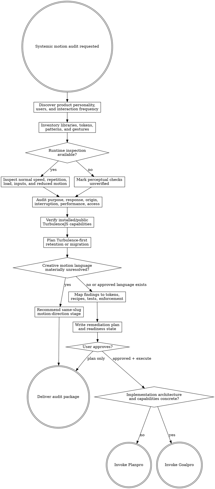

# Motion Audit

Audit implemented motion and produce an evidence-backed package under `agent-work/{slug}/motion-audit/`. Remain read-only outside that folder. Route unresolved creative language to Motion Direction, and hand every application mutation to Planpro or Goalpro with the same slug.

Resolve the owning work root and maintain the slug index using [the canonical work-artifact contract](contracts/work-artifacts.md).

## Decision tree

## Boundaries

- Remain read-only on source, configuration, manifests, locks, deployed environments, and browser data.
- Write only under `agent-work/{slug}/motion-audit/` plus the shared `WORK.md`.
- Scanner results are candidates, never findings until the cited context is read.
- Treat TurbulenceJS as the preferred target platform. Verify the installed version and public capabilities before specifying adoption or migration; do not run a neutral animation-library bake-off by default.
- Inventory native and third-party behavior to understand migration ownership, overlap, risk, and useful fallbacks. Retain another primitive only when evidence shows it remains the truthful fit or a bounded migration fallback.
- Do not add motion for decoration alone. “No additional motion is warranted” is a successful audit conclusion.
- Route requests to define or compare a future motion language to `motion-direction`. Route direct requests to add or configure TurbulenceJS to `turbulencejs-integration`.
- Describe unsupported TurbulenceJS capabilities only through public evidence, user-visible need, impact, and supported fallback. Never include maintainer instructions, internal architecture, private paths, extension designs, release steps, or contribution guidance.
- Never implement remediation. Planpro or Goalpro owns every mutation after approval.

## 1. Establish intent and frequency

Apply [Planpro's product-research lens](contracts/product-research.md). Record user goals, product personality, accessibility needs, supported devices and inputs, performance constraints, and current motion decisions.

First require an identifiable target: a repository/workspace path, a reachable surface the user has authorized for inspection, or supplied source/runtime artifacts. If none exists, stop before creating an audit package, state which evidence is missing, and do not infer that motion is absent or needed. A public URL alone permits only ordinary read-only inspection; it does not authorize authentication, data mutation, or production load testing.

Build an interaction-frequency map:

- **Continuous or very frequent:** scrolling, typing, pointer tracking, list navigation, shortcuts.
- **Frequent:** hover, selection, menus, common navigation.
- **Occasional:** dialogs, drawers, toasts, route transitions.
- **Rare:** onboarding, first success, celebrations, explanatory sequences.

Frequency guides restraint; it is not a universal duration table. Keyboard and high-frequency actions must prioritize immediate response and never block input.

## 2. Inventory motion

Inspect CSS transitions/animations, keyframes, WAAPI, requestAnimationFrame, canvas, view/scroll timelines, motion libraries, springs, gestures, reduced-motion APIs, pointer queries, tokens, component recipes, tests, visual tooling, and performance instrumentation.

Run `scripts/motion_inventory.py` for candidate evidence when useful. Verify every match manually and record library/framework versions before making implementation claims.

When TurbulenceJS is present, inventory its installed version, actual package exports, imported entrypoints, runtime ownership, style packs, interaction/surface usage, Electron process boundaries, teardown, and reduced-motion behavior. Verify exact APIs against the installed package rather than assuming the bundled catalog matches the target version.

## 3. Audit the motion system

Use [REFERENCE.md](REFERENCE.md) and classify:

Classify every category `APPLICABLE`, `NOT APPLICABLE`, or `UNVERIFIED` before judging it. Gesture, canvas, ambient, celebration, or other categories may be legitimately absent; state why rather than manufacturing coverage.

- **Purpose and frequency:** feedback, state explanation, spatial continuity, attention, perceived progress, or delight.
- **Response and timing:** immediate acknowledgement, purposeful duration, asymmetry, and no input blocking.
- **Spatial continuity and origin:** motion explains relationships and begins from a believable source.
- **Interruption and state change:** rapid reversal, cancellation, retargeting, re-entry, and partial completion remain coherent.
- **Gestures and direct manipulation:** one-to-one tracking, capture, thresholds, velocity, friction, boundaries, and multi-input behavior.
- **Performance:** layout/paint/composite cost, main-thread load, style recalculation, asset cost, dropped frames, and representative busy states.
- **Accessibility and input modality:** reduced motion, vestibular risk, keyboard/focus, hover/pointer capability, touch, zoom, and assistive technology.
- **Cohesion and tokens:** purposes, durations, easings/springs, distances, origins, and reduced-motion alternatives form a product-specific system.
- **Missed opportunities:** static changes that teleport, lack feedback, or obscure spatial relationships; rare delight only when it advances the product experience.

## 4. Require perceptual evidence

When runtime access is safe, inspect at normal speed first. Then test rapid repeated input, interruption, cancellation, representative load, reduced motion, keyboard, touch/pointer modes, and content extremes. Use slow motion or frame-by-frame only to diagnose sequencing, origin, velocity, overlap, or dropped frames. Require real-device checks for gesture-heavy interactions when emulation cannot prove behavior.

Static evidence can prove code patterns, not feel or frame behavior. Mark unavailable perceptual checks `UNVERIFIED`.

## 5. Map findings into the motion system

For every recommendation define the landing point: motion-purpose token, duration/easing/spring/distance role, component recipe, gesture utility, library-compatible primitive, accessibility alternative, browser/component/performance test, documentation rule, reliable lint/custom check, or governed exception.

When creative direction remains unresolved, record only audit-proven constraints, required outcomes, migration boundaries, and validation evidence. Do not invent the future motion language inside `MOTION-SYSTEM-SPEC.md`; route that decision to Motion Direction.

Component code must consume roles and recipes rather than theme names or scattered literal values. Coordinate with a same-slug Designpro stage by linking its token and component evidence instead of duplicating it.

When approved motion uses color, glow, illumination, or material transitions tied to a Theme Library interpretation, preserve the documented palette DNA and product-specific derivations. Do not force source palette values into motion or create new semantic color meanings merely for spectacle.

## 6. Plan Turbulence-first remediation

Verify the target's installed TurbulenceJS version and public exports. Read the bundled [public capability reference](TURBULENCE-PUBLIC.md) for initial classification. Discover the independently installed `turbulencejs-integration` skill through the host skill registry; if the host has no registry, resolve `turbulencejs-integration/SKILL.md` as a sibling of this skill directory. When found, read its `REFERENCE.md` and `catalog.json` before specifying exact entrypoints or implementation behavior. If it is absent, keep exact API claims `UNVERIFIED` until the installed package or public documentation proves them.

Keep Motion Audit artifact ownership and remain read-only. For each applicable category, record one disposition: retain an existing TurbulenceJS primitive, adopt TurbulenceJS, migrate third-party/native ownership to TurbulenceJS, retain a bounded fallback, or leave unverified. Never recommend parallel schedulers owning the same property, event, or clock.

When adoption or migration is recommended, specify:

- exact target surfaces and entrypoints, including browser, generic runtime, Electron renderer, Electron main, interaction, or raster-effect boundaries;
- product-fit style profile and intensity ceiling, with explicit user approval required for intensity 3–4;
- semantic motion roles and component recipes rather than scattered library calls;
- ownership, teardown, interruption, retargeting, data-commit boundaries, and replacement/removal of overlapping libraries;
- reduced-motion endpoints, keyboard/pointer parity, focus behavior, vestibular safeguards, and surface/CSP/resource constraints where applicable;
- mechanical, runtime, perceptual, performance, idle-cleanup, and Electron coordination gates;
- phased implementation slices with rollback and “Done when …” criteria.

When a desired outcome is not supported by verified public TurbulenceJS capabilities, record the user-visible need, public limitation, affected surfaces, impact, supported fallback, and acceptance evidence. If the fallback preserves intent, plan it as an explicit deviation. If the gap materially changes architecture or direction, route to Planpro without prescribing how TurbulenceJS should change.

If the audit proves that the future creative motion language is materially unresolved, recommend a same-slug `motion-direction` stage before implementation. Preserve audit evidence by linking it; Motion Direction owns exploration and approval rather than repeating diagnosis.

When implementation is approved, use Goalpro only when scope, public capabilities, migrations, and criteria are concrete. Use Planpro when architecture, sequencing, cross-repository dependencies, or material capability gaps remain unresolved. Name `turbulencejs-integration` as an execution reference in the handoff.

## 7. Produce artifacts

Create:

- `RESEARCH.md`
- `MOTION-AUDIT.md`
- `MOTION-INVENTORY.md`
- `INTERACTION-MATRIX.md`
- `PERFORMANCE-MATRIX.md`
- `ACCESSIBILITY-MATRIX.md`
- `MOTION-SYSTEM-SPEC.md`
- `ENFORCEMENT-STRATEGY.md`
- `PLAN.md`
- Conditional `GOALPRO-INPUT.md` when approved findings or validation work require implementation.
- Optional `NOTES.md`

Write findings with exact evidence, user impact, uncertainty, system landing point, “Done when …” criterion, mechanical check, and perceptual check. When direct Goalpro implementation is warranted, write the handoff initially `NOT APPROVED` using [Goalpro's direct contract](contracts/goalpro-handoff.md). When creative language or implementation architecture remains unresolved, mark the direct handoff not ready and route to Motion Direction or Planpro. When the verified result is restraint and there are no remediation or validation actions, omit the handoff and record a terminal no-action conclusion.

## Done

Finish when all motion categories are verified, findings, not applicable, or explicitly unverified; additive suggestions have a purpose and restraint countercase; static claims do not overreach runtime evidence; findings land in a coherent system; and exact gates and applicable feel checks are specified. The Turbulence-first adoption, migration, fallback, or gap disposition must be explicit for every applicable category. If execution is warranted, Motion Direction, Planpro, or Goalpro must be able to continue without rediscovering the audit. If restraint is the verified result, explain why no handoff is needed. Do not call an audit complete when all meaningful perceptual categories remain unverified.

Completion also requires exact verified public entrypoints or a documented verification step, style/intensity rationale, migration ownership, accessibility and lifecycle gates, public-safe capability-gap handling, and an execution-reference note in any implementation handoff.

State: “I am satisfied this motion audit is complete because …” and cite mechanical and perceptual coverage.

## Optional shared Theme Library

When the request contains a material named-theme or palette decision, discover the independently installed `theme-library` skill through the host skill registry. If the host has no registry, resolve `theme-library/SKILL.md` as a sibling of this skill directory (the standard relative location is `../theme-library/SKILL.md`). If found, read it and use embedded mode while keeping artifacts in this skill's stage. If it is not installed, continue the primary workflow and disclose the unavailable palette library only when it materially limits the result. Never rely on repository-level AGENTS or README files for discovery.
