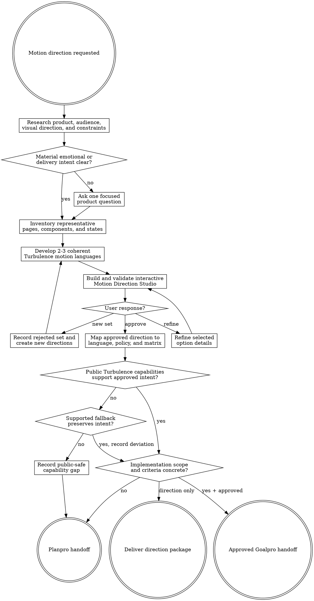

# Motion Direction

Turn product intent into an approved TurbulenceJS-first motion language under `agent-work/{slug}/motion-direction/`. Remain read-only outside that folder. Compare complete motion systems visually before mapping the selected direction into policy. Hand every application mutation to Planpro or Goalpro with the same slug.

Resolve the owning work root and maintain the slug index using [the canonical work-artifact contract](contracts/work-artifacts.md).

## Decision tree

## Boundaries

- Remain read-only on application and TurbulenceJS source, configuration, manifests, locks, deployed environments, and external services.
- Write only under `agent-work/{slug}/motion-direction/` plus the shared `WORK.md`.
- Treat TurbulenceJS as the selected creative platform. Verify installed/public capabilities; do not run a neutral library bake-off.
- Create synthetic target-informed planning pages only inside the skill stage. Never copy the preview into product source or call it production-ready code.
- Do not diagnose the implemented motion system comprehensively; route systemic defects, performance, accessibility, and migration evidence to `motion-audit`.
- Route direct package selection or configuration to `turbulencejs-integration`. Route implementation of an approved policy to Planpro or Goalpro.
- Never expose TurbulenceJS maintainer instructions, internal architecture, private paths, extension designs, release steps, or contribution guidance.
- Do not use novelty as permission to delay input, obscure state, overwhelm frequent interactions, break reduced-motion meaning, exceed resource limits, or leak lifecycle work.

## 1. Establish product and emotional intent

Apply [Planpro's product-research lens](contracts/product-research.md). Inspect product purpose, audience, jobs, trust posture, brand, approved visual direction, information density, supported devices and inputs, accessibility needs, performance constraints, themes, and delivery environment. Identify the emotion motion should add: clarity, momentum, tactility, warmth, play, surprise, spectacle, or another product-specific quality.

Require an identifiable target: a repository/workspace, an authorized reachable surface, or supplied source/runtime artifacts. If none exists, ask one focused question before creating an artifact package. Do not infer a generic dashboard when the target is unknown.

Write one evidence-labeled **motion read** covering product, audience, interaction frequency, spatial model, rhythm, desired joy, trust constraints, and expressive ceiling. Mark statements `EVIDENCE`, `ASSUMPTION`, `USER DECISION`, or `UNVERIFIED`. Ask only when a material direction cannot be discovered safely.

## 2. Inventory representative surfaces

Inventory the target's real vocabulary before designing directions:

- application shell, route/page families, navigation, menus, sidebars, drawers, headers, and toolbars;
- overlays, dialogs, popovers, tooltips, tabs, accordions, forms, validation, and controls;
- cards, lists, tables, timelines, charts, editors, media, code, or other product-specific structures;
- skeletons, spinners, loading bars, progress, empty, error, degraded, recovery, success, toast, and notification states;
- direct manipulation, gestures, responsive changes, keyboard/pointer/touch behavior, onboarding, first success, and celebrations;
- current visual/motion tokens, TurbulenceJS version and public exports, other animation ownership, tests, runtime fixtures, and reduced-motion behavior.

Mark every preview specimen `IMPLEMENTED`, `PROPOSED`, or `INFERRED`, with source evidence and importance. When a same-slug `motion-audit` or `design-direction` stage exists, link and reuse its verified evidence rather than repeating diagnosis or creative decisions.

## 3. Develop distinct motion directions

Create two or three coherent whole-product motion languages. Each option must specify:

- product rationale, intended feeling, success signal, guardrail, and invalidation experiment;
- response rhythm, duration/asymmetry posture, spatial model, believable origins, path and depth logic;
- semantic motion roles, choreography, interruption, retargeting, and reduced-motion posture;
- TurbulenceJS public entrypoint or recipe-family hypotheses and an explicit intensity ceiling;
- Essential, Expressive, and Signature delight placement by interaction frequency;
- accessibility, performance, lifecycle, responsive/input, implementation, migration, and rollback implications;
- what it preserves, changes, prohibits, and risks becoming under repetition.

Directions are distinct only when they change at least three consequential relationships among response/rhythm, spatial model/origin, transition choreography, material/effect vocabulary, and delight placement. Palette, easing, duration, or intensity swaps over the same system do not qualify.

Push beyond generic fades and slides. Every direction should investigate at least one product-fit Signature opportunity using distinctive TurbulenceJS cartoon, cinematic, extreme, interaction, effect, or surface behavior. It may reject the opportunity after frequency, accessibility, performance, lifecycle, or trust analysis; it may not skip exploration merely because restraint is easier.

Recommend one option with evidence, but do not ask for selection until the Studio is complete and validated. Do not blend incompatible options silently.

## 4. Build the Motion Direction Studio

For every non-trivial direction decision, create `MOTION-DIRECTION-PREVIEW.html` before asking the user to choose. Read [PREVIEW.md](PREVIEW.md) completely before construction.

Build one self-contained, responsive HTML decision surface with:

- accessible direction, synthetic page/surface, full/reduced-motion, and replay controls;
- the same realistic, sanitized, target-informed content and component structure for every direction;
- representative route entry, navigation, menu/sidebar, overlay, form feedback, data/list update, loading/progress, empty/error/success, notification, and rare delight flows when applicable;
- normal-speed playback first, then explicit rapid interruption/reversal stress controls;
- visible purpose, frequency, semantic role, delight tier, public Turbulence family, reduced endpoint, risk, and trade-off notes;
- responsive narrow and wide states, keyboard operation, focus visibility, and a visible “planning preview, not production” notice;
- no remote scripts, styles, fonts, analytics, customer data, secrets, or untrusted HTML interpolation.

Label each motion specimen `SIMULATED`, `PUBLIC-RUNTIME`, or `UNVERIFIED`. A planning approximation may demonstrate intended feel, but it cannot prove an exact TurbulenceJS API. When the Studio executes installed public TurbulenceJS behavior, expose diagnostics for active owned work, interruption, and settled cleanup. Never fabricate runtime evidence.

Run `python3 {motion-direction-skill-root}/scripts/validate_motion_direction_preview.py agent-work/{slug}/motion-direction/MOTION-DIRECTION-PREVIEW.html` and fix every structural failure. Manually exercise every control by keyboard, inspect normal and reduced motion, replay repeated flows, stress interruption, check narrow/wide layouts and 200% zoom, and view every direction at normal speed before presenting it. When direct local-file rendering is unavailable, follow PREVIEW.md's loopback-only preview fallback; never copy the Studio into product source or upload it merely to review it.

## 5. Iterate to explicit approval

Offer exactly three conversational outcomes:

1. **REFINE** — apply feedback to one or more directions, preserve unaffected distinctions, increment the revision, validate, and present again.
2. **NEW SET** — record the rejected set and reasons, then create two or three genuinely new motion systems rather than renamed intensity variants.
3. **APPROVE** — record the selected option and exact validated preview revision, then map policy.

Maintain an append-only revision table in `DIRECTION-OPTIONS.md`. Save every validated revision at `previews/MOTION-DIRECTION-PREVIEW-R{n}.html`; keep `MOTION-DIRECTION-PREVIEW.html` as the latest alias. Do not finalize the motion language, policy, plan, or Goalpro handoff before explicit approval.

## 6. Govern the selected language

Translate the approved direction into `MOTION-LANGUAGE.md`, `ANIMATION-POLICY.md`, and `COMPONENT-MOTION-MATRIX.md`.

Use three governed delight tiers:

- **ESSENTIAL** — immediate, frequent, reduced-safe feedback and continuity.
- **EXPRESSIVE** — recognizable character for occasional navigation, overlays, transitions, progress, and success.
- **SIGNATURE** — rare memorable moments using distinctive TurbulenceJS capabilities with explicit trigger frequency, resource cap, fallback, interruption, and cleanup.

Tiers are semantic policies, not a global intensity switch. For every applicable component/state category define purpose, trigger, frequency, default tier, allowed escalation, semantic role/token, origin/path, timing/spring hypothesis, public Turbulence family, ownership, interruption/cancellation, reduced endpoint, input/focus behavior, performance/resource budget, lifecycle cleanup, evidence, and status. Mark absent categories `NOT APPLICABLE` with reason; do not manufacture coverage.

The policy must include principles, spatial model, rhythm, choreography, page/component recipes, prohibited patterns, exception process, new-component decision tree, target-project agent/contributor instructions, documentation landing points, enforcement targets, rollout, rollback, and perceptual review. Components consume semantic roles and recipes rather than package calls, theme names, or scattered literal values.

Run `python3 {motion-direction-skill-root}/scripts/validate_motion_policy.py agent-work/{slug}/motion-direction/ANIMATION-POLICY.md agent-work/{slug}/motion-direction/COMPONENT-MOTION-MATRIX.md` before declaring the policy ready. The validator proves coverage and structure, not taste or runtime correctness.

## 7. Handle public capability limits safely

Verify installed/public TurbulenceJS exports and documentation before declaring a limitation. If the approved behavior is unsupported:

- record only the desired user-visible behavior, public limitation, affected surfaces, impact, supported fallback, and acceptance evidence;
- continue with an explicit deviation when the fallback preserves approved intent;
- route to Planpro when the limitation materially changes direction, architecture, sequencing, or dependencies;
- never prescribe how TurbulenceJS should be changed internally.

## 8. Produce artifacts

Create:

- `RESEARCH.md`
- `DIRECTION-OPTIONS.md`
- `MOTION-DIRECTION-PREVIEW.html` plus immutable `previews/` revisions
- `MOTION-LANGUAGE.md`
- `ANIMATION-POLICY.md`
- `COMPONENT-MOTION-MATRIX.md`
- `ENFORCEMENT-STRATEGY.md`
- `PLAN.md`
- Conditional `CAPABILITY-GAPS.md` when approved intent exceeds verified public capabilities.
- Conditional `GOALPRO-INPUT.md` only when scope, capabilities, criteria, and approval make the direct handoff ready.
- Optional `NOTES.md` for sanitized evidence or decisions.

Use [REFERENCE.md](REFERENCE.md) for artifact schemas, option tests, category coverage, tier rules, and handoff readiness. Read the bundled [public TurbulenceJS capability reference](TURBULENCE-PUBLIC.md) before mapping entrypoint families, and use bundled templates rather than recreating artifact structure. Resolve artifact ownership through the generated local [work-artifact contract](contracts/work-artifacts.md).

## 9. Hand off without implementing

- Use Goalpro when the selected direction, application targets, supported public Turbulence capabilities, migration ownership, acceptance criteria, gates, rollout, and rollback are concrete and explicitly approved.
- Use Planpro when implementation architecture, sequencing, cross-repository dependencies, or a material capability limitation remains unresolved.
- Leave the direction package terminal when the user wants policy only.
- Preserve the same slug. Name `turbulencejs-integration` as the public API, lifecycle, interruption, accessibility, process-boundary, and verification reference for execution.

## Done

Finish when evidence and assumptions are separated; representative surfaces reflect the target; two or three motion systems are genuinely distinct and visibly compared; every requested refinement or rejected set is preserved; the selected preview revision has explicit approval; the approved language maps to complete semantic roles, delight tiers, component/state policies, reduced endpoints, lifecycle and performance rules, prohibited patterns, exceptions, and enforcement; capability limits are public-safe; validators pass; and Planpro or Goalpro can continue without rediscovering direction.

State: “I am satisfied this motion direction is complete because …” and cite the selected preview revision, animation policy, component matrix, validator results, and unresolved decisions.

## Optional shared Theme Library

When a material named-theme or palette decision affects glow, illumination, trails, particles, raster treatments, or other motion-linked color, discover the independently installed `theme-library` skill through the host skill registry. If the host has no registry, resolve `theme-library/SKILL.md` as a sibling of this skill directory. If found, use it in embedded mode while keeping artifacts in Motion Direction. If absent, continue and disclose the unavailable palette library only when it materially limits the result. Never create new semantic color meanings merely for spectacle or rely on repository-level instructions for discovery.
