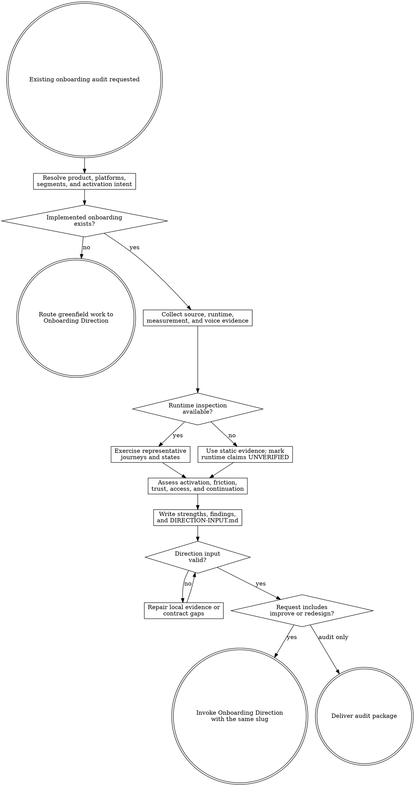

# Onboarding Audit

Audit an implemented onboarding system under `agent-work/{slug}/onboarding-audit/`. Remain read-only outside that stage. Always create a reusable `DIRECTION-INPUT.md`; invoke Onboarding Direction with the same slug only when the request includes improvement or redesign.

Resolve the owning work root and maintain the slug index using [the canonical work-artifact contract](contracts/work-artifacts.md).

## Decision tree



## Boundaries

- Remain read-only on application source, configuration, documentation, manifests, lockfiles, analytics, external services, production data, and deployed environments.
- Write only under `agent-work/{slug}/onboarding-audit/` plus the shared `WORK.md`.
- Use existing read-only sessions and non-mutating inspection only when authorized. Never impersonate a user, create production accounts, change analytics, grant permissions, or submit real personal data merely to complete an audit.
- Audit an implemented journey; route genuinely greenfield onboarding directly to Onboarding Direction.
- Diagnose copy in context but do not rewrite it. Onboarding Direction owns embedded Prose Humanizer composition.
- Treat [FOUNDATIONS.md](FOUNDATIONS.md) as a research-derived heuristic set, not a universal scoring checklist. Product evidence, safety, privacy, regulation, trust, and actual user behavior outrank generic advice.
- Preserve coherent strengths. Do not redesign a recognizable workflow merely because another pattern is fashionable.
- Do not implement remediation. Planpro and Goalpro own all application mutations after an approved direction.

## 1. Establish scope and activation evidence

Apply [Planpro's product-research lens](contracts/product-research.md). Read current product and brand documents, acquisition promises, personas, onboarding specifications, tests, support themes, analytics definitions, approved experiments, existing copy, relevant history, and platform guidance.

Identify:

- primary and materially different secondary users;
- web, native mobile, or cross-platform scope;
- entry sources and prerequisites;
- the earliest action believed to predict retained value;
- observed activation, time-to-value, drop-off, retention, and support signals when available;
- the guardrails that must not regress, including safety, informed consent, data integrity, account recovery, and accessibility.

Do not invent an activation event or numeric target. Label unsupported candidates as hypotheses and name the cheapest evidence that would distinguish them.

## 2. Inventory the current journey

Trace each material segment from entry to first value and early continued use. Include signup or guest use, verification, profile questions, permissions, imports or starter content, education, empty states, loading, validation, errors, cancellation, retry, interruption, resume, success, collaboration, notifications, and later feature introduction where applicable.

Record every representative step in `CURRENT-JOURNEY.md` with platform, segment, entry, user action, requested information, system response, next value gained, evidence, elapsed-time evidence when measured, exit/re-entry behavior, state coverage, and instrumentation.

Use runtime inspection when safely available. Exercise keyboard, touch, assistive-technology semantics, narrow and wide viewports, text expansion, reduced motion, slow or failed network behavior, software keyboard behavior, and permission denial where applicable. When runtime inspection is unavailable, separate static facts from `UNVERIFIED` perceptual or behavioral claims.

## 3. Assess the onboarding system

Read [REFERENCE.md](REFERENCE.md) completely before classifying findings. Evaluate activation alignment, time-to-value, cognitive load, outcome orientation, learning by doing, progressive disclosure, personalization, commitment timing, contextual permissions, starter content, empty states, copy and trust, accessibility, platform ergonomics, performance and interruption resilience, continuation beyond session one, measurement, and experimentability.

For every dimension use `VERIFIED`, `SUPPORTED`, `INFERRED`, `UNVERIFIED`, or `NOT APPLICABLE`. Avoid checklist math and unsupported maturity scores. Rank findings by evidenced user-success impact, confidence, urgency, effort, and reversibility.

Each finding must include an `ONB-{number}` ID, observed behavior, expected outcome, user impact, platform and segment, evidence, foundation principle, severity, confidence, strength to preserve, recommendation boundary, cheapest validation experiment, and related finding IDs. Recommendations describe the problem and outcome; Onboarding Direction owns the new solution.

## 4. Produce the audit package

Create the following artifacts using the exact heading schemas in [REFERENCE.md](REFERENCE.md):

- `RESEARCH.md` — scope, product promise, users, activation evidence, platforms, sources, constraints, quality attributes, contradictions, and unknowns.
- `CURRENT-JOURNEY.md` — step-by-step implemented flow and state inventory by segment and platform.
- `AUDIT-REPORT.md` — executive read, verified strengths, prioritized findings, systemic patterns, measurement gaps, experiment shortlist, and improvement boundary.
- `DIRECTION-INPUT.md` — compact canonical handoff defined in `REFERENCE.md`; link detailed evidence instead of duplicating it.
- `NOTES.md` — optional sanitized source notes.

Run:

```bash
python3 {onboarding-audit-skill-root}/scripts/validate_direction_input.py \
  agent-work/{slug}/onboarding-audit/DIRECTION-INPUT.md
```

Fix every local contract failure before handoff. A valid file may be `PARTIAL` when material evidence is honestly missing; it may not hide the gap.

## 5. Route the result

- **Audit only:** deliver the report and direction-input path. Do not infer authorization to redesign.
- **Audit and improve, redesign, or optimize:** discover `onboarding-direction` through the host skill registry or sibling `../onboarding-direction/SKILL.md`, then invoke it with `DIRECTION-INPUT.md` and the same slug. Direction may continue without another audit-approval gate because it remains read-only and has its own preview approval gate.
- **Direction unavailable:** deliver the valid handoff and explain that the independently installable direction skill is missing. Do not replace it with an ad hoc redesign.
- **Implementation requested:** complete the audit and direction selection first, then route the approved direction through Planpro or a `READY` Goalpro handoff. Never mutate from the audit stage.

## Done

Finish when the implemented journey and relevant states are inventoried; activation claims and metrics are evidenced or explicitly unknown; strengths and findings are traceable; web/mobile dimensions are classified proportionally; runtime limitations are honest; `DIRECTION-INPUT.md` validates; and the request is either delivered as an audit or routed to Onboarding Direction without application mutation.

State: “I am satisfied this onboarding audit is complete because …” and cite the journey coverage, evidence model, validated handoff, runtime limitations, and remaining unknowns.

## Optional shared Theme Library

When the onboarding request contains a material named-theme or palette decision, discover the independently installed `theme-library` skill through the host skill registry. If the host has no registry, resolve `theme-library/SKILL.md` as a sibling of this skill directory (the standard relative location is `../theme-library/SKILL.md`). Use it only as evidence for the existing approved identity; keep artifacts in this skill's stage. If it is not installed, continue the audit and disclose the unavailable palette library only when it materially limits a finding. Never rely on repository-level AGENTS or README files for discovery.
