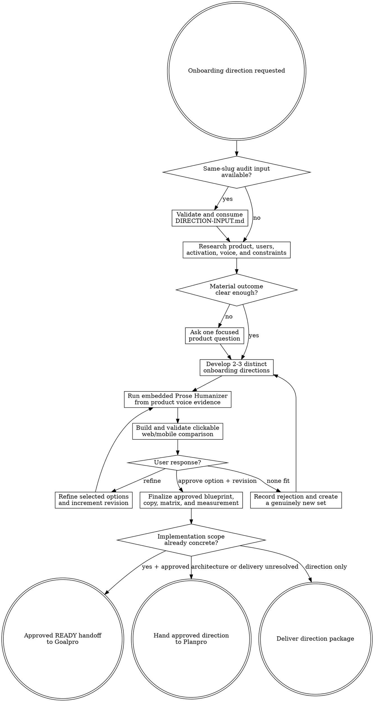

# Onboarding Direction

Turn product evidence or a same-slug Onboarding Audit into an approved onboarding system under `agent-work/{slug}/onboarding-direction/`. Remain read-only outside that stage. Hand implementation to Planpro or Goalpro only after the user approves a named preview revision.

Resolve the owning work root and maintain the slug index using [the canonical work-artifact contract](contracts/work-artifacts.md).

## Decision tree



## Boundaries

- Remain read-only on application source, configuration, documentation, manifests, lockfiles, analytics, external services, production data, and deployed environments.
- Write only under `agent-work/{slug}/onboarding-direction/` plus the shared `WORK.md`.
- Treat the HTML preview as a planning prototype. Never copy it into product source or present it as production-ready web or native code.
- Do not silently change authentication, authorization, billing, consent, permissions, data collection, retention, persistence, notification, safety, or recovery behavior. Expose each material change as a direction decision.
- Do not art-direct the whole product. Reuse approved design-direction artifacts, current brand evidence, and the strongest implemented visual patterns. When identity is unresolved, use a conservative structural preview and label the limitation.
- Use [FOUNDATIONS.md](FOUNDATIONS.md) as research-derived heuristics. Product evidence and trust constraints outrank generic speed or screen-count advice.
- Do not implement the selected direction. Planpro owns unresolved implementation design; Goalpro owns mutations from a complete approved handoff.
- Preview approval selects direction only. It does not authorize application mutation.

## 1. Establish the activation brief

Apply [Planpro's product-research lens](contracts/product-research.md). Read product promises, users, current or proposed journeys, support evidence, analytics definitions, approved experiments, design and brand guidance, neighboring interface copy, accessibility and localization constraints, platform requirements, and delivery boundaries.

When `agent-work/{slug}/onboarding-audit/DIRECTION-INPUT.md` exists or is supplied, validate and read it plus every required source artifact. Preserve finding IDs and strengths. Treat `PARTIAL` gaps as explicit assumptions or experiments. Stop on `BLOCKED` until its named condition is resolved.

Write an activation brief in `RESEARCH.md` covering:

- user, entry promise, job, segment, and platform;
- activation event and evidence level;
- shortest trustworthy path to first value;
- guardrails, failure signal, and meaningful later success;
- current strengths to preserve and audit findings to resolve;
- required authentication, data, permission, safety, and recovery constraints;
- voice and visual evidence;
- metrics, evidence gaps, and cheapest validation experiments.

Do not invent a retention relationship or numeric target. Ask one focused question only when a material product decision cannot be discovered.

## 2. Develop distinct directions

Create two or three directions that differ in onboarding logic, not palette or headline treatment. Each option specifies:

- activation mechanism and first meaningful result;
- entry, segmentation, personalization, and experienced-user path;
- commitment, authentication, data, and permission timing;
- starter content, guided accomplishment, contextual education, and progressive disclosure;
- step sequence, requested decisions, likely friction, interruption, resume, error, and recovery;
- first-session success and later-session continuation;
- platform-specific behavior without forced web/mobile parity;
- accessibility, localization, trust, performance, and implementation implications;
- instrumentation, cheapest validation experiment, guardrail, abandonment evidence, effort, and reversibility;
- audit findings resolved and strengths preserved when an audit exists.

Recommend one direction from evidence, but do not ask for selection until the comparison preview is complete and validated. Preserve incompatible options rather than silently blending them.

## 3. Ground and humanize the copy

Discover `prose-humanizer` through the host skill registry or sibling `../prose-humanizer/SKILL.md`. Use it in embedded mode and keep all artifacts in this stage.

Supply the audience, purpose, approved facts and claims, product terms, current voice evidence, required UI structure, privacy and permission meaning, action consequences, and output format. Require final copy, material pattern clusters changed, fidelity confirmation, and unresolved source ambiguity. Preserve placeholders, identifiers, analytics semantics, legal meaning, and platform terminology.

If Prose Humanizer is unavailable, draft conservatively from neighboring approved copy, run the same fact/meaning/structure comparison, and disclose the missing specialist only when it materially limits voice quality. Never substitute generic startup language or unsupported persuasion.

Write exact representative strings to `COPY-DECK.md`: titles, body, actions, helper text, validation, permissions, loading, empty, error, recovery, success, skip, resume, and later-session prompts. Record voice evidence and fidelity results.

## 4. Build the interactive approval preview

Read [PREVIEW.md](PREVIEW.md) completely before writing HTML. Create one self-contained, responsive `ONBOARDING-PREVIEW.html` that lets the user compare and click through every direction. Preserve immutable revisions under `previews/ONBOARDING-PREVIEW-R{n}.html` and keep the root file as the latest alias.

Show the same product promise and activation target across options so the comparison is fair. Represent every platform in scope, while allowing justified platform-specific paths. Include realistic copy, step sequence, progress or orientation, skip/exit/resume, commitment and permissions, loading/error/degraded/recovery states, activation success, later continuation, measurement, accessibility, and tradeoffs.

Run:

```bash
python3 {onboarding-direction-skill-root}/scripts/validate_onboarding_preview.py \
  agent-work/{slug}/onboarding-direction/ONBOARDING-PREVIEW.html
```

Fix every validator failure, then open the file and manually exercise all direction, platform, flow, feedback, keyboard, narrow-layout, zoom, and reduced-motion behavior before presenting it.

## 5. Iterate to explicit approval

Accept three outcomes:

1. **Refine** — apply concrete feedback, preserve unaffected decisions, increment the revision, rerun embedded humanization where copy changed, regenerate, validate, and present again.
2. **New set** — preserve the rejected options and reasons, then create two or three directions with genuinely different activation or sequencing logic.
3. **Approve** — record the option ID, preview revision, user statement, approved scope, and explicit exclusions before finalizing the blueprint.

Maintain an append-only revision table in `DIRECTION-OPTIONS.md`. Approval without a named validated preview revision is incomplete. Never pressure the user to select the recommendation.

## 6. Finalize the selected system

After approval create the following artifacts using the exact heading schemas in [REFERENCE.md](REFERENCE.md):

- `ONBOARDING-BLUEPRINT.md` — selected direction, activation path, segment branches, step logic, commitment and permission timing, starter state, education, interruption, recovery, success, continuation, preserved strengths, resolved findings, and prohibited shortcuts.
- `EXPERIENCE-MATRIX.md` — platform, segment, entry, viewport, input, state, permission, connectivity, accessibility, localization, content extreme, exit/re-entry, and expected behavior.
- `COPY-DECK.md` — final representative strings and Prose Humanizer fidelity evidence.
- `MEASUREMENT-PLAN.md` — activation hypothesis, event meanings, funnel/cohort questions, guardrails, experiment sequence, instrumentation gaps, rollout learning, and abandonment evidence.
- `PLAN.md` — conditional implementation outline only when concrete current architecture makes it responsible; otherwise let Planpro create the implementation plan from the approved package.
- `GOALPRO-INPUT.md` — conditional direct handoff only when every section of [Goalpro's contract](contracts/goalpro-handoff.md) is complete, the named preview revision and scope are approved, and remaining unknowns cannot materially change risk or behavior.

Also retain `RESEARCH.md`, `DIRECTION-OPTIONS.md`, `ONBOARDING-PREVIEW.html`, immutable previews, and optional `NOTES.md`.

## Handoff

- Use Planpro by default when architecture, state, analytics, experiments, auth, permissions, data, rollout, native/web coordination, or project gates remain unresolved.
- Use Goalpro directly only from a `READY`, explicitly approved handoff with independently verifiable “Done when …” criteria and no material post-approval delta.
- Deliver the direction package without handoff when the user wants guidance only.
- Preserve the same slug through Onboarding Audit, Onboarding Direction, Planpro, and Goalpro.

## Done

Finish when evidence and assumptions are separated; activation and guardrails are explicit; options differ in consequential onboarding logic; copy reflects the actual product and passes embedded fidelity checks; the validated interactive preview covers every scoped platform and critical state; the user approved a named revision; the selected blueprint, matrix, copy, and measurement plan are complete; audit findings and strengths are traceable when present; and implementation is routed without source mutation.

State: “I am satisfied this onboarding direction is complete because …” and cite the activation evidence, preview approval, humanization fidelity, platform/state coverage, audit traceability, and handoff readiness.

## Optional shared Theme Library

When the onboarding request contains a material named-theme or palette decision, discover the independently installed `theme-library` skill through the host skill registry. If the host has no registry, resolve `theme-library/SKILL.md` as a sibling of this skill directory (the standard relative location is `../theme-library/SKILL.md`). Use it in embedded mode while keeping artifacts in this stage, and preserve approved product identity rather than turning onboarding into a new theme exercise. If it is not installed, continue from current brand and design evidence and disclose the unavailable palette library only when it materially limits the preview. Never rely on repository-level AGENTS or README files for discovery.
