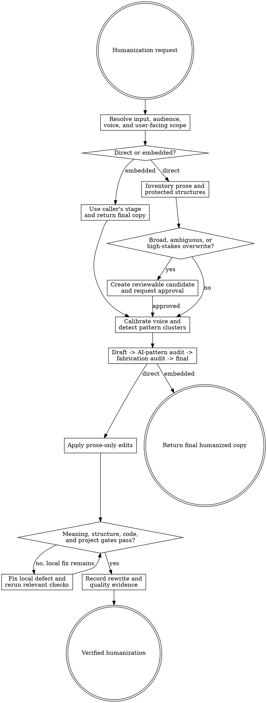

# Prose Humanizer

Humanize everything users read without changing what the product, document, or interface claims or does. This skill directly completes bounded work and never requires Goalpro.

Resolve the owning work root and maintain `agent-work/{slug}/WORK.md` using [the canonical work-artifact contract](contracts/work-artifacts.md) when present, otherwise use the bundled [portable contract](contracts/work-artifacts.md). Direct work writes under `agent-work/{slug}/prose-humanizer/`. Embedded use keeps artifact ownership with the caller and creates no second stage.

Read [REFERENCE.md](REFERENCE.md) completely before rewriting files or source code. This skill adapts the open-source `blader/humanizer` foundation; see [THIRD-PARTY-NOTICES.md](THIRD-PARTY-NOTICES.md).

## Boundaries

- Change user-facing prose, not program semantics, data models, identifiers, translation keys, routes, links, bindings, conditions, component behavior, or executable code.
- Preserve every factual claim unless the user separately authorizes a factual correction. Never invent or strengthen facts, names, numbers, dates, quotes, citations, product capabilities, proof, pricing, guarantees, or legal meaning.
- Humanization is not fact checking, legal review, translation, SEO strategy, or conversion strategy. Report unsupported or contradictory claims instead of silently repairing them.
- When SEO Stack context applies, preserve the approved page owner, cluster/intent boundary, protected winners, search-facing claim qualifiers, heading and metadata meaning, citation support, and internal-link responsibilities. Humanization may improve phrasing but cannot make SEO portfolio decisions.
- Do not flatten a real voice merely because it contains one pattern associated with AI writing. Diagnose clusters and context.
- Do not neutralize deliberate, supportable marketing persuasion. Remove formulaic hype while preserving brand, audience, product vocabulary, and intended action.
- Do not overwrite broad, ambiguous, or high-stakes copy without a reviewable candidate and explicit approval.
- Do not invoke Goalpro. This skill owns direct edits and verification.

## 1. Choose the invocation mode

- **Pasted text:** humanize text supplied in conversation. Create direct artifacts when an owning workspace exists; write the final result to `HUMANIZED.md` and return it in chat.
- **Bounded file:** the user names specific files or a clearly bounded directory. Explicitly asking to humanize them authorizes prose-only edits after inspection.
- **Broad site or documentation set:** inventory the scope, create a reviewable representative candidate, and obtain approval before overwriting.
- **High-stakes copy:** legal, medical, financial, safety, security, privacy, policy, accessibility-critical, regulated, pricing, guarantee, or public claim language always receives review-before-write unless the user explicitly approves an exact candidate.
- **Embedded:** another skill or task calls this skill. Use the caller's stage, run the complete internal loop, return final prose plus compact fidelity evidence, and do not create a `prose-humanizer` stage.

Use the bundled `templates/` files for every matching direct-use artifact rather than recreating their structure. Write `SCOPE.md` for direct use with mode, audience, files/sections, requested outcome, source authority, voice evidence, protected structures, risk, approval status, and applicable project gates.

## 2. Inventory user-facing prose and protections

Inspect enough surrounding context to understand meaning and structure. Include visible headings, paragraphs, lists, labels, buttons, links, helper text, validation, errors, empty/loading/success states, tooltips, metadata, alt text, captions, transactional templates, and documentation prose.

For HTML, Markdown/MDX, JSX/TSX, and templates, distinguish prose from code and structured values. Preserve:

- frontmatter keys and non-prose values;
- imports, exports, identifiers, props, attributes with behavioral meaning, and component structure;
- code blocks, inline code, commands, API names, types, paths, and examples unless prose inside them is explicitly in scope;
- URLs, anchors, link destinations, translation keys, placeholder tokens, interpolation, ICU syntax, and template delimiters;
- data, JSON keys, schema fields, structured-data shape, tests, fixtures, and snapshots unless the user explicitly scopes user-visible content within them;
- quotations, titles, proper names, citations, and source wording whose exactness matters.

For search-targeted prose, also protect the approved primary owner and user job; overlap exclusions; canonical/index and structured-data meaning; metadata promise; entity names; citation qualifiers; and internal-link destinations and anchor intent. Headings, titles, descriptions, and anchor labels may be rewritten only when their search and navigation meaning remains within the approved brief.

User-facing strings embedded in source are in scope when they can be edited without changing these protections. Use framework-aware parsing and project gates where available; never rely on a bulk search-and-replace across mixed code and prose.

## 3. Calibrate voice before removing patterns

If the user supplies a writing sample, analyze its sentence length, vocabulary, paragraph rhythm, punctuation, recurring turns of phrase, formality, humor, and deliberate irregularities. The sample outranks generic heuristics when it does not conflict with factual or structural safety.

Without a sample, infer voice conservatively from approved neighboring copy and the content's job. Technical, reference, policy, and legal prose may correctly remain neutral. Marketing, editorial, and personal prose may carry stronger personality. Do not inject first person, jokes, uncertainty, or opinions merely to appear human.

Record the voice baseline and intentional traits to preserve in `REWRITE-REPORT.md`.

## 4. Detect clusters, not isolated tells

Use the taxonomy and false-positive guidance in `REFERENCE.md`. Look for interacting patterns such as inflated significance plus vague claims plus generic conclusions, or forced triples plus synonym cycling plus even cadence. An isolated em dash, transition, short sentence, formal word, or clean heading is not evidence by itself.

Preserve specific and unusual detail, mixed feelings, defensible opinions, genuine asides, varied rhythm, domain vocabulary, and deliberate persuasion. Humanization can mean leaving a passage unchanged.

## 5. Run the rewrite loop

For every scoped unit:

1. **Draft:** preserve meaning and all claims while improving specificity, clarity, cadence, and voice. Preserve information, not paragraph shape.
2. **Obvious-AI audit:** ask what still feels generated, formulaic, over-smoothed, theatrical, repetitive, or generic. Cite patterns, not vibes.
3. **Fabrication and drift audit:** compare every fact, name, number, date, quote, citation, capability, guarantee, and scope qualifier with the source. Check that uncertainty did not become certainty.
4. **Structure audit:** verify protected syntax, placeholders, links, markup, bindings, identifiers, and code behavior.
5. **Final:** revise once from those audits and read the result aloud or simulate cadence explicitly.

In pasted mode, return the final rewrite and a short material-change summary. Do not make the user read the internal draft unless review-before-write applies or they request it. In embedded mode, return final copy plus only the compact evidence the caller needs.

## 6. Apply edits safely

For a bounded direct request, apply the final prose-only edits. For broad or high-stakes work, write `HUMANIZED.md` as the review candidate, show a concise representative delta and risk notes, then wait for explicit approval before overwriting source files.

Append progress entries using `WIP`, `DONE`, `BLOCKED`, `SKIP`, `STRENGTHENED`, or `FLAKE-FIXED`. Every `DONE` entry includes: “I am satisfied this step is complete because …” plus meaning, structural, and machine evidence.

If the same verification gate fails after three substantive fixes, classify local versus external blockage. Continue independent files when safe; otherwise record the blocker and ask one focused question.

## 7. Verify meaning, structure, and project health

For every direct run verify:

- all source facts and claims remain, unless an explicitly approved cut is recorded;
- no new facts, stronger promises, changed numbers, altered citations, or shifted certainty appeared;
- voice and audience fit improved without erasing intentional human traits;
- headings, labels, CTA meaning, error/recovery guidance, and cross-references remain coherent;
- applicable SEO owner, intent, protected-winner, metadata, heading, citation, entity, and internal-link constraints remain consistent with the approved brief;
- Markdown/MDX, HTML, JSX/TSX, templates, frontmatter, placeholders, links, and structured data remain valid;
- source-code edits pass applicable format, parse, type, lint, unit, snapshot, build, and rendered checks;
- documentation edits pass available link, spelling/style, docs-build, and example checks;
- the final diff contains only scoped prose changes.

Apply [Goalpro's quality contract](contracts/execution-quality.md) proportionally when available; otherwise use the matrix in `REFERENCE.md`. Factual fidelity, meaning, voice, structural safety, user experience, and machine verification are presumptively applicable.

Write `REWRITE-REPORT.md` and `QUALITY-REPORT.md`, then update `WORK.md`. Do not paste sensitive source text into artifacts; cite file and section locations instead.

## Artifacts

- `SCOPE.md` — invocation mode, audience, source authority, voice, eligible prose, protected structures, risk, approval, and gates.
- `PROGRESS.md` — append-only rewrite and verification log.
- `REWRITE-REPORT.md` — voice baseline, pattern clusters, representative decisions, fidelity audit, changed files/sections, and remaining concerns.
- `QUALITY-REPORT.md` — meaning, factual, structural, project, and integrated evidence.
- `HUMANIZED.md` — conditional output for pasted text or review-before-write candidates.
- `NOTES.md` — optional sanitized source or decision notes.

Use the schemas and examples in [REFERENCE.md](REFERENCE.md). Templates are starting points only.

## Embedded contract

The caller supplies audience, purpose, source text or locations, approved facts/claims, protected terms, voice evidence, output format, and—when applicable—the SEO owner, intent, protected winners, search-facing claims, metadata/heading constraints, citations, and internal-link responsibilities. Return:

1. Final humanized prose in the requested structure.
2. A compact record of material pattern clusters changed.
3. Confirmation that facts/claims and protected structures were compared.
4. Any unresolved source ambiguity that the caller must not hide.

The caller owns approval, files, stage artifacts, and project gates. Do not create a redundant stage or silently broaden scope.

## Done

Finish when the requested user-facing prose is natural and audience-fit; every fact and qualifier is preserved or explicitly approved; protected markup/code remains valid; broad/high-stakes approval is accurate; applicable project gates pass; the diff is prose-only; and all quality dimensions end `VERIFIED`, `NOT APPLICABLE`, or explicitly `WAIVED`.

State: “I am satisfied this humanization is complete because …” and cite the fidelity comparison, structural checks, project gates, and remaining waivers.

## Optional SEO Stack consultation

Use this integration only for search-targeted prose, an explicitly supplied SEO brief, or embedded work from `landing-page` or `seo-content`. Ordinary prose does not require SEO skills or provider access.

1. Prefer the caller's approved SEO context. When direct work needs missing context, read the exact specialist brief from `seo-content` or `landing-page` plus the governing `seo-strategy` portfolio opportunity. Follow Strategy's Foundation/Setup pointers only when necessary to understand ownership or a protected constraint. Strategy alone does not supply page-level wording or structure.
2. Preserve primary owner, cluster/search intent, user job, protected winners, overlap exclusions, search-facing claims and qualifiers, entity/product terminology, title/H1 roles, heading semantics, metadata promise, citations, and internal-link destinations/anchor purpose.
3. Rewrite eligible wording for clarity, specificity, voice, and natural cadence. Do not add keywords, broaden intent, change a URL/canonical/index decision, strengthen a search promise, remove citation scope, or make a supporting page compete with its primary owner.
4. Route material owner, intent, URL, portfolio, or cannibalization questions to `seo-strategy`; one-asset research/implementation questions to `seo-content`; and material landing-page persuasion/design decisions to `landing-page`.
5. Record the brief path/revision and SEO fidelity comparison in `SCOPE.md` and `REWRITE-REPORT.md` for direct use, or return that compact evidence to the embedded caller.

Prose Humanizer does not need `seo-stack` CLI or provider credentials for prose-only work. If the caller already owns compatible CLI evidence, treat its sanitized conclusions as supplied evidence; do not independently collect analytics, conduct keyword research, or mutate SEO setup.

## Optional shared Theme Library

When humanizing copy tied to a named theme or brand-direction artifact, discover `theme-library` through the host registry or sibling directory and use only its documented voice/identity evidence. Keep artifacts in this stage. If absent, continue from product and voice evidence; palette guidance is never required for prose-only work.
