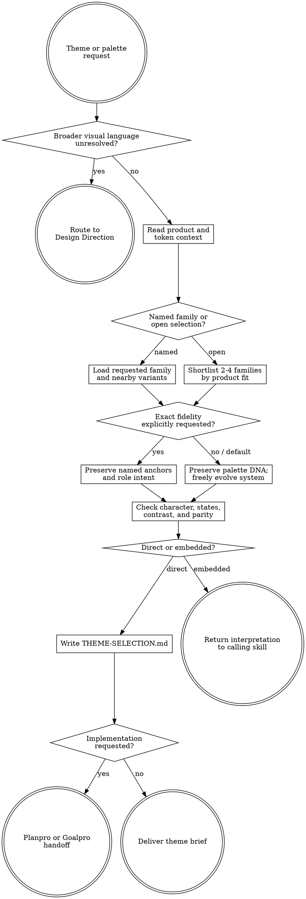

# Theme Library

Use the canonical bundled palette corpus as creative source material. Preserve recognizable palette DNA while giving the acting agent freedom to derive, evolve, complement, contrast, mute, intensify, or expand colors for the actual product.

Resolve the owning work root and maintain the slug index using [the canonical work-artifact contract](contracts/work-artifacts.md) for direct invocations. Embedded consultation by another skill stays inside that skill's existing stage.

## Decision tree

## Boundaries

- Own no application mutations. Inspect product context read-only and hand implementation to Planpro or Goalpro.
- Do not require a sibling repository, network source, or local path. [PALETTE-MASTER.md](PALETTE-MASTER.md) and `assets/theme-family-catalog.json` are canonical.
- Do not treat catalog surface, border, status, or accent assignments as mandatory unless the user requests exact fidelity.
- Do not turn every theme into the same token recipe. Product job, content, typography, density, imagery, data, accessibility, and brand determine the resulting system.
- Route unresolved composition, typography, material, interaction, or identity exploration to Design Direction. Route existing implementation drift and enforcement audits to Designpro.

## 1. Choose consultation mode

- **Direct:** the user explicitly asks Theme Library to select or adapt a theme. Write under `agent-work/{slug}/theme-library/`.
- **Embedded:** another skill encounters a material theme request. Read this skill and its references, then record the theme interpretation in the caller's own artifacts; do not create a redundant Theme Library stage.

## 2. Read context before color

Establish the user, product job, trust posture, emotional target, content density, supported modes, existing semantic tokens, brand constraints, accessibility needs, data visualization, imagery, and implementation boundary. If the user names a family, inspect it plus adjacent variants. Otherwise shortlist two to four candidates using [REFERENCE.md](REFERENCE.md).

## 3. Set the interpretation mode

Default to **interpretive** unless the user explicitly asks for exact reproduction.

- **Interpretive:** preserve two to four identity anchors and characteristic relationships, then freely derive ramps, neutrals, surfaces, borders, focus, statuses, charts, shadows, overlays, complementary colors, and contrasting accents. Hue, chroma, temperature, and luminance may shift when product fit improves.
- **Fidelity:** preserve named anchors and recognizable role intent. Derive missing values and accessible variants, but disclose every material departure.
- **Hybrid:** combine families only when the product rationale is clear. Name the dominant family, borrowed qualities, and collision risks; do not average palettes mechanically.

Read [REFERENCE.md](REFERENCE.md) completely for the palette-DNA framework, freedom zones, anti-cookie-cutter rules, and validation. Use relevant sections of [PALETTE-MASTER.md](PALETTE-MASTER.md) or query the JSON rather than loading the entire catalog unnecessarily.

## 4. Produce a theme interpretation

Define:

- Product outcome and intended feeling.
- Selected family/variant and interpretation mode.
- Two to four identity anchors and the relationships that make the family recognizable.
- Preserve, evolve, add, and avoid decisions.
- Proposed primitive ramps and semantic-role hypotheses appropriate to the product—not copied blindly from the catalog.
- Added complementary/contrasting colors with purpose and harmony rationale.
- Light/dark, state, chart/syntax, content, imagery, and accessibility implications where applicable.
- Exact values as hypotheses until rendered in representative context.
- Invalidation signals and the cheapest useful preview or contrast checks.

## 5. Record or return

For direct use, write `THEME-SELECTION.md` with headings: `Product context`, `Selection`, `Interpretation mode`, `Palette DNA`, `Preserve evolve add avoid`, `Derived system hypotheses`, `Accessibility and parity`, `Validation`, `Decision status`, and `Handoff`. Optional `NOTES.md` may contain sanitized evidence. Keep selection status provisional until the user approves it or an approved Design Direction preview incorporates it.

When implementation is requested, route through Planpro if token architecture, component impact, rollout, or delivery remains unresolved. A direct Goalpro handoff is allowed only when the interpretation and implementation scope are both approved and concrete; write `GOALPRO-INPUT.md` using [Goalpro's handoff contract](contracts/goalpro-handoff.md), preserve the same slug, and expose derived/additional colors as approved decisions rather than rediscovering them during execution.

For embedded use, return the same information compactly to the caller. Design Direction owns comparative HTML exploration; Designpro owns audit findings and theme enforcement; Planpro owns unresolved implementation architecture; Goalpro owns approved mutations.

## Done

Finish when the choice is grounded in product context; catalog evidence and creative derivation are distinguishable; the palette retains recognizable DNA without rigid role copying; additions have purpose; accessibility and theme parity are classified; and the correct caller or handoff can proceed without rediscovering the color intent.

State: “I am satisfied this theme interpretation is complete because …” and cite the palette anchors, creative changes, validation evidence, and remaining hypotheses.
