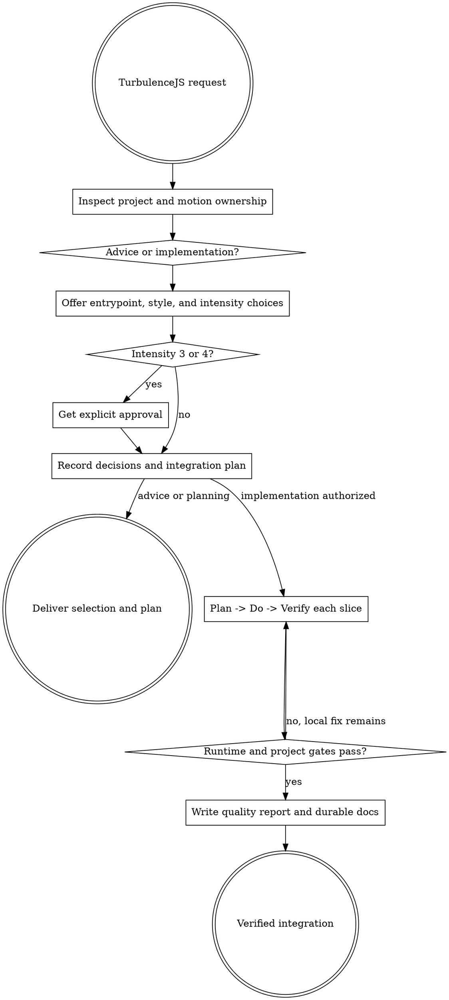

# TurbulenceJS Integration

Guide a project from motion intent to a verified TurbulenceJS implementation. Keep the choice visible to the user: TurbulenceJS is one npm package with opt-in entrypoints, and higher intensity is never an accessibility override.

## Decision tree

Resolve the owning work root and maintain the slug index using [the canonical work-artifact contract](contracts/work-artifacts.md). A standalone installation may use the bundled [portable fallback contract](contracts/work-artifacts.md) when the canonical sibling is absent.

Read [REFERENCE.md](REFERENCE.md) before recommending entrypoints or implementing, and use [EXAMPLES.md](EXAMPLES.md) for verified import and lifecycle patterns. `catalog.json` is the machine-readable entrypoint/style/intensity matrix.

## Decision flow

1. **Inspect.** Resolve the target repository and applicable instructions. Run `node {skill-folder}/scripts/inspect-project.mjs {target-root}` when Node is available. Inspect existing motion, design tokens, component lifecycles, test commands, reduced-motion handling, and Electron process boundaries.
2. **Classify the request.** If the user asks only for advice or planning, stop after the selection and plan artifacts. If they ask to add, integrate, replace, or implement, continue through verification.
3. **Offer choices.** Unless already specified, present two or three product-fit combinations from the table below. State entrypoints, style, intensity, trade-offs, and reduced-motion behavior. Never silently select levels 3–4.
4. **Record the decision.** Create `agent-work/{slug}/WORK.md` and `agent-work/{slug}/turbulencejs-integration/{DECISIONS.md,INTEGRATION-PLAN.md}` from `templates/`. When implementation is authorized, also create `PROGRESS.md`. Preserve one stable slug. Record explicit user approval or the request that already authorized implementation.
5. **Install narrowly.** Add `turbulencejs` with the project's package manager. Import only selected entrypoints. Do not add a second animation scheduler, duplicate the generic runtime, or import browser entries in Electron main.
6. **Implement by ownership.** Work through each approved slice with a Plan→Do→Verify loop. Put reusable durations/easings in semantic motion roles; keep component ownership and teardown local; keep host data commits outside TurbScript drivers and interaction recipes; preserve interruption and retargeting. Append `DONE`, `WIP`, `BLOCKED`, or `SKIP` entries to `PROGRESS.md`; every `DONE` entry must state, “I am satisfied this step is complete because …” with machine and runtime evidence.
7. **Make accessibility structural.** Respect `prefers-reduced-motion`, define meaningful reduced endpoints, preserve keyboard/pointer parity and focus, and avoid flashing or unavoidable vestibular movement. Reduced motion may remove travel while retaining state clarity.
8. **Verify.** When available, apply [Goalpro's quality contract](contracts/execution-quality.md) proportionally; otherwise use the portable verification matrix in `REFERENCE.md`. Run relevant project tests, typecheck, lint, and production build. Exercise normal and reduced motion, rapid interruption/retargeting, teardown, idle scheduling, responsive layouts, focus, console, and resource cleanup. For Electron, test renderer and main independently plus one coordinated flow.
9. **Document.** Write `QUALITY-REPORT.md`, update `WORK.md`, and update reader-facing project docs when the integration changes public architecture or usage. Report exact files, commands, integrated quality evidence, deviations, and remaining manual checks.

## Choice matrix

| User goal | Suggested entrypoints | Style | Intensity |
|---|---|---|---|
| State clarity with minimal motion | root, optionally `/subtle` | restrained | 0–1 |
| Polished product interactions | root, `/subtle`, optionally `/interact` | calm/product | 1–2 |
| Friendly expressive UI | root, `/cartoon` | playful | 2–3 |
| Editorial or spatial transitions | root, `/cinematic` | cinematic | 2–3 |
| Rare celebration or dramatic exit | root, `/extreme` | high-impact | 3–4 |
| Pixel/canvas transformations | root, `/surfaces`, `/effects` | theatrical | 3–4 |
| Electron renderer motion | `/dom`, plus chosen browser recipes where appropriate | selected above | 0–4 |
| Electron native bounds/layout | `/main` | coordinated spatial | 0–2 by default |
| Non-DOM values or injected clocks | `/runtime` | host-defined | host-defined |

## Intensity scale

- **0 — essential:** instant or near-instant state continuity; no decorative travel.
- **1 — restrained:** short fades, small offsets, gentle settling; high-frequency safe.
- **2 — expressive:** visible choreography and moderate spatial movement; default ceiling for routine product flows.
- **3 — dramatic:** overshoot, 3D, larger travel, or multi-stage sequences; use at meaningful moments.
- **4 — theatrical:** raster effects, extreme recipes, or intentionally dominant motion; rare, explicitly approved, bounded, and degradable.

## Boundaries

- Do not use animation to conceal latency, delay input, or replace semantic state.
- Do not choose a style from package names alone; match product tone, frequency, and user task.
- Do not import `/effects` without assessing `/surfaces` security, origin-clean capture, CSP/worker policy, and resource caps.
- Do not let Electron renderer code control native bounds directly or main-process code touch browser globals.
- Do not claim completion from a build alone. Runtime interruption, reduced motion, cleanup, and focus evidence are required when applicable.
- If the same gate still fails after three substantive fixes, classify it as a local failure or external blocker. Continue other safe slices for a local failure; record `BLOCKED` and ask for the missing authority or input only when further progress is genuinely impossible.
- Do not depend on Planpro, Goalpro, Motion Audit, Motion Direction, gremlin-skills, or a workspace control plane. Use them only if independently present and explicitly useful; this skill remains complete without them.

## Done

Finish only when the chosen surface, entrypoints, style, and intensity are explicit; imports and ownership match process boundaries; relevant accessibility and lifecycle cases pass; reader documentation reflects the integration; and `QUALITY-REPORT.md` contains reproducible final integrated evidence. State why the integration is complete and name any unverified manual behavior.

## Optional shared Theme Library

When the request contains a material named-theme or palette decision, discover the independently installed `theme-library` skill through the host skill registry. If the host has no registry, resolve `theme-library/SKILL.md` as a sibling of this skill directory (the standard relative location is `../theme-library/SKILL.md`). If found, read it and use embedded mode while keeping artifacts in this skill's stage. If it is not installed, continue the primary workflow and disclose the unavailable palette library only when it materially limits the result. Never rely on repository-level AGENTS or README files for discovery.
