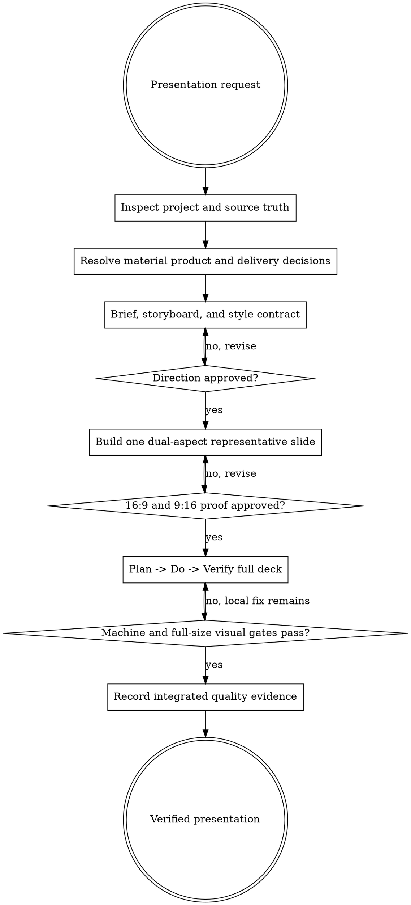

# TurbulenceJS Presentation

Turn source material and motion intent into a browser-native presentation with one semantic story and two deliberate compositions. Treat the files in `styles/` as composable influences, not rigid audience lanes. A presentation may borrow from one primary guide and zero to two secondary guides, but it must resolve them into one coherent project style contract before construction.

## Decision tree

Resolve the owning work root and maintain the slug index using [the canonical work-artifact contract](contracts/work-artifacts.md). A standalone installation may use the bundled [portable fallback contract](contracts/work-artifacts.md) when the canonical sibling is absent.

Read [REFERENCE.md](REFERENCE.md) before planning and use [EXAMPLES.md](EXAMPLES.md) for compact examples. The helper scripts are pure Node.js and do not require this repository or another installed skill.

## Workflow

1. **Inspect the target.** Resolve the project root and its instructions. Run `node {skill-folder}/scripts/inspect-project.mjs {target-root}`. Inspect package manager, TurbulenceJS availability, presentation/runtime conventions, brand tokens, existing assets, content sources, tests, reduced-motion behavior, and export requirements. Do not ask for facts the project already answers.
2. **Interview adaptively.** Establish purpose and desired audience response; audience mix; content and authoritative sources; target duration or slide range; information density; desired visual and animation character; brand constraints and assets; primary and secondary aspect/export needs; accessibility or sensitivity constraints; and delivery environment. Bundle related questions. Offer explicit defaults when the user is unsure. Continue until omissions no longer change the narrative, visual system, motion ceiling, or delivery contract.
3. **Create durable working state.** Choose one stable slug. Create `agent-work/{slug}/WORK.md` and `agent-work/{slug}/turbulencejs-presentation/` from the templates. Keep facts, assumptions, decisions, approval, progress, and evidence in these artifacts rather than relying on chat history.
4. **Discover style influences.** Run `node {skill-folder}/scripts/list-styles.mjs --project {target-root} --json`. It discovers built-ins plus valid project-local files in `.turbulencejs/presentation-styles/` without a registry. Present a compact menu in language suited to the project. A style is guidance, never a full presentation template.
5. **Compose one direction.** Select one primary and at most two secondary influences. Write `STYLE-CONTRACT.md`: name each borrowed trait, state which guide wins every conflict, freeze semantic palette/type/layout/motion/aspect rules, define a signature move, define forbidden motion, and set an intensity ceiling. Project truth and user constraints outrank all style guides. Never persist a new project-local or global style file unless the user explicitly requests it.
6. **Plan the story.** Write `DECK-BRIEF.md`, `STORYBOARD.md`, and `BUILD-PLAN.md`. Use one claim per slide; stable slide IDs; content, evidence, asset provenance, and notes; layout and motion roles; explicit landscape and portrait recipes; content budgets; and a density/escalation curve. Prefer the smallest slide count that communicates the story. A duration estimate is a planning aid, not a reason to pad the deck.
7. **Approval gate 1 — direction.** Present the brief, storyboard, and composed style contract. Ask for approval before production work. If the user changes the story or direction, revise the artifacts and seek approval again. Do not treat silence as approval.
8. **Build a representative proof.** Implement one high-information slide that exercises the signature layout and motion. Render it at exactly 1920×1080 and 1080×1920, including reduced-motion endpoints. Use the same semantic content but distinct composition recipes; do not blanket-scale, crop, rotate, or merely stack the landscape slide.
9. **Approval gate 2 — sample.** Show or link the full-size landscape and portrait proof, explain motion and reduced behavior, and request approval. Revise until approved. Do not construct the full deck before this gate unless the user explicitly waives it.
10. **Build the full presentation.** Keep a data-driven semantic deck model separate from rendering and motion. Import only public TurbulenceJS entrypoints. Own and stop every performance; interrupt old work before navigation/reflow; keep code and important copy selectable; preserve focus and keyboard navigation; and make export endpoints deterministic. Work in Plan→Do→Verify slices. Append `DONE`, `WIP`, `BLOCKED`, `SKIP`, `STRENGTHENED`, or `FLAKE-FIXED` entries to `PROGRESS.md`; every `DONE` entry must state, “I am satisfied this step is complete because …” with machine and perceptual evidence.
11. **Verify structurally and visually.** Apply [Goalpro's quality contract](contracts/execution-quality.md) proportionally when available; otherwise use the portable verification matrix in `REFERENCE.md`. Validate the deck and styles. Test every slide at 1920×1080 and 1080×1920 with full and reduced motion. Check overflow, title/body budgets, contrast, semantic active/inactive state, URL restoration, focus, readiness, console errors, interruption, teardown, idle scheduling, and surface cleanup. Capture every slide and inspect both aspects at full size; tests cannot decide whether a composition communicates well.
12. **Report.** Complete `QUALITY-REPORT.md`, `PROGRESS.md`, and `WORK.md` with exact commands, counts, captures, manual findings, deviations, unresolved risks, and final integrated evidence. Finish only when every approved requirement has evidence.

## Style composition rules

- One primary influence defines the communication rhythm and default density.
- Zero to two secondary influences may contribute named traits only; they do not create modes or separate audience lanes.
- Resolve conflicts in this order: user constraints, source truth, accessibility, delivery environment, primary guide, secondary guides.
- Record the final value for every palette role, type role, spacing/safe-area rule, motion role, intensity range, signature move, and prohibited behavior. Never make renderers combine style JSON at runtime.
- If no guide fits, derive a project style contract directly. Save it as a reusable style file only after explicit user approval.

## Dual-aspect contract

- Maintain one semantic slide identity and claim across aspects.
- Give each layout role separate `landscape` and `portrait` composition recipes plus safe areas, focal point behavior, stacking order, and content budgets.
- Recompose hierarchy. In portrait, top-weight the opening claim and move supporting evidence into intentional vertical regions; do not assume landscape columns simply become one long column.
- Track aspect-neutral logical motion such as `toward-reading-flow`, then map it to physical axes per recipe.
- Keep assets orientation-aware with provenance, focal point, fit/crop rules, and a truthful fallback.
- Treat 16:9 and 9:16 as peers even when one is the primary delivery aspect.

## Motion and lifecycle contract

- Use root, `/subtle`, and `/cinematic` for most presentation work. `/cartoon` is an optional bounded contrast. `/effects` and `/surfaces` are rare, explicitly justified, resource-capped climaxes.
- Separate style from intensity. Set an explicit 0–4 ceiling; routine presentation motion should usually remain at 1–2 and dramatic moments at 3.
- Reduced motion must show the same meaning and final state without depending on travel, depth, blur, flashing, or prolonged staging.
- Export mode must hide controls, await fonts/assets, resolve animations to deterministic endpoints, and publish a capture-ready signal.
- Every controller, listener, timer, worker, canvas, observer, and animation frame has an owner and cleanup path. A settled slide must report zero owned work.

## Boundaries

- Do not invent claims, citations, customer evidence, performance numbers, or asset provenance.
- Do not flatten the deck to screenshots when semantic HTML can express the content.
- Do not encode crucial meaning only through color or motion.
- Do not use a build pass as proof of responsive, accessible, or lifecycle correctness.
- Do not require Planpro, Goalpro, subagents, a particular model, or host-specific UI. Use them only when independently available and requested; this skill is complete without them.
- Do not publish, deploy, upload assets, modify global styles, or write outside the target workspace without explicit authorization.
- If the same gate still fails after three substantive fixes, classify it as a local failure or external blocker. Continue other safe slices for a local failure; record `BLOCKED` and ask for missing authority or input only when further progress is genuinely impossible.

## Done

The result is complete only when the user approved the direction and dual-aspect proof; every slide has one semantic identity plus explicit 16:9 and 9:16 behavior; motion and reduced endpoints are intentional; assets and claims are sourced; every slide passed machine checks and full-size visual inspection; lifecycle diagnostics settle cleanly; and durable artifacts contain reproducible evidence.

## Optional shared Theme Library

When the request contains a material named-theme or palette decision, discover the independently installed `theme-library` skill through the host skill registry. If the host has no registry, resolve `theme-library/SKILL.md` as a sibling of this skill directory (the standard relative location is `../theme-library/SKILL.md`). If found, read it and use embedded mode while keeping artifacts in this skill's stage. If it is not installed, continue the primary workflow and disclose the unavailable palette library only when it materially limits the result. Never rely on repository-level AGENTS or README files for discovery.
