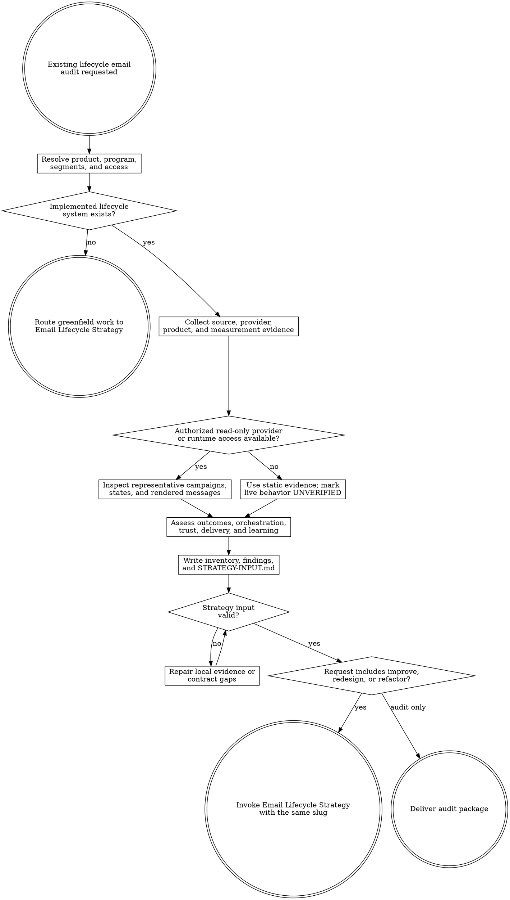

# Email Lifecycle Audit

Audit an implemented lifecycle email system under `agent-work/{slug}/email-lifecycle-audit/`. Remain read-only outside that stage. Always create a reusable `STRATEGY-INPUT.md`; invoke Email Lifecycle Strategy with the same slug only when the request includes improvement, redesign, or refactoring.

Resolve the owning work root and maintain the slug index using [the canonical work-artifact contract](contracts/work-artifacts.md).

## Decision tree



## Boundaries

- Remain read-only on product source, configuration, databases, analytics, DNS, email providers, production data, deployed environments, recipients, and campaign state.
- Write only under `agent-work/{slug}/email-lifecycle-audit/` plus the shared `WORK.md`.
- Use existing authorized read-only sessions or APIs only. Never send email, create recipients, impersonate users, toggle campaigns, change consent, alter DNS, or mutate provider configuration merely to complete an audit.
- Audit an implemented program. Route genuinely greenfield lifecycle strategy directly to Email Lifecycle Strategy.
- Diagnose copy in context but do not rewrite it. Email Lifecycle Strategy owns embedded Prose Humanizer composition.
- Treat [FOUNDATIONS.md](FOUNDATIONS.md) as research-derived heuristics, not a universal checklist or legal conclusion. Product evidence, user expectations, current primary guidance, safety, privacy, consent, and qualified legal review outrank generic advice.
- Preserve coherent strengths. Do not redesign a program merely because another cadence or vendor pattern is fashionable.
- Do not implement remediation. Planpro and Goalpro own every product, provider, DNS, analytics, template, data, and sending mutation after an approved strategy.

## 1. Establish scope and product outcomes

Apply [Planpro's product-research lens](contracts/product-research.md) when available; otherwise use the proportional product-context contract in [REFERENCE.md](REFERENCE.md). Read product and brand documents, acquisition promises, lifecycle specifications, support themes, analytics definitions, experiment records, current copy, campaign ownership, incident history, and relevant code/configuration.

Identify:

- primary and materially different secondary users, account roles, plans, geographies, and acquisition contexts;
- product promise, first value, second value, expected usage cycle, and lifecycle maturity states;
- observed activation, retention, reactivation, conversion, support, unsubscribe, complaint, and delivery evidence;
- lifecycle scope and exclusions, including transactional/service messages that coordinate with the program;
- guardrails that must not regress: account access, security, billing, consent, preference, data integrity, support context, accessibility, and sender trust.

Do not invent a retained-value relationship, cadence, attribution window, legal basis, consent state, or numeric target. Label unsupported candidates as hypotheses and name the cheapest evidence that would distinguish them.

## 2. Inventory the current system

Trace the path from product event to recipient state, eligibility, arbitration, queue, provider, template, delivery, deep-link destination, product outcome, and campaign exit. Cover source modules, jobs, data models, provider configuration evidence, message streams or subdomains, templates, analytics, dashboards, alerts, runbooks, and manual ownership where present.

Inventory every material campaign or message with its objective, classification, audience, lifecycle stage, entry, delay, branches, exit, suppression, priority, frequency, sender, reply behavior, CTA/deep link, dynamic fields and fallbacks, rendering states, measurement, owner, and evidence. Include onboarding, activation rescue, value reinforcement, feature adoption, trial, billing coordination, inactivity, re-engagement, win-back, sunset, and transactional conflicts that affect user experience.

Use authorized read-only provider/runtime inspection when safely available. Inspect representative recipients only through sanitized fixtures or existing non-mutating preview surfaces. Exercise missing/long/Unicode/RTL data, deleted or inaccessible content, mobile, dark mode, images off, large text, semantic reading order, broken links, bounced/complained/unsubscribed states, delayed or duplicate events, support conflicts, reactivation, retries, and campaign exit where the available surface permits it. Mark unavailable live behavior `UNVERIFIED`.

## 3. Assess the lifecycle system

Read [REFERENCE.md](REFERENCE.md) completely before classifying findings. Evaluate product-outcome alignment, first/second value, maturity, meaningful activity, event correctness, identity scope, entry/exit behavior, arbitration, suppression, frequency, classification, consent, preferences, deliverability, copy, deep links, personalization, fallbacks, accessibility, rendering, reliability, ownership, monitoring, recovery, attribution, holdouts, guardrails, and experimentability.

For every dimension use `VERIFIED`, `SUPPORTED`, `INFERRED`, `UNVERIFIED`, or `NOT APPLICABLE`. Avoid checklist math and unsupported maturity scores. Rank findings by evidenced user-success impact, confidence, urgency, effort, reversibility, and whether a flaw invalidates other measurement.

Give every verified strength a stable `EMS-{number}` ID, evidence status, evidence citation, user or operational value, and preservation boundary. Each finding must include an `EML-{number}` ID, observed behavior, desired user outcome, impact, affected campaigns/states/segments, evidence, foundation principle, severity, confidence, related `EMS-*` strengths to preserve, recommendation boundary, cheapest validation experiment, and related finding IDs. Recommendations define the problem and required outcome; Email Lifecycle Strategy owns the replacement.

When a conclusion depends on law, mailbox-provider requirements, or version-sensitive provider behavior, consult current primary sources, record jurisdiction/version and access date, distinguish fact from inference, state that the audit is not legal advice, and identify qualified-review needs.

## 4. Produce the audit package

Create these artifacts using the exact heading schemas in [REFERENCE.md](REFERENCE.md):

- `RESEARCH.md` — scope, product/lifecycle evidence, sources, access limits, provider context, constraints, contradictions, and unknowns.
- `CURRENT-SYSTEM.md` — architecture, events/states, classification/streams, consent/suppression, orchestration, rendering, operations, measurement, and unverified behavior.
- `CAMPAIGN-INVENTORY.md` — campaign coverage, normalized inventory, cross-campaign conflicts, content/rendering states, measurement, ownership, and exclusions.
- `AUDIT-REPORT.md` — executive read, verified strengths, prioritized findings, systemic patterns, risk boundaries, measurement gaps, experiments, and refactor boundary.
- `STRATEGY-INPUT.md` — compact canonical handoff defined in `REFERENCE.md`; link detailed evidence instead of duplicating it.
- `NOTES.md` — optional sanitized source notes.

Run:

```bash
python3 {email-lifecycle-audit-skill-root}/scripts/validate_strategy_input.py \
  agent-work/{slug}/email-lifecycle-audit/STRATEGY-INPUT.md
```

Fix every local contract failure before handoff. A valid file may be `PARTIAL` when material evidence is honestly missing; it may not conceal the gap. The validator must account for every `EML-*` finding and `EMS-*` strength in `AUDIT-REPORT.md`. Readiness describes evidence, not permission: the handoff must remain `EVIDENCE_ONLY`, and the current user request determines whether Strategy may run.

## 5. Route the result

- **Audit only:** deliver the report and strategy-input path. Do not infer authorization to redesign.
- **Audit and improve, redesign, optimize, or refactor:** discover `email-lifecycle-strategy` through the host skill registry or sibling `../email-lifecycle-strategy/SKILL.md`, then invoke it with `STRATEGY-INPUT.md` and the same slug. Strategy may continue without another audit-approval gate because it remains read-only and has its own preview approval gate.
- **Strategy unavailable:** deliver the valid handoff and explain that the independently installable strategy skill is missing. Do not replace it with an ad hoc strategy.
- **Implementation requested:** complete the audit and named strategy approval first, then route the approved package through Planpro or a `READY` Goalpro handoff. Never mutate from the audit stage.

## Done

Finish when the implemented system and material campaigns/states are inventoried; product-outcome, data, consent, deliverability, copy, accessibility, operational, and measurement claims are evidenced or explicitly unknown; `EMS-*` strengths and `EML-*` findings are fully traceable; provider/runtime limitations and legal-review boundaries are honest; `STRATEGY-INPUT.md` validates; and the request is either delivered as an audit or routed to Email Lifecycle Strategy without external mutation.

State: “I am satisfied this email lifecycle audit is complete because …” and cite inventory coverage, evidence status, validated handoff, live-access limits, current-source checks, and remaining unknowns.

## Optional shared Theme Library

When the audit contains a material named-theme or palette decision, discover the independently installed `theme-library` skill through the host registry or sibling `../theme-library/SKILL.md`. Use it only to evaluate consistency with existing approved identity; keep artifacts in this stage. If unavailable, continue and disclose the limitation only when it materially affects a finding. Never rely on repository-level instructions for discovery.
