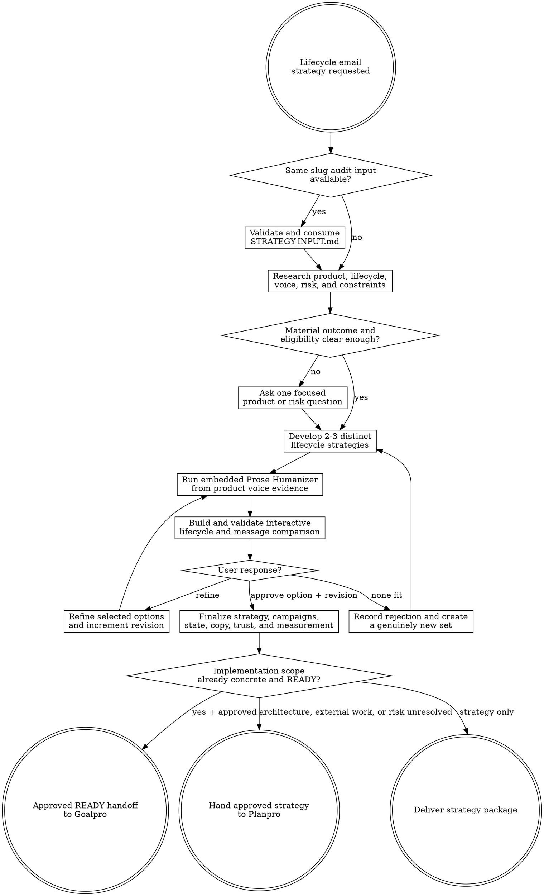

# Email Lifecycle Strategy

Turn product evidence or a same-slug Email Lifecycle Audit into an approved lifecycle email system under `agent-work/{slug}/email-lifecycle-strategy/`. Remain read-only outside that stage. Hand implementation to Planpro or Goalpro only after the user approves a named preview revision.

Resolve the owning work root and maintain the slug index using [the canonical work-artifact contract](contracts/work-artifacts.md).

## Decision tree



## Boundaries

- Remain read-only on application source, configuration, databases, analytics, DNS, email providers, production data, recipients, deployed environments, and campaign state.
- Write only under `agent-work/{slug}/email-lifecycle-strategy/` plus the shared `WORK.md`.
- Treat the HTML preview as a planning prototype. Never copy it into production templates or present it as provider- or mailbox-ready email HTML.
- Preview approval selects program and copy direction only. It does not authorize event, data, template, provider, DNS, analytics, migration, deployment, or sending changes.
- Never invent activation relationships, timing, targets, legal basis, consent, progress, offers, discounts, product claims, sender availability, or provider capability.
- Preserve account access, security, billing, transactional urgency, support context, opt-out, suppression, retention, deletion, privacy, and user expectations. Expose every proposed change.
- Own email strategy while recording conflicts with in-product, support, sales, and other channels. Do not silently expand into a complete multichannel program.
- Do not implement the selected strategy. Planpro owns unresolved implementation design; Goalpro owns mutations only from a complete approved handoff.

## 1. Establish the lifecycle brief

Apply [Planpro's product-research lens](contracts/product-research.md) when available; otherwise use [REFERENCE.md](REFERENCE.md). Read product promises, jobs, users, account roles, plans, acquisition context, current or proposed lifecycle, support evidence, analytics definitions, experiments, brand and sender guidance, neighboring product/email copy, accessibility/localization requirements, provider and deliverability context, consent/preferences, operational ownership, and delivery boundaries.

When `agent-work/{slug}/email-lifecycle-audit/STRATEGY-INPUT.md` exists or is supplied, validate and read it plus every required source artifact. Its existence, `EVIDENCE_ONLY` marker, and `READY` or `PARTIAL` state do not authorize Strategy: continue only when the current request explicitly includes strategy, improvement, redesign, or refactoring, or the user later authorizes this stage. Preserve and account for every `EML-*` finding ID and `EMS-*` strength ID. Treat `PARTIAL` gaps as explicit assumptions or experiments. Stop on `BLOCKED` until the named product, consent, data, safety, authority, or qualified-review condition is resolved.

Write the lifecycle brief in `RESEARCH.md`:

- product promise, jobs, first value, second value, expected usage cycle, and retained-value evidence;
- segments, account roles, plans, geographies, acquisition context, and maturity states;
- shortest trustworthy path to value plus appropriate repetition, expansion, retention, and re-engagement;
- reliable events, meaningful activity, identity/account scope, data latency, and deep-link destinations;
- transactional/marketing boundary, consent/preferences, support and billing conflicts, and suppression;
- sender/reply model, brand/voice evidence, visual/email-system evidence, and approved claims;
- deliverability, accessibility, localization, operations, rollout, rollback, and external-review constraints;
- current `EMS-*` strengths and `EML-*` findings to preserve or resolve;
- success signal, guardrail, failure signal, attribution/holdout evidence, and cheapest experiments.

Do not invent product relationships or targets. Ask one focused question only when an undiscoverable product, risk, consent, or authority decision would materially change every responsible option.

## 2. Develop distinct strategies

Create two or three whole-program directions that share the same product truth but differ in consequential lifecycle logic, not visual email treatment alone. Options may differ in:

- time-based backbone versus behavioral branching;
- activation-rescue versus value-reinforcement emphasis;
- segment and maturity model;
- personalization depth and data dependency;
- sender, reply, support, and escalation model;
- program breadth and staged ramp;
- priority, suppression, frequency, and arbitration posture;
- education, trial, inactivity, re-engagement, and sunset approach;
- measurement, holdouts, rollout, complexity, risk, and reversibility.

Every direction specifies product outcomes; lifecycle states; campaign portfolio; entry, delay, branch, exit, replace, suppress, escalation, and sunset decisions; frequency and priority; channel-fit rationale; sender/copy thesis; representative messages; merge-field/fallback posture; consent, classification, deliverability, accessibility, and operational assumptions; product measurement and holdouts; cheapest validation experiment; guardrail and abandonment evidence; effort and reversibility; and an explicit row for every `EML-*` finding and `EMS-*` strength. Do not mark a finding resolved by strategy prose alone; name the proposed response and future verification evidence.

Recommend one direction from evidence, but do not request selection until the comparison preview validates. Preserve incompatible options instead of silently blending them.

## 3. Ground and humanize the messages

Discover `prose-humanizer` through the host skill registry or sibling `../prose-humanizer/SKILL.md`. Use it in embedded mode and keep all artifacts in this stage.

Supply audience, lifecycle moment, objective, classification, sender/reply behavior, approved facts and claims, actual product voice, CTA destination and consequence, merge fields/fallbacks, images-off meaning, consent/unsubscribe requirements, protected terminology/structure, and output format. Require final copy, material pattern clusters changed, fidelity confirmation, and unresolved source ambiguity. Preserve factual qualifiers, user state, legal/trust meaning, identifiers, analytics semantics, links, and supported template variables.

Before approval, write complete representative messages to `MESSAGE-SAMPLES.md` for each applicable role:

- immediate welcome or first action;
- first-value rescue or resume;
- first-value success and second-value prompt;
- one behavior-selected adjacent workflow;
- one product-appropriate early-inactivity intervention;
- distinct 30-, 60-, and 90-day examples when re-engagement is in scope.

After approval, create complete copy for the approved initial program in `COPY-DECK.md`. Keep later portfolio items as implementation-safe briefs until selected. Every message records sender, reply expectation, subject, preview, plain-text meaning, body hierarchy, one primary CTA, justified supporting links, eligibility, merge fields/fallbacks, images-off behavior, classification, unsubscribe requirements, and unresolved data.

If Prose Humanizer is unavailable, draft conservatively from approved neighboring copy, run the same fact/meaning/structure comparison, and disclose the unavailable specialist only when it materially limits voice quality.

## 4. Build the interactive approval preview

Read [PREVIEW.md](PREVIEW.md) completely before writing HTML. Create one self-contained responsive `EMAIL-LIFECYCLE-PREVIEW.html` that compares every strategy. Preserve immutable revisions under `previews/EMAIL-LIFECYCLE-PREVIEW-R{n}.html` and keep the root file as the latest alias.

Use the same product outcomes, segments, constraints, and evidence across options. Let the user simulate representative lifecycle states and product actions; show whether each strategy sends, waits, replaces, suppresses, exits, escalates, or sunsets; and explain why. Include campaign maps, priority/frequency, representative humanized copy, dynamic-field and inaccessible-content fallbacks, desktop/mobile, light/dark, images-off, consent/classification, deliverability/operations, accessibility, measurement/holdouts, audit traceability, and trade-offs.

Run:

```bash
python3 {email-lifecycle-strategy-skill-root}/scripts/validate_email_lifecycle_preview.py \
  agent-work/{slug}/email-lifecycle-strategy/EMAIL-LIFECYCLE-PREVIEW.html
```

Fix every validator failure, then open the file and manually exercise all strategy, user-state, campaign-decision, email-view, feedback, keyboard, narrow-layout, text-expansion, images-off, and reduced-motion behavior before presenting it. Real mailbox-client and provider rendering remain explicit implementation-stage checks unless authorized evidence exists.

## 5. Iterate to explicit approval

Accept three outcomes:

1. **Refine** — apply concrete feedback, preserve unaffected decisions, increment the revision, rerun embedded humanization where copy changed, regenerate, validate, and present again.
2. **New set** — preserve rejected options and reasons, then create two or three strategies with genuinely different lifecycle logic.
3. **Approve** — record option ID, preview revision, user statement, approved scope, exclusions, and material assumptions before finalizing.

Maintain an append-only revision table in `STRATEGY-OPTIONS.md`. Approval without a named validated preview revision is incomplete. Never pressure selection of the recommendation.

## 6. Finalize the selected program

After approval create these artifacts using the exact heading schemas in [REFERENCE.md](REFERENCE.md):

- `LIFECYCLE-STRATEGY.md` — outcomes, stages, segments, channel fit, sender, portfolio, cadence, arbitration, continuation, re-engagement, sunset, rollout, risks, and preserved strengths.
- `CAMPAIGN-MAP.md` — every approved campaign with classification, audience, entry, branches, exit, priority, suppression, frequency, sender, CTA, owner, dependencies, and state.
- `STATE-AND-DECISION-MODEL.md` — product events, derived states, identity, meaningful activity, data timing, decisions, pseudocode, edge cases, idempotency, and test scenarios.
- `MESSAGE-BRIEFS.md` — implementation-safe briefs for the full approved portfolio.
- `COPY-DECK.md` — full approved-initial-program copy, protected variables, and Prose Humanizer fidelity evidence.
- `DELIVERABILITY-AND-CONSENT-GUARDRAILS.md` — classification, eligibility, consent/preferences, suppression, external-review boundaries, sender/stream/domain dependencies, authentication, reputation, accessibility/rendering, privacy, and ownership.
- `MEASUREMENT-PLAN.md` — product outcomes, events, attribution, holdouts, cohorts, guardrails, reporting limits, rollout learning, privacy, and abandonment evidence.
- `GOALPRO-INPUT.md` — conditional direct handoff only when every section of [Goalpro's contract](contracts/goalpro-handoff.md) is complete, the named preview revision and scope are approved, external/manual work is separated, and remaining unknowns cannot materially change risk or behavior.

Also retain `RESEARCH.md`, `STRATEGY-OPTIONS.md`, `MESSAGE-SAMPLES.md`, `EMAIL-LIFECYCLE-PREVIEW.html`, immutable previews, and optional `NOTES.md`.

## Handoff

- Use Planpro by default when events, data, identity, templates, providers, DNS, consent, analytics, operations, migrations, rollout, external verification, or project gates remain unresolved.
- Use Goalpro directly only from a `READY`, explicitly approved handoff with independently verifiable “Done when …” criteria and no material post-approval delta.
- Deliver the approved strategy without implementation handoff when the user wants guidance only.
- Preserve the same slug through Email Lifecycle Audit, Email Lifecycle Strategy, Planpro, and Goalpro.

## Done

Finish when evidence and assumptions are separated; options differ in consequential lifecycle logic; messages reflect the actual product and pass embedded fidelity checks; the validated interactive preview exposes real send/non-send/exit consequences and critical rendering modes; the user approves a named revision; final strategy, campaign, state, brief, copy, trust/delivery, and measurement artifacts are consistent; every audit `EML-*` finding and `EMS-*` strength is traceable; current-source and qualified-review boundaries are explicit; and implementation is routed without external mutation.

State: “I am satisfied this email lifecycle strategy is complete because …” and cite outcome evidence, preview approval, humanization fidelity, state/campaign coverage, audit traceability, consent/deliverability limits, measurement, and handoff readiness.

## Optional shared Theme Library

When the strategy contains a material named-theme or palette decision, discover the independently installed `theme-library` skill through the host registry or sibling `../theme-library/SKILL.md`. Use it in embedded mode while keeping artifacts in this stage, and preserve approved product/email identity rather than turning lifecycle strategy into a new brand exercise. If unavailable, continue from current brand evidence and disclose the limitation only when it materially affects the preview.
