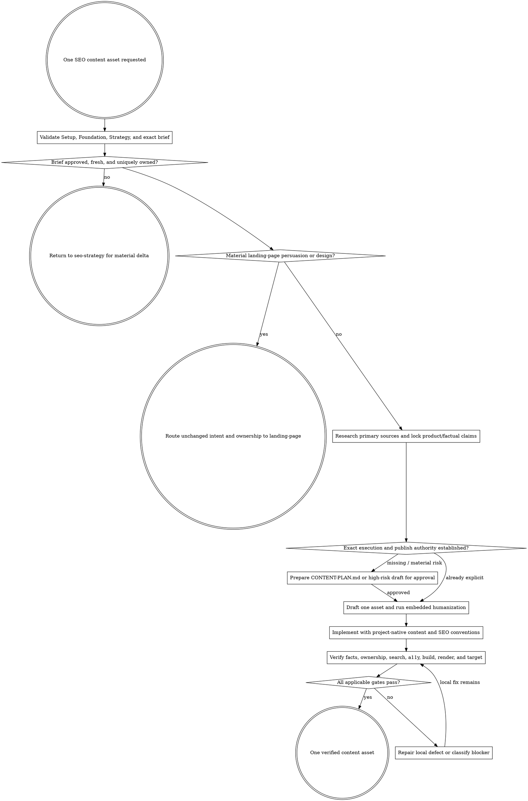

# SEO Content

Turn one approved Strategy brief into one truthful, useful, verified content asset. Preserve the assigned cluster and protected winners; never treat content volume as progress.

Resolve the owning work root and maintain `agent-work/{slug}/WORK.md` using [the canonical work-artifact contract](contracts/work-artifacts.md). Write this stage under `agent-work/{slug}/seo-content/`. Read [REFERENCE.md](REFERENCE.md) completely before validating a brief, researching claims, or changing content.

## Boundaries

- Execute exactly one approved brief and one primary owner per run. Do not mass-generate a cluster, batch-publish templated variants, or expand into unapproved adjacent queries.
- Require the same-slug verified `seo-setup` status, approved `seo-foundation` ownership, approved `seo-strategy` portfolio row, and exact brief. Validate contents and freshness; filenames alone prove nothing.
- If a proposed URL overlaps a protected winner or lacks one unambiguous owner, stop and return to `seo-strategy`. Do not resolve strategy by drafting harder.
- Route a landing page with material persuasion, CTA, proof, visual-direction, layout, preview, or conversion decisions through `landing-page`. Preserve Strategy's owner, intent, facts, guardrails, and measurement contract in the handoff.
- Never invent product capabilities, experience, tests, quotes, examples, customers, credentials, certifications, benchmarks, outcomes, statistics, sources, dates, authors, or firsthand use.
- Never copy a competitor's distinctive language or structure, manufacture information gain, paraphrase a source too closely, or use word count as a quality target.
- Inspect freely. Source mutation requires explicit implementation authority for the exact approved brief. High-stakes claims, external CMS publication, production deployment, material brief deltas, redirects, analytics changes, and external configuration require the applicable explicit approval.
- Never weaken a citation qualifier, privacy/consent behavior, canonical/index posture, redirect, protected route, or existing winning page merely to fit a draft.

## 1. Validate the exact upstream contract

Use the same slug across all SEO stages. Validate:

- `SEO-SETUP-STATUS.json` is schema-valid, overall `VERIFIED`, and fragile provider/live evidence is still current enough for the task;
- `SEO-FOUNDATION.md` identifies the cluster, owner, intent boundary, protected winners, source limitations, and freshness;
- `SEO-STRATEGY.md`, `CONTENT-PORTFOLIO.csv`, and the exact editorial or page brief agree on action, URL, owner, audience, user job, differentiation, evidence, internal links, measurement, rollout, and approval;
- no material implementation drift has invalidated route, product truth, or publishing conventions.

Write `BRIEF-VALIDATION.md`. Any material missing or contradictory field blocks execution and routes to `seo-strategy`; do not silently repair upstream artifacts.

## 2. Resolve authority and implementation target

Inspect project instructions, content architecture, CMS or repository ownership, route generation, metadata, schema, author/byline rules, asset pipeline, localization, preview/deployment path, and project gates. Confirm whether the requested target is draft-only, local implementation, preview deployment, CMS publication, or production.

An explicit request to implement an already-approved exact brief authorizes ordinary reversible source changes within that brief. Write `CONTENT-PLAN.md` before mutation. Ask for approval when authority is absent or when the plan introduces a material delta in claims, owner/intent, URL, external publication, production, analytics, privacy, redirects, or destructive behavior. A high-stakes or externally published draft must receive exact content approval before publication.

## 3. Research for truth and information gain

Research the user question, product evidence, and claims—not just the keyword. Prefer current primary sources: product implementation and authoritative docs for product behavior, original studies/data for statistics, standards and regulators for rules, and direct source material for named claims. Secondary sources may orient research but do not outrank primary evidence.

Write:

- `SOURCE-LEDGER.md` with source, publisher, type, accessed date, covered claim, scope, limitation, and citation destination;
- `CLAIM-LEDGER.md` with each material factual/product claim labelled `VERIFIED`, `USER-APPROVED`, `ATTRIBUTED`, `UNKNOWN`, or `REJECTED`;
- the asset's specific information gain: decision aid, verified product workflow, comparison dimension, original synthesis, example, diagram, checklist, or answer unavailable from the current owner.

Unsupported material claims are removed, narrowed, clearly attributed, or returned for user evidence. Do not cite search-result snippets as sources. Respect copyright and quotation limits.

## 4. Draft for the user job

Draft `CONTENT-DRAFT.md` when review is required or useful; otherwise implement through a temporary stage draft and retain a compact final record. Start from the brief's user job and search intent. Use the required information architecture only when it helps the reader. Answer the primary question early, make qualifiers visible, keep examples accurate, and end with the next useful action rather than a generic summary.

Do not keyword-stuff titles, headings, anchors, alt text, or body copy. Use related terms only where they improve precision. Do not force FAQ sections, fixed lengths, formulaic introductions, fake personal anecdotes, or empty “ultimate guide” positioning.

Discover `prose-humanizer` through the host registry or sibling `../prose-humanizer/SKILL.md`. When found, read it and use embedded mode with the claim ledger, audience, purpose, approved terminology, protected citations, and markup. Keep artifacts here. Humanization must not change facts, certainty, intent, or source boundaries.

## 5. Implement the approved asset

Use project-native content collections, routes, MD/MDX, CMS fields, components, metadata helpers, images, author rules, and tests. Preserve unrelated work and existing content ownership.

Execute each implementation slice through Plan -> Do -> Verify. Keep the asset shippable between slices and recheck ownership, claims, and rendered behavior after integration.

Implement:

- one clear title/H1 relationship and semantic heading hierarchy;
- an intentional `INDEX`, `NOINDEX`, or approved unresolved posture, canonical URL, robots behavior, and sitemap inclusion;
- truthful title/description/social metadata without clickbait or unsupported promises;
- only applicable, visible, valid structured data whose values match rendered content;
- approved internal links with descriptive, non-spammy anchors and no orphaning;
- external citations at the claim location when the format supports them;
- accessible content structure, tables, media, captions, alternative text, focus behavior, and responsive overflow;
- authorized conversion or outcome instrumentation only, preserving Setup's consent contract.

Append `WIP`, `DONE`, `BLOCKED`, `SKIP`, `STRENGTHENED`, or `FLAKE-FIXED` entries to `PROGRESS.md`. Every `DONE` entry includes “I am satisfied this step is complete because …” plus claim, ownership, project, and rendered evidence.

## 6. Verify the integrated result

Run project-specific format, parse, schema, type, lint, test, content, link, build, and browser gates. Verify:

- every material claim against `CLAIM-LEDGER.md`, including numbers, dates, scope, certainty, citations, byline, and update date;
- the intended query/user job is satisfied without taking ownership from another page;
- primary owner, supporting links, protected winners, URL, canonical, index posture, sitemap behavior, headings, metadata, and structured data match Strategy;
- rendered content is complete without client-only hiding, broken MDX, hydration errors, inaccessible structures, overflow, broken media, or dead links;
- mobile, desktop, 200% zoom, keyboard, content extremes, and supported themes/locales behave intentionally;
- performance and bundle behavior remain proportionate to the content value;
- the approved target—local, preview, CMS, or production—shows the expected asset and no unrelated change.

Apply [Goalpro's quality contract](contracts/execution-quality.md) proportionally. Product truth, correctness, security/privacy, content and accessibility, compatibility, performance, maintainability, rollback, and machine plus rendered verification are presumptively applicable.

When the same gate fails after three substantive fixes, classify local versus external blockage. Continue independent verification when safe; otherwise preserve resumable state and ask one focused question.

## 7. Record the content receipt

Write `CONTENT-RECEIPT.md` with brief and approval provenance, final URL/target, owner and cluster, action, changed files or CMS record identifiers, claims/sources, index/canonical/schema/link posture, gates, rendered/published evidence, baseline pointer, rollback, known limitations, indexing-assistance eligibility, and next monitoring windows. Do not include secrets, private analytics rows, raw provider bodies, or unnecessary personal data.

Update `WORK.md`. When an approved canonical production page is newly published or materially updated, hand its receipt to `seo-indexing` for bounded live verification and optional request processing. Give `seo-monitor` the Strategy measurement contract plus content and indexing receipt paths; do not manufacture indexing or post-publication results at implementation time.

## Artifacts

- `BRIEF-VALIDATION.md` — prerequisite paths, freshness, owner/intent, protected winners, brief consistency, and route decision.
- `CONTENT-PLAN.md` — exact asset target, authority, research, implementation, gates, target environment, rollout, and rollback.
- `SOURCE-LEDGER.md` — primary/secondary source roles, dates, claim coverage, limitations, and citation destinations.
- `CLAIM-LEDGER.md` — material claims, status, evidence, wording constraints, and final locations.
- `CONTENT-DRAFT.md` — conditional review candidate or retained final copy when the project does not own the content source.
- `PROGRESS.md` — append-only implementation and verification log.
- `CONTENT-RECEIPT.md` — final ownership, changed target, published/rendered evidence, indexing eligibility, baseline pointer, and downstream handoffs.
- `QUALITY-REPORT.md` — proportional quality classification and final integrated verification.
- `NOTES.md` — optional sanitized research or decision notes.

## Done

Finish only when one exact approved brief has one verified owner; material claims and citations pass; copy is useful, specific, human, and non-derivative; implementation matches project conventions; protected winners and upstream intent are unchanged; search, metadata, structured data, links, accessibility, project, rendering, and authorized target checks pass; rollback and receipt exist; and no required approval or user-only publish step remains.

State: “I am satisfied this SEO content asset is complete because …” with the approved brief, claim audit, changed target, gates, rendered/published evidence, and remaining waivers. If deployment or external publication was not authorized or observed, report the exact incomplete state instead of calling the asset production-verified.

## Optional shared Theme Library

When a material named-theme or palette decision exists in the approved brief, discover the independently installed `theme-library` through the host registry or sibling directory and use embedded mode. Keep artifacts here and preserve the governing design direction. If absent, continue from existing product tokens; content work does not create a new visual language.
