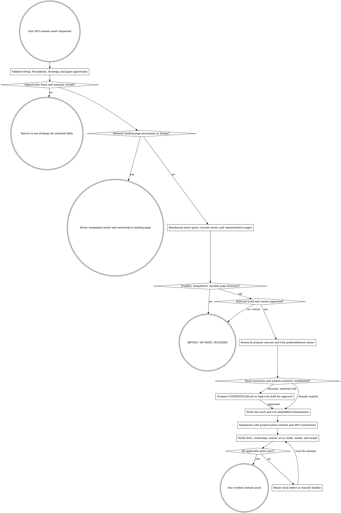

# SEO Content

Turn one approved Strategy opportunity into one truthful, competitive, durable, verified content asset—or conclude that it should be revised or not published. Preserve the assigned cluster and protected winners; never treat content volume or technical validity as progress.

Resolve the owning work root and maintain `agent-work/{slug}/WORK.md` using [the canonical work-artifact contract](contracts/work-artifacts.md). Write this stage under `agent-work/{slug}/seo-content/`. Read [REFERENCE.md](REFERENCE.md), apply [the SEO page-quality contract](contracts/seo-page-quality.md), and apply [the SEO change-control contract](contracts/seo-change-control.md) before accepting a page direction, researching claims, or changing content.

## Boundaries

- Evaluate and execute at most one page opportunity and one primary owner per run. Do not mass-generate a cluster, batch-publish templated variants, or expand into unapproved adjacent queries.
- Require the same-slug verified `seo-setup` status, approved `seo-foundation` ownership, and approved `seo-strategy` portfolio row plus page opportunity. Treat any supplied page brief as a hypothesis to challenge, not authority to bypass benchmarking.
- If a proposed URL overlaps a protected winner or lacks one unambiguous owner, stop and return to `seo-strategy`. Do not resolve strategy by drafting harder.
- Route a landing page with material persuasion, CTA, proof, visual-direction, layout, preview, or conversion decisions through `landing-page`. Preserve Strategy's owner, intent, facts, guardrails, and measurement contract in the handoff.
- Never invent product capabilities, experience, tests, quotes, examples, customers, credentials, certifications, benchmarks, outcomes, statistics, sources, dates, authors, or firsthand use.
- Never copy a competitor's distinctive language or structure, manufacture information gain, paraphrase a source too closely, or use word count as a quality target.
- Never infer that a recurring competitor module, outline, page length, methodology, or ranking caused success. Inspect representative full pages and record uncertainty.
- Inspect, benchmark, and draft artifacts freely. Source mutation begins only after the exact `EDITORIAL-BRIEF.md` revision and `PUBLISH` verdict are approved. High-stakes claims, external CMS publication, production deployment, material brief deltas, redirects, analytics changes, and external configuration require the applicable explicit approval.
- Never weaken a citation qualifier, privacy/consent behavior, canonical/index posture, redirect, protected route, or existing winning page merely to fit a draft.
- Truthfulness is a floor, not the editorial bar. A technically correct page with a bland title, brittle catalogue, wrong SERP role, no information advantage, or no reason to choose it cannot pass.
- Do not treat persuasive or navigational language as unsupported merely because it is not a literal database field. Classify factual, derived, comparative, persuasive, and navigational wording separately.
- Improve before removing. Inspect available facts, traits, aliases, descriptions, measurements, relationships, taxonomy, media, and product actions before deleting, hiding, or neutralizing useful content.
- Treat visible FAQ utility separately from FAQ-schema eligibility, and repeated shared framing separately from harmful page-level duplication.

## 1. Validate and challenge the upstream opportunity

Use the same slug across all SEO stages. Validate:

- `SEO-SETUP-STATUS.json` is schema-valid, overall `VERIFIED`, and fragile provider/live evidence is still current enough for the task;
- `SEO-FOUNDATION.md` identifies the cluster, owner, intent boundary, protected winners, source limitations, and freshness;
- `SEO-STRATEGY.md`, `CONTENT-PORTFOLIO.csv`, and `PAGE-OPPORTUNITIES.md` agree on action, owner, audience, user job, evidence strength, protected assets, internal-link role, measurement, and benchmark readiness;
- no material implementation drift has invalidated route, product truth, or publishing conventions.

Write `BRIEF-VALIDATION.md`. Record both internal consistency and strategic challenges. Missing ownership or material portfolio contradictions route to `seo-strategy`; weak titles, structures, formats, competitive premises, or page-level evidence are this specialist's responsibility to investigate rather than inherit.

## 2. Benchmark the exact page opportunity

Write `PAGE-BENCHMARK.md` using the shared contract. Inspect the current owner plus a representative set of current results and full pages for the exact query, intent, market, language, device/context, engine, and retrieval date. Compare page roles, title promises, user jobs, information architecture, catalogue/data models, proof, interaction, conversion paths, useful differences, weaknesses, and unserved needs.

Write `PAGE-REQUIREMENTS.md`. Classify every proposed requirement `MUST`, `OPTIONAL`, `TEST`, or `REJECTED`, cite its evidence, and name its invalidation condition. Competitor recurrence alone cannot produce a `MUST`.

## 3. Make the editorial decision and approve the brief

Write `EDITORIAL-BRIEF.md` and `EDITORIAL-REVIEW.md`. The brief owns the proposed title/H1 relationship, reader promise, information architecture, catalogue model, differentiation, source/claim plan, internal-link role, and maintenance posture. The review independently evaluates truth and competitiveness and sets `PUBLISH`, `REVISE`, `NO PAGE`, or `BLOCKED`.

Test the title for accuracy, appeal, specificity, differentiation, evergreen durability, and catalogue scalability. A mutable inventory count cannot be frozen into an evergreen title unless automation keeps it correct or the page is explicitly a dated snapshot. Removing an unsupported “best” claim is not enough; the replacement must still offer a concrete, defensible reason to click.

Compare the proposed page with the current owner and benchmark pages. Ask: Does it fit what users seek for this query without copying? Is it materially better or different? Can its structure hold the planned catalogue? Would an experienced SEO editor publish it now? If not, revise, return `NO PAGE`, or route a portfolio delta to Strategy.

Obtain explicit approval of the exact `EDITORIAL-BRIEF.md` revision before source mutation. A prior Strategy approval authorizes portfolio investigation, not this page implementation.

For any existing user-facing change, write `SEO-CHANGE-LEDGER.json` with exact representative before/after, page family and route count, term gains/losses, intent/CTR/persuasion/conversion mechanisms, evidence, disposition, canary, rollout, and rollback. Shared-template, multi-route, removal, title, description, FAQ, module-visibility, structured-data, CTA, and link-copy changes require an `SEO-CHANGE-APPROVAL.json` whose digest and approved IDs validate before mutation.

## 4. Resolve authority and implementation target

Inspect project instructions, content architecture, CMS or repository ownership, route generation, metadata, schema, author/byline rules, asset pipeline, localization, preview/deployment path, and project gates. Confirm whether the requested target is draft-only, local implementation, preview deployment, CMS publication, or production.

An explicit request to implement an already-approved specialist brief authorizes ordinary reversible source changes only when the approved revision, `PUBLISH` verdict, and benchmark remain current. Write `CONTENT-PLAN.md` before mutation. Ask for approval when authority is absent or when the plan introduces a material delta in claims, title promise, catalogue model, owner/intent, URL, external publication, production, analytics, privacy, redirects, or destructive behavior. A high-stakes or externally published draft must receive exact content approval before publication.

## 5. Research for truth and information gain

Research the user question, product evidence, and claims—not just the keyword. Prefer current primary sources: product implementation and authoritative docs for product behavior, original studies/data for statistics, standards and regulators for rules, and direct source material for named claims. Secondary sources may orient research but do not outrank primary evidence.

Write:

- `SOURCE-LEDGER.md` with source, publisher, type, accessed date, covered claim, scope, limitation, and citation destination;
- `CLAIM-LEDGER.md` with each material factual/product claim labelled `VERIFIED`, `USER-APPROVED`, `ATTRIBUTED`, `UNKNOWN`, or `REJECTED`;
- the asset's specific information gain: decision aid, verified product workflow, comparison dimension, original synthesis, example, diagram, checklist, or answer unavailable from the current owner.

Classify each changed phrase `FACTUAL`, `DERIVED`, `COMPARATIVE`, `PERSUASIVE`, or `NAVIGATIONAL`. Preserve supported high-intent terminology and record every term gained or lost. A truthful replacement that becomes vague, generic, or less actionable returns to `REVISE`.

Unsupported material claims are removed, narrowed, clearly attributed, or returned for user evidence. Do not cite search-result snippets as sources. Respect copyright and quotation limits.

## 6. Draft for the user job

Draft `CONTENT-DRAFT.md` when review is required or useful; otherwise implement through a temporary stage draft and retain a compact final record. Start from the approved specialist brief's user job and search intent. Use only `MUST` requirements that remain supported; treat `OPTIONAL` and `TEST` items honestly. Answer the primary question early, make qualifiers visible, keep examples accurate, and end with the next useful action rather than a generic summary.

Do not keyword-stuff titles, headings, anchors, alt text, or body copy. Use related terms only where they improve precision. Do not force FAQ sections, fixed lengths, formulaic introductions, fake personal anecdotes, or empty “ultimate guide” positioning.

Do not remove a useful visible FAQ because FAQ schema is unavailable or ineligible. Do not call repeated orientation or CTA copy harmful duplication without evaluating the complete page's unique value and attempting an entity-specific improvement from available data.

Discover `prose-humanizer` through the host registry or sibling `../prose-humanizer/SKILL.md`. When found, read it and use embedded mode with the claim ledger, audience, purpose, approved terminology, protected citations, and markup. Keep artifacts here. Humanization must not change facts, certainty, intent, or source boundaries.

Before implementation, repeat the comparative editorial review against the complete draft. Artifact completeness, truthful claims, and clean prose cannot change a `REVISE`, `NO PAGE`, or `BLOCKED` verdict into `PUBLISH`.

## 7. Implement the approved asset

Use project-native content collections, routes, MD/MDX, CMS fields, components, metadata helpers, images, author rules, and tests. Preserve unrelated work and existing content ownership.

Before mutation, run `python3 scripts/validate_seo_change_control.py --ledger SEO-CHANGE-LEDGER.json --approval SEO-CHANGE-APPROVAL.json` when a ledger is required. Implement only approved change IDs. Any changed after-value, transformation, route count, scope, rollout, or rollback invalidates approval.

Execute each implementation slice through Plan -> Do -> Verify. Keep the asset shippable between slices and recheck ownership, claims, and rendered behavior after integration.

Implement:

- one clear title/H1 relationship and semantic heading hierarchy;
- an intentional `INDEX`, `NOINDEX`, or approved unresolved posture, canonical URL, robots behavior, and sitemap inclusion;
- truthful, compelling, differentiated, and durable title/description/social metadata without clickbait or unsupported promises;
- only applicable, visible, valid structured data whose values match rendered content;
- approved internal links with descriptive, non-spammy anchors and no orphaning;
- external citations at the claim location when the format supports them;
- accessible content structure, tables, media, captions, alternative text, focus behavior, and responsive overflow;
- authorized conversion or outcome instrumentation only, preserving Setup's consent contract.

Append `WIP`, `DONE`, `BLOCKED`, `SKIP`, `STRENGTHENED`, or `FLAKE-FIXED` entries to `PROGRESS.md`. Every `DONE` entry includes “I am satisfied this step is complete because …” plus claim, ownership, project, and rendered evidence.

## 8. Verify the integrated result

Run project-specific format, parse, schema, type, lint, test, content, link, build, and browser gates. Verify:

- every material claim against `CLAIM-LEDGER.md`, including numbers, dates, scope, certainty, citations, byline, and update date;
- the intended query/user job is satisfied without taking ownership from another page;
- the rendered title, promise, structure, catalogue capacity, and information gain still earn a `PUBLISH` verdict against the dated benchmark;
- the page gives the target user a concrete reason to choose it over the current owner and representative alternatives;
- primary owner, supporting links, protected winners, URL, canonical, index posture, sitemap behavior, headings, metadata, and structured data match Strategy;
- rendered content is complete without client-only hiding, broken MDX, hydration errors, inaccessible structures, overflow, broken media, or dead links;
- mobile, desktop, 200% zoom, keyboard, content extremes, and supported themes/locales behave intentionally;
- performance and bundle behavior remain proportionate to the content value;
- the approved target—local, preview, CMS, or production—shows the expected asset and no unrelated change.
- representative rendered before/after matches approved change IDs, preserves reviewed terms and specificity, and exposes no unapproved user-facing delta;

Apply [Goalpro's quality contract](contracts/execution-quality.md) proportionally. Product truth, correctness, security/privacy, content and accessibility, compatibility, performance, maintainability, rollback, and machine plus rendered verification are presumptively applicable.

Technical, schema, build, link, accessibility, and rendering success are necessary but never substitute for the page-quality verdict. A test authored from the same editorial opinion is conformance evidence only. Update `EDITORIAL-REVIEW.md` with the final comparative review and any material delta from the approved brief or change ledger.

When the same gate fails after three substantive fixes, classify local versus external blockage. Continue independent verification when safe; otherwise preserve resumable state and ask one focused question.

## 9. Record the content receipt

Write `CONTENT-RECEIPT.md` with opportunity, benchmark, specialist brief, editorial verdict, and approval provenance; final URL/target; owner and cluster; action; changed files or CMS record identifiers; claims/sources; index/canonical/schema/link posture; comparative and technical gates; rendered/published evidence; baseline pointer; rollback; known limitations; indexing-assistance eligibility; and next monitoring windows. Do not include secrets, private analytics rows, raw provider bodies, or unnecessary personal data.

Update `WORK.md`. When an approved canonical production page is newly published or materially updated, hand its receipt to `seo-indexing` for bounded live verification and optional request processing. Give `seo-monitor` the Strategy measurement contract plus content and indexing receipt paths; do not manufacture indexing or post-publication results at implementation time.

## Artifacts

- `BRIEF-VALIDATION.md` — prerequisite paths, freshness, owner/intent, protected winners, upstream consistency, strategic challenges, and route decision.
- `PAGE-BENCHMARK.md` — exact query scope, current owner, representative pages, page roles, competitive evidence, gaps, counterevidence, and limitations.
- `PAGE-REQUIREMENTS.md` — `MUST`, `OPTIONAL`, `TEST`, and `REJECTED` requirements with evidence and invalidation conditions.
- `EDITORIAL-BRIEF.md` — approved specialist-owned title, promise, information architecture, catalogue model, differentiation, sources, links, and maintenance posture.
- `EDITORIAL-REVIEW.md` — truth/competitiveness matrix, title and catalogue tests, comparative review, verdict, revisions, and approval state.
- `CONTENT-PLAN.md` — exact asset target, authority, research, implementation, gates, target environment, rollout, and rollback.
- `SOURCE-LEDGER.md` — primary/secondary source roles, dates, claim coverage, limitations, and citation destinations.
- `CLAIM-LEDGER.md` — material claims, status, evidence, wording constraints, and final locations.
- `SEO-CHANGE-LEDGER.json` and `SEO-CHANGE-APPROVAL.json` — conditional exact before/after, route scope, term effects, disposition, canary, rollback, approved IDs, and digest.
- `CONTENT-DRAFT.md` — conditional review candidate or retained final copy when the project does not own the content source.
- `PROGRESS.md` — append-only implementation and verification log.
- `CONTENT-RECEIPT.md` — final ownership, changed target, published/rendered evidence, indexing eligibility, baseline pointer, and downstream handoffs.
- `QUALITY-REPORT.md` — proportional quality classification and final integrated verification.
- `NOTES.md` — optional sanitized research or decision notes.

## Done

Finish only when one approved page opportunity has one verified owner; a current page-specific benchmark exists; every requirement has an evidence strength; the exact specialist brief and `PUBLISH` verdict are approved; required change-ledger bytes and IDs are approved and match the rendered result; the title is truthful, compelling, durable, and catalogue-safe; the page is demonstrably competitive and worth publishing; material claims and citations pass; copy is useful, specific, human, and non-derivative; implementation matches project conventions; protected winners and upstream intent are unchanged; comparative, search, metadata, structured data, links, accessibility, project, rendering, and authorized-target checks pass; rollback and receipt exist; and no required approval or user-only publish step remains.

State: “I am satisfied this SEO content asset is complete because …” with the benchmark, approved specialist brief, editorial verdict, claim audit, changed target, comparative and technical gates, rendered/published evidence, and remaining waivers. If deployment or external publication was not authorized or observed, report the exact incomplete state instead of calling the asset production-verified.

## Optional shared Theme Library

When a material named-theme or palette decision exists in the approved brief, discover the independently installed `theme-library` through the host registry or sibling directory and use embedded mode. Keep artifacts here and preserve the governing design direction. If absent, continue from existing product tokens; content work does not create a new visual language.
