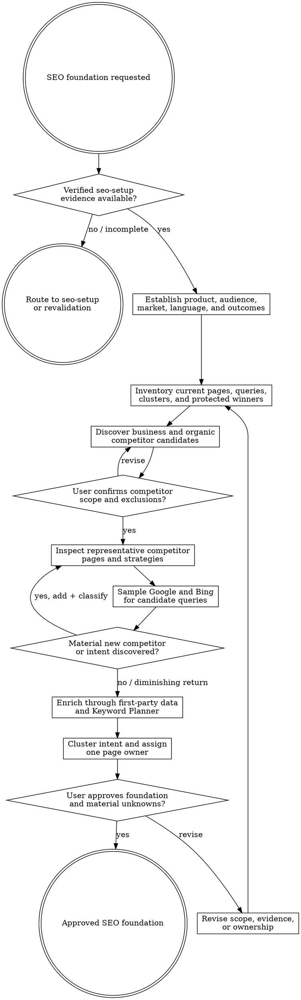

# SEO Foundation

Turn verified measurement/search access and product truth into an approved competitor, query-demand, cluster, and page-ownership foundation. This stage is read-only outside `agent-work/{slug}/seo-foundation/`; it never changes project source, public content, provider configuration, or external accounts.

Resolve the owning work root and maintain `agent-work/{slug}/WORK.md` using [the canonical work-artifact contract](contracts/work-artifacts.md). Write stage artifacts under `agent-work/{slug}/seo-foundation/`. Read [REFERENCE.md](REFERENCE.md) before collecting or ranking evidence.

## Boundaries

- Remain read-only outside this stage. Do not edit metadata, pages, links, sitemaps, tracking, DNS, provider settings, or external accounts.
- Do not create content briefs or a publishing roadmap; that belongs to `seo-strategy`.
- Do not treat business competitors, organic SERP competitors, publishers, marketplaces, aggregators, directories, or adjacent substitutes as interchangeable.
- Do not call raw word frequency a competitor's “SEO strategy.” Weight titles, headings, page roles, internal anchors, navigation, entities, structured data, format, proof, and repeated search intent while excluding boilerplate.
- Do not bypass bot protection, authentication, paywalls, rate limits, or site terms. Use public pages, search results, available first-party exports, current APIs, and authorized signed-in computer use.
- Never combine Google, Bing, Analytics, Keyword Planner, third-party metrics, markets, languages, devices, or date windows without preserving and explaining their distinct scopes.
- Google Ads competition is paid-search advertiser competition, not organic ranking difficulty.
- Search results are samples, not universal rank truth. Record engine, query, date, market, language, device/context, and limitations.

## 1. Validate Setup and choose the pipeline slug

Find `agent-work/{slug}/seo-setup/SEO-SETUP-STATUS.json` in the same initiative first. An explicitly selected prior Setup artifact may be reused when it belongs to the same project and current production site. Validate its schema, overall status, canonical origin, provider targets, verification timestamps, and fragile live evidence.

If Setup is incomplete, stale in a way that can change the research, or points at the wrong site/property/account, route to `seo-setup` and stop. A filename or prior completion claim is not proof. If the installed `seo-setup` package and `seo-stack` CLI are discoverable, use their read-only validation/normalization commands. If the helper is unavailable but Setup evidence is otherwise current and correctly scoped, perform the documented checks manually and record the fallback. Manual fallback replaces tooling only; it never turns missing, stale, or mismatched Setup evidence into valid prerequisites.

## 2. Establish product and research scope

Apply [Planpro's product-research lens](contracts/product-research.md). Inspect product docs, current pages, analytics definitions, conversions, existing SEO strategy, query exports, user language, geography, sales/app-store markets, and product truth.

Write `FOUNDATION-BRIEF.md` with:

- primary users, jobs, problems, and useful conversion outcomes;
- product capabilities and claims that search pages may truthfully fulfil;
- target market, language, search engines, device/context, and research date;
- business objectives, guardrails, and failure signals;
- current site/page inventory and known clusters;
- data sources, compatible windows, gaps, and limitations;
- explicit exclusions and sensitive/high-risk topics.

Ask one focused question only when a material market, audience, product, or risk decision cannot be discovered. Do not ask the user to name competitors before performing initial discovery.

## 3. Establish the first-party baseline

Use compatible GSC, Bing, GA4, crawl/index, and current page evidence to identify:

- current query-to-page ownership;
- pages with meaningful clicks, impressions, CTR, position, engagement, or conversion evidence;
- emerging queries and low-CTR/high-impression exceptions;
- current page families, internal-link hubs, duplicates, redirects, noindex surfaces, and locale boundaries;
- protected winners whose URL, intent, title, H1, canonical, or structure should not change without stronger evidence.

Write `SITE-BASELINE.md`. Preserve sources and windows. “No data” and “access unavailable” are distinct states.

## 4. Discover and confirm competitors

Build an initial `COMPETITORS.md` from product evidence, direct category searches, high-intent seed queries, current SERPs, customer alternatives, app stores/marketplaces where relevant, and existing internal research. Classify each candidate using [REFERENCE.md](REFERENCE.md).

Present the candidate list with why each matters, confidence, evidence, and proposed inclusion/exclusion. Ask the user to confirm or revise the material competitor scope. Preserve rejected candidates and rationale; do not silently re-add them unless new evidence changes their classification.

If the user already approved a current competitor set in an authoritative artifact, cite it and ask only about material new candidates.

## 5. Inspect competitor page strategies

For each approved competitor, select representative pages by role rather than crawling blindly: homepage, category/product owner, high-ranking landing page, hub, guide/blog, comparison, tool/directory, and relevant locale surface. Inspect final rendered/public state when possible.

Record in `COMPETITOR-ANALYSIS.md`:

- page role, intended query/intent, title, description, H1/H2 structure, content format, proof, CTA, schema, canonical/index posture, and update signals;
- navigation, internal anchors, hub/spoke relationships, repeated entities and phrases, supporting content, and cross-cluster bridges;
- differentiation between brand positioning, conversion content, educational support, and template boilerplate;
- strengths, gaps, risks, unsupported claims, and adoption fit for this product.

Do not copy competitor prose, structure, or claims. Extract patterns and evidence.

## 6. Sample SERPs and iterate discovery

Search Google and Bing for the candidate terms and intent variants. Write `SERP-SNAPSHOTS.md` with reproducible scope and the observed result/page types, domains, intent mix, SERP features, and volatility limitations.

When a materially new domain or search intent recurs, classify it and inspect representative pages. Repeat competitor-page and SERP analysis until the next pass produces no material new competitor, intent, or page-role evidence, or until diminishing returns are explicit. Do not loop merely because another domain exists.

## 7. Enrich demand and rank opportunities

Combine:

- first-party GSC and Bing query/page evidence;
- Google Ads Keyword Planner ideas and historical metrics through the approved UI/API path;
- competitor and SERP recurrence;
- current page ownership and product fulfilment;
- optional third-party data whose proprietary semantics are labelled.

Write normalized `KEYWORD-DEMAND.csv` plus its source dictionary in `KEYWORD-DEMAND.md`. Rank opportunity by evidence-adjusted user/product value and feasibility, not search volume alone. Include demand/trend, intent and conversion relevance, current traction, product truth, SERP/page-type fit, competitive evidence, authority/internal-link fit, cannibalization risk, effort, reversibility, and uncertainty. Do not invent universal weights; state and justify any project-specific scoring.

## 8. Cluster and assign page ownership

Build `KEYWORD-CLUSTERS.md` and `PAGE-OWNERSHIP.md`. Every cluster includes:

- user intent and desired outcome;
- primary query family and meaningful modifiers;
- one current or proposed primary owner;
- same-cluster support pages and one optional cross-cluster bridge;
- excluded intents and neighboring owners;
- current evidence, opportunity, product fulfilment, and uncertainty;
- protected-winner and cannibalization rules;
- create/refresh/consolidate decision deferred to Strategy.

One page may support adjacent language, but it cannot be the primary owner of incompatible clusters. A new URL is not implied by an unowned keyword.

## 9. Consolidate and approve the foundation

Write `SEO-FOUNDATION.md` as the consumption index: scope, source ledger, baseline, competitor map, SERP findings, ranked opportunities, clusters, ownership, protected winners, risks, unknowns, and freshness/revalidation rules. Link detailed artifacts instead of duplicating them.

Show the proposed competitor set, priority opportunities, cluster map, ownership decisions, protected winners, and material unknowns. Ask whether the foundation matches the user's market and product understanding. Record approval provenance and revisions in the artifact and `WORK.md`.

## Artifacts

- `FOUNDATION-BRIEF.md` — product, market, language, outcome, scope, and source contract.
- `SITE-BASELINE.md` — current pages, queries, owners, conversions, and protected winners.
- `COMPETITORS.md` — classified candidates, evidence, user decisions, and iteration history.
- `COMPETITOR-ANALYSIS.md` — representative page-level strategy evidence.
- `SERP-SNAPSHOTS.md` — engine/query/scope-labelled search-result samples.
- `KEYWORD-DEMAND.csv` and `KEYWORD-DEMAND.md` — normalized evidence and field/source dictionary.
- `KEYWORD-CLUSTERS.md` — intent-led cluster definitions and boundaries.
- `PAGE-OWNERSHIP.md` — one owner per cluster plus support/bridge rules.
- `SEO-FOUNDATION.md` — approved downstream consumption index.
- `NOTES.md` — optional sanitized research notes.

## Done

Finish only when Setup evidence is valid; market and product scope are explicit; the user has confirmed material competitor inclusions/exclusions; representative competitor pages and both requested search engines have been sampled; iterative discovery reaches an evidenced stop; demand preserves source semantics; every material cluster has one owner or an explicit unresolved decision; protected winners and cannibalization rules are recorded; and the user approves the consolidated foundation.

State: “I am satisfied the SEO foundation is complete because …” with evidence coverage, remaining uncertainty, and the exact `SEO-FOUNDATION.md` path. Do not implement or hand directly to Goalpro; the next stage is `seo-strategy` with the same slug.

## Optional shared Theme Library

When the request contains a material named-theme or palette decision, discover the independently installed `theme-library` skill through the host skill registry. If the host has no registry, resolve `theme-library/SKILL.md` as a sibling of this skill directory (the standard relative location is `../theme-library/SKILL.md`). If found, read it and use embedded mode while keeping artifacts in this skill's stage. If it is not installed, continue the primary workflow and disclose the unavailable palette library only when it materially limits the result. Never rely on repository-level AGENTS or README files for discovery.
