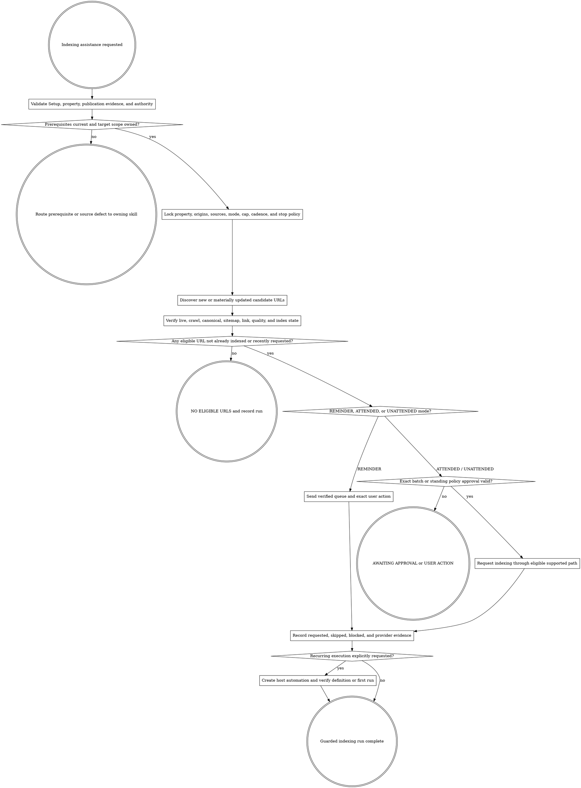

# SEO Indexing

Help search engines discover a small number of important, ready pages after publication. Treat a request as an indexing-assistance signal—not proof of indexing, ranking, traffic, or faster inclusion.

Resolve the owning work root and maintain `agent-work/{slug}/WORK.md` using [the canonical work-artifact contract](contracts/work-artifacts.md). Write this stage under `agent-work/{slug}/seo-indexing/`. Read [REFERENCE.md](REFERENCE.md) completely before selecting URLs, requesting indexing, or creating an automation.

## Boundaries

- Act as a guarded executor. Read freely, but request indexing or create/change an automation only under an explicit approved operating contract.
- Keep `seo-monitor` read-only. Consume its `INDEXING ASSIST` route when present; never treat a monitoring recommendation as mutation authority.
- Do not repair source, content, sitemap, internal links, robots, canonicals, redirects, structured data, deployment, or provider ownership here. Route the exact defect to `seo-content`, `landing-page`, `seo-setup`, diagnosis, or Goalpro.
- Use Google Search Console signed-in computer use for ordinary web pages. The Search Console URL Inspection API only reads the indexed version; it does not request indexing or run a live test.
- Use Google's Indexing API only after current official documentation, page markup, account authorization, and quota prove the URL is an eligible `JobPosting` or livestream `BroadcastEvent` page. Never send ordinary articles, landing pages, product pages, or guides through that restricted API.
- Never bypass sign-in, multi-factor authentication, terms, CAPTCHA, provider quotas, property permissions, or anti-abuse controls. Pause for the authorized user when required.
- Do not submit a URL merely to fill a numerical allowance. Google publishes a daily limit but no guaranteed ten-URL quota; `10` is an optional user-approved operational cap, not a provider entitlement.
- Never claim a request was accepted unless provider-visible evidence exists. Never call `REQUESTED` or an API success response `INDEXED`.
- Do not repeat a request for the same unchanged URL. Requeue only after a material published update, a verified indexing defect repair, an explicit provider retry instruction, or a user-approved exception.
- Do not persist credentials, session material, raw provider bodies, unnecessary analytics/query data, or personal information.

## 1. Validate prerequisites and ownership

Use the same slug as the publishing or monitoring initiative when one exists. Validate:

- current, schema-valid `SEO-SETUP-STATUS.json` with overall `VERIFIED` status for canonical origin, crawl/index foundation, Search Console property/access, and sitemap;
- one approved Search Console property and every allowed canonical origin;
- owner or full-user authority for manual indexing requests, or the exact verified restricted-API authority when applicable;
- an approved `CONTENT-RECEIPT.md`, Landing Page quality/production receipt, deployment/CMS record, sitemap delta, or user-supplied URL list tied to owned production content;
- Foundation/Strategy ownership, intent, protected winners, and `INDEX` posture when the page belongs to the SEO pipeline;
- the live production environment rather than localhost, preview, staging, gated, campaign-only, or private URLs.

Do not trust filenames, route declarations, build output, or a sitemap row as publication proof. If prerequisites are missing or stale, record the gap and route it to the owning stage before any request.

## 2. Lock the operating contract

Write `INDEXING-BRIEF.md` before selection or mutation. Define:

- objective, slug, property, allowed canonical origins, and environment;
- candidate sources and publication-evidence requirements;
- `REMINDER`, `ATTENDED`, or `UNATTENDED` mode;
- `max_requests_per_run`, schedule, timezone, and no-work behavior;
- eligibility, priority, deduplication, and requeue rules;
- credential-source names, user-only steps, artifact retention, notifications, cost/quota posture, failure policy, and disable path;
- exact-batch approval or standing-policy approval provenance.

`REMINDER` prepares a verified queue and exact manual steps. `ATTENDED` previews each run's exact batch and requires confirmation before signed-in submission. `UNATTENDED` requires a standing approval bounded to the named property, origins, discovery sources, mode, cap, eligibility rules, schedule, credential posture, and stop behavior.

Renew approval when the property, origin, environment, discovery source, mode, cap, eligibility rule, provider path, credential posture, schedule, notification destination, or stop behavior changes materially. A newly discovered URL inside an unchanged approved policy is not itself a material delta.

## 3. Discover and prioritize candidates

Prefer authoritative sources in this order:

1. verified content or landing-page publication receipts;
2. deployment/CMS records tied to the approved production target;
3. sitemap additions or truthful `lastmod` changes since the prior run;
4. an exact user-provided owned URL list.

Do not crawl the whole site to manufacture work. Normalize redirects, fragments, tracking parameters, alternate hosts, locale variants, trailing slashes, and case according to the approved canonical architecture. Preserve discovery source and publication/update timestamp.

Prioritize only eligible URLs:

- `P0` — newly published, strategically owned page with complete discovery signals;
- `P1` — materially updated owner or repaired indexing defect with a new receipt;
- `P2` — user-approved exceptional request with a documented reason.

Select at most `max_requests_per_run`; default to ten only when the approved contract adopts that ceiling. An empty batch is a successful `NO ELIGIBLE URLS` run.

## 4. Verify every URL live

Use a real public GET and representative rendered inspection. For each candidate prove or classify:

- DNS, TLS, HTTP status, redirect chain, and final URL;
- allowed origin and Search Console property containment;
- successful public response without authentication, soft-404, placeholder, or error shell;
- robots.txt, meta robots, and `X-Robots-Tag` permit crawling and indexing;
- user-declared canonical matches the approved owner and final URL;
- intended sitemap membership and truthful recent `lastmod` when applicable;
- at least one crawlable internal discovery path appropriate to the site architecture;
- meaningful, non-duplicate published content matching the approved page purpose;
- current Search Console indexed-version verdict through the read-only API or UI when available;
- no prior request for the unchanged version in `SUBMISSION-HISTORY.md`.

Write `runs/{run-id}/DISCOVERY.md` and `runs/{run-id}/URL-VERIFICATION.csv`. Do not call a live page indexable solely because it returns `200`, and do not call it unindexed solely because a search operator omits it.

## 5. Preview and request indexing

Write `runs/{run-id}/SUBMISSION-PLAN.md` with the ordered exact batch, verification evidence, provider path, expected user-visible action, quota/cost posture, stop conditions, and approval reference.

For ordinary pages:

1. Open the approved Search Console property in an authorized signed-in browser.
2. Inspect the exact canonical URL.
3. If Search Console already reports the page indexed, mark `ALREADY_INDEXED` and do not request again.
4. If the provider's quick check rejects the URL, mark `PROVIDER_REJECTED`, capture the sanitized reason, and stop for that URL.
5. Select Request indexing once.
6. Record `REQUESTED` only when Search Console visibly accepts the request into its queue.
7. Stop the batch on quota, authentication, property mismatch, CAPTCHA, unexpected provider state, or policy ambiguity.

For an eligible restricted-API page, preserve current official eligibility and quota evidence, send only the approved canonical URL, and record the response semantics exactly. An HTTP success means Google received the notification, not that the page is indexed.

Use Plan -> Do -> Verify for each mutation slice. Append `WIP`, `DONE`, `BLOCKED`, `SKIP`, `STRENGTHENED`, or `FLAKE-FIXED` entries to `PROGRESS.md`. Every `DONE` entry includes “I am satisfied this step is complete because …” plus URL, approval, provider, and receipt evidence.

## 6. Record receipts and hand off

Write `runs/{run-id}/RUN-REPORT.md` with discovered, eligible, requested, already indexed, skipped, rejected, quota-stopped, and blocked counts plus exact sanitized evidence. Append one row per candidate to `SUBMISSION-HISTORY.md`; never rewrite prior rows.

Update `INDEXING-STATUS.md` and `WORK.md`. Hand requested URLs and observation timing to `seo-monitor`. Route source defects to their owning executor. A request receipt starts observation; it does not close an indexing outcome.

Apply [Goalpro's quality contract](contracts/execution-quality.md) proportionally. Verify scope, approval, privacy, source compatibility, browser/API behavior, immutable receipts, rollback or disable behavior, and truthful final status in `QUALITY-REPORT.md`.

## 7. Create an optional reminder or recurring job

Create or change a schedule only when the user explicitly requests recurring execution and approves the exact automation contract. Use the host-supported automation mechanism; do not invent cron, launchd, CI, or a cloud scheduler unless the user explicitly chooses that platform.

Preview `AUTOMATION-PLAN.md` with task prompt, repository/task, working directory, daily time or interval, timezone, property/origins, mode, cap, candidate sources, verification rules, credential posture, artifacts, notifications, quota/cost behavior, failure policy, first-run check, and pause/disable/delete path.

The scheduled run must fail closed on wrong property, new origin, stale Setup, missing publication evidence, ineligible URLs, schema mismatch, authentication loss, provider quota, or attempted scope expansion. `REMINDER` mode never clicks Request indexing. `ATTENDED` mode pauses for the exact batch. `UNATTENDED` mode may submit only inside the approved standing policy.

After creation, write `AUTOMATION-RECEIPT.md`. Verify the saved schedule and task. Observe one real run when feasible; otherwise report `AWAITING FIRST RUN`. Never describe the automation as healthy until an actual scheduled run produces valid artifacts and the expected submission or no-work outcome.

## Artifacts

- `INDEXING-BRIEF.md` — property, origins, sources, mode, cap, eligibility, cadence, credentials, stop behavior, and approval.
- `INDEXING-STATUS.md` — stable current queue, last run, automation state, blocks, and next action.
- `URL-QUEUE.csv` — current normalized candidates and their eligibility state.
- `SUBMISSION-HISTORY.md` — append-only URL/version, request, provider, outcome, and requeue ledger.
- `PROGRESS.md` — conditional append-only execution log when submission or automation mutation begins.
- `runs/{run-id}/DISCOVERY.md` — exact source inventory, timestamps, normalization, and exclusions.
- `runs/{run-id}/URL-VERIFICATION.csv` — one source-labelled readiness row per candidate.
- `runs/{run-id}/SUBMISSION-PLAN.md` — conditional exact batch and approval proof before a request.
- `runs/{run-id}/RUN-REPORT.md` — immutable counts, outcomes, evidence, blocks, and handoff.
- `AUTOMATION-PLAN.md` and `AUTOMATION-RECEIPT.md` — conditional schedule definition and creation evidence.
- `QUALITY-REPORT.md` — proportional quality classification and final integrated verification after mutation.
- `NOTES.md` — optional sanitized provider research or decision notes.

## Done

Finish a run when the property and authority are explicit; candidates came from approved sources; every candidate is normalized and live-verified; already indexed, duplicate, unchanged, ineligible, and blocked URLs are skipped honestly; every request has current approval and provider-visible evidence; history is append-only; quota/auth/provider failures stop safely; automation truth matches observed state; and the next monitor observation or owning-stage repair is clear.

State: “I am satisfied this SEO indexing run is complete because …” with property, mode, candidate source, eligible/requested/skipped counts, approval, provider receipt, automation state, and next observation. Never say the pages are indexed unless later provider evidence proves that state.

## Optional shared Theme Library

Indexing work does not redesign pages. If a named-theme release may have caused a render, contrast, asset, performance, or crawlability defect, discover `theme-library` through the host registry or sibling directory for evidence vocabulary only. Keep artifacts here and route any design mutation to its owning skill. If Theme Library is absent, continue with the project's existing visual contract.
