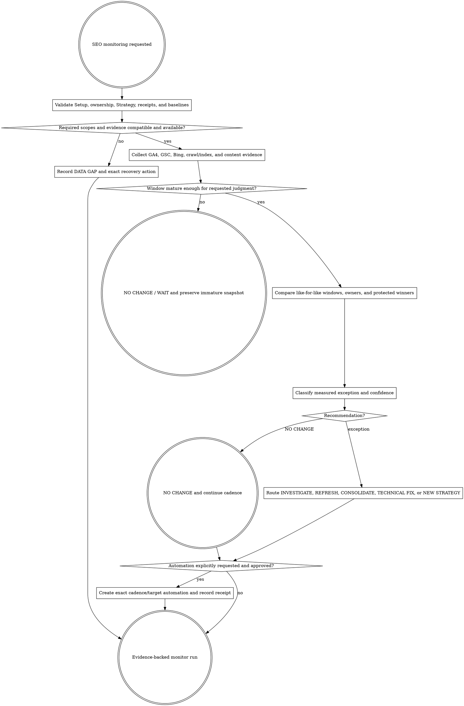

# SEO Monitor

Measure what changed, preserve source semantics, protect winners, and recommend the smallest evidence-backed next action. Monitoring is read-only; a report is not permission to rewrite the site.

Resolve the owning work root and maintain `agent-work/{slug}/WORK.md` using [the canonical work-artifact contract](contracts/work-artifacts.md). Write stable artifacts under `agent-work/{slug}/seo-monitor/` and immutable run evidence under `runs/{run-id}/`. Read [REFERENCE.md](REFERENCE.md) before collecting or comparing data. When evaluating an SEO release, apply [the SEO change-control contract](contracts/seo-change-control.md).

## Boundaries

- Read repository, public site, approved artifacts, and authorized analytics/search data. Do not edit source, content, DNS, analytics, search consoles, sitemaps, redirects, provider settings, campaigns, or production configuration.
- Do not combine Google, Bing, GA4, crawl, rank-check, or third-party metrics as if they were interchangeable. Preserve provider, property, retrieval date, available/final date, window, market, language, device/context, query, and page.
- Do not infer causality from correlation, claim an indexing state from rank movement, call paid competition organic difficulty, or promise traffic/ranking outcomes.
- Protect current winners. Short-term volatility, an immature window, a reporting delay, seasonality, or one noisy query does not authorize a rewrite.
- Keep technical and editorial release layers separate. A beneficial canonical, routing, sitemap, or relationship-data fix does not prove that accompanying title, metadata, FAQ, visible-copy, CTA, or module changes were beneficial.
- Treat a build, schema check, snapshot, or verifier written from the same editorial assumption as conformance evidence only. It cannot establish competitiveness, click appeal, persuasion, or causality.
- Define a cadence when useful, but create or change an automation only when the user explicitly requests it and the exact scope, recipients/destination, credential posture, schedule, timezone, cost, and stop behavior are approved.
- Never store credentials, raw provider bodies, unnecessary personal/event-level data, or unredacted query exports in durable artifacts. Aggregate to the minimum useful scope and follow project privacy/retention policy.

## 1. Validate the monitoring contract

Use the pipeline slug or an explicitly linked monitoring slug. Validate:

- current `SEO-SETUP-STATUS.json` and access required for this run;
- approved `SEO-FOUNDATION.md` ownership, protected winners, market/language, and source limitations;
- approved `SEO-STRATEGY.md`, `MEASUREMENT-PLAN.md`, and relevant portfolio rows;
- `CONTENT-RECEIPT.md` for each evaluated implementation, including final target, baseline pointer, publication time, rollback, and intended monitoring windows;
- `SEO-CHANGE-LEDGER.json` plus its digest-matching `SEO-CHANGE-APPROVAL.json` for user-facing changes, or `SEO-TECHNICAL-SCOPE.json` for a technical-only release;
- the actual deployed change IDs or technical classes, representative rendered before/after evidence, canary result, and separate editorial/technical rollback boundaries;
- current route, deployment, sitemap, canonical/index, analytics event, and data-retention reality.

Do not trust filenames. If a required prerequisite is invalid, stale, missing, or materially contradicted by current state, record the exact data gap and route it to the owning stage.

## 2. Lock scope before collection

Write `MONITOR-BRIEF.md` with the decision this run must support, site/property, owners/pages/clusters, protected winners, release layer, approved change IDs or technical classes, expected mechanism, conversion/outcome, providers, market, language, device/context, requested and available windows, comparison method, maturity rule, cadence, privacy/retention, and approved automation scope.

Prefer Strategy's baseline and 7/14/28-day gates when still valid; these are checkpoints, not universal statistical guarantees. Choose comparison windows that respect data availability, weekday/seasonal effects, launches, migrations, outages, campaigns, and known product changes. Record why the comparison is fair enough—or why no judgment is yet warranted.

## 3. Collect source-labelled evidence

Discover `seo-setup` and its `seo-stack` CLI through the host registry or sibling `../seo-setup/`. Confirm CLI/schema compatibility. Use read-only provider commands and `normalize` when compatible; otherwise use current official APIs, approved exports, or signed-in computer use with the same normalized contract. Never silently omit a requested source.

Collect only what the decision needs:

- GA4 organic landing-page sessions/users and approved outcome events, with consent and attribution limitations;
- Search Console query/page clicks, impressions, CTR, average position, coverage/inspection, sitemap, and enhancement evidence when available;
- Bing query/page and crawl/index evidence as a separate source;
- live HTTP, robots, canonical, sitemap, structured-data, status, performance, and representative render/crawl evidence;
- current page ownership, portfolio action, content receipt, deployment, and internal-link state;
- the approved change ledger or technical scope, actual rendered output, and release receipt needed to distinguish the technical and editorial layers;
- material external context such as release, outage, migration, seasonality, or known campaign dates.

Write an immutable `runs/{run-id}/DATA-INVENTORY.md`, normalized `SNAPSHOT.csv` or `SNAPSHOT.json`, and sanitized provider receipts. Record missing rows and unavailable precision explicitly.

## 4. Check maturity and compatibility

Before comparison, apply the gates in [REFERENCE.md](REFERENCE.md): same semantic metric, source/property, market/language/device, query/page/owner, compatible date windows, data completeness, and comparable site state. Separate branded/non-branded and page/query views when material.

If the intended checkpoint is not mature, write `WAIT — NO CHANGE`, the next eligible observation time, and the limited facts that can be stated now. Preserve the snapshot; do not fill the gap with live rank anecdotes.

## 5. Compare outcomes and guardrails

Compare against the approved pre-change baseline and relevant prior snapshots. Evaluate:

- intended outcome and leading signals;
- protected-winner clicks, conversions, visibility, index/canonical state, and ownership;
- query-to-page alignment, new cannibalization, page substitution, and cluster coverage;
- crawl/index/sitemap/redirect/structured-data regressions;
- content freshness, factual/product drift, broken links, and deployment divergence;
- ledger-predicted query terms, specificity, click appeal, persuasion, visible utility, and conversion path, including every material term or cue gained or lost;
- measurement integrity and data gaps.

Report absolute and relative deltas with denominators and scope. Show small samples and withheld/rounded values honestly. Describe associations and competing explanations; do not claim the content caused the result unless the design supports that claim. If a mixed release improves technical health while weakening the user-facing layer, recommend retaining the verified technical fix and independently restoring or rewriting the approved editorial change set when rollback boundaries permit.

## 6. Classify the smallest next action

Assign one primary recommendation per measured exception:

- `NO CHANGE` — evidence is healthy, inconclusive, immature, or within expected variation.
- `INVESTIGATE` — anomaly or data quality problem needs diagnosis before a content/strategy decision.
- `REFRESH` — the same owner and intent remain correct, but evidence shows a bounded factual, product, usefulness, or alignment gap.
- `CONSOLIDATE` — multiple owners are measurably splitting one intent and Strategy's protected-winner rules support consolidation planning.
- `INDEXING ASSIST` — an approved, live, canonical new or materially updated owner is not indexed and merits the bounded individual-request workflow; this is not a defect diagnosis or ranking promise.
- `TECHNICAL FIX` — crawl, index, canonical, redirect, sitemap, render, metadata, performance, instrumentation, or deployment behavior is broken.
- `NEW STRATEGY` — user intent, market, competition, product truth, ownership, or portfolio assumptions materially changed.

Every recommendation includes evidence, confidence, competing explanations, affected owner/protected winner, release layer, related change IDs or technical classes, smallest reversible next step, route, success/failure signal, independent rollback boundary, and recheck timing. A report may contain only `NO CHANGE`; activity is not a success criterion.

Route bounded approved refresh work to `seo-content`, material landing-page work to `landing-page`, eligible individual URL requests to `seo-indexing`, ownership/portfolio changes to `seo-strategy`, prerequisite drift to `seo-setup`, and known approved technical implementation to Goalpro. Unknown technical failures require diagnosis or planning before mutation. Monitor supplies evidence only; `INDEXING ASSIST` never authorizes a submission.

## 7. Publish the run and optional cadence

Write the immutable run report and update stable indexes:

- `runs/{run-id}/MONITOR-REPORT.md` — scope, compatibility, deltas, guardrails, exceptions, recommendations, and confidence;
- `SEO-MONITOR.md` — current status and links to the latest/baseline/prior comparable runs;
- `MONITOR-HISTORY.md` — append-only run, window, status, recommendation, route, and evidence links;
- `ACTION-QUEUE.md` — open measured exceptions, owner, route, approval state, and recheck timing.

If the user explicitly requests automation, use the host's supported automation mechanism rather than inventing a scheduler. Preview the exact task, cadence, timezone, target task/repository, data sources, credential/retention behavior, output destination, notification behavior, failure policy, cost implications, and disable path. Create it only after approval and write `AUTOMATION-RECEIPT.md`. An automation definition is not proof that a first run succeeded; verify one run or record `AWAITING FIRST RUN`.

## Artifacts

- `MONITOR-BRIEF.md` — decision, scope, owners, outcomes, sources, windows, maturity, privacy, cadence, and approval.
- `SEO-MONITOR.md` — stable current-status index and comparable-run pointers.
- `MONITOR-HISTORY.md` — append-only run and recommendation ledger.
- `ACTION-QUEUE.md` — measured exceptions, protected-winner impact, routes, approval, and recheck state.
- `runs/{run-id}/DATA-INVENTORY.md` — exact sources, properties, scopes, windows, completeness, and limitations.
- `runs/{run-id}/SNAPSHOT.csv` or `SNAPSHOT.json` — normalized, minimized, source-labelled evidence.
- `runs/{run-id}/MONITOR-REPORT.md` — compatibility judgment, release layers and change IDs, deltas, guardrails, findings, recommendation, confidence, independent rollback boundary, and next observation.
- `AUTOMATION-PLAN.md` and `AUTOMATION-RECEIPT.md` — conditional; only when recurring automation is explicitly requested and created.
- `NOTES.md` — optional sanitized research or decision notes.

## Done

Finish a run when prerequisite and data freshness are explicit; requested sources are collected or honestly marked unavailable; all comparisons are scope-compatible; maturity is judged; protected winners and technical guardrails are checked; evaluated releases are reconciled to approved change IDs or technical classes; technical and editorial effects and rollback boundaries remain distinct; each exception has one evidence-backed recommendation or an explicit data gap; no mutation occurred; stable and immutable artifacts are updated; and the next observation or route is clear.

State: “I am satisfied this SEO monitoring run is complete because …” with source/window compatibility, baseline, protected-winner checks, recommendation evidence, and next timing. Do not say monitoring is automated unless creation succeeded, and do not say recurring monitoring is healthy until an actual scheduled run is observed.

## Optional shared Theme Library

When a named-theme change is part of the monitored release and could affect rendering, contrast, assets, or performance, discover `theme-library` through the host registry or sibling directory for evidence vocabulary only. Keep artifacts here. Monitoring never redesigns the theme.
