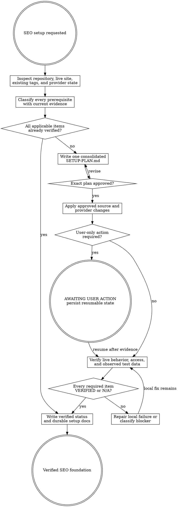

# SEO Setup

Bootstrap the prerequisites every later SEO skill depends on, prove they work, and document the result. This is a guarded direct executor: it may change project source and authorized external configuration only after one consolidated setup plan is explicitly approved.

Resolve the owning work root and maintain `agent-work/{slug}/WORK.md` using [the canonical work-artifact contract](contracts/work-artifacts.md). Write stage artifacts under `agent-work/{slug}/seo-setup/`. Read [REFERENCE.md](REFERENCE.md) before classifying prerequisites and [CLI.md](CLI.md) before invoking or changing the bundled `seo-stack` CLI.

## Boundaries

- Setup owns prerequisite establishment and verification only. Do not discover competitors, rank keywords, plan pages, write SEO content, or judge performance trends.
- Inspect freely. Do not mutate project source, DNS, analytics, search-console, advertising, webmaster, consent, or production configuration before approval of the exact `SETUP-PLAN.md` revision.
- One approval covers the ordinary actions disclosed in that plan. Ask again only for a material delta involving provider/account targets, ownership, DNS, privacy/consent, cost, destructive behavior, or production scope.
- Pause for interactive sign-in, terms acceptance, account-owner decisions, or authorized DNS action. Record `AWAITING USER ACTION`; never imitate completion.
- Prefer an existing correct property, stream, account, verification, sitemap, or tag. Never create duplicates merely because the current agent did not create them.
- Never create or activate an advertising campaign. Keyword Planner requires one verified UI or API access path, not ad spend.
- Never store access tokens, refresh tokens, client secrets, developer tokens, API keys, cookies, or raw provider responses in source, artifacts, logs, or durable documentation.
- Do not use Google's general Indexing API for ordinary pages. General sites use verified sitemaps and, for isolated URLs, the Search Console URL Inspection UI.
- Setup verifies the property, sitemap, access, and inspection prerequisites; ongoing post-publication URL selection and approved individual requests belong to `seo-indexing`.

## 1. Resolve project and product context

Inspect applicable agent instructions, workspace ownership, manifests, routes, deployment configuration, canonical production domains, current SEO documentation, analytics/privacy policy, environment-variable names, and available provider access. Apply [Planpro's product-research lens](contracts/product-research.md) proportionally: identify site users, conversion outcomes, privacy/consent constraints, operators, environments, markets/locales, and rollback boundaries.

Choose or preserve one kebab-case slug across the SEO pipeline. If this is the initial program, later `seo-foundation` and `seo-strategy` stages use the same slug. If a prior verified Setup artifact is intentionally reused, downstream stages must cite its path and current revalidation evidence.

## 2. Audit every prerequisite

Use the evidence checklist in [REFERENCE.md](REFERENCE.md) and the bundled CLI in read-only mode where useful. Classify each requirement as:

- `VERIFIED` — current code, live behavior, provider access, and required observed data prove it works.
- `NOT APPLICABLE` — a concrete product or architecture reason makes the item irrelevant.
- `AWAITING USER ACTION` — a named interactive or authority-bound step is required.
- `BLOCKED` — required access or external state cannot currently be obtained.
- `FAILED` — current evidence proves the item is broken or inconsistent.

Write `AUDIT.md` and `SEO-SETUP-STATUS.json`. Configuration presence alone is not verification. A tag ID without a live request and observed test event, a sitemap file without a successful fetch and correct URLs, or a console property without verified access remains incomplete.

## 3. Prepare one consolidated setup plan

For every non-verified applicable item, write `SETUP-PLAN.md` with:

- exact source files, provider properties/accounts, domains, sitemap URLs, and non-secret identifiers;
- proposed action and why it is required;
- API, signed-in computer-use, or user-only path;
- privacy, ownership, cost, production, and destructive-risk classification;
- verification evidence and failure signal;
- rollback or removal path;
- ordered dependencies and user-action pauses.

Show the complete plan and request explicit approval of a named revision. Approval applies only to the stated targets and actions.

## 4. Apply approved changes

Use API calls when current official documentation, required scopes, credentials, and exact targets are verified. Use signed-in computer use when the API cannot perform the step or the user already has an appropriate authenticated session. Use project-native source patterns for tags, metadata, routes, sitemaps, consent, tests, and configuration.

Execute Plan -> Do -> Verify slices. Append `WIP`, `DONE`, `BLOCKED`, `SKIP`, `STRENGTHENED`, or `FLAKE-FIXED` entries to `PROGRESS.md`. Every `DONE` entry includes: “I am satisfied this step is complete because …” plus machine and live/provider evidence.

When a user-only step appears, record the exact action, destination, expected visible result, and safe resumption check. Do not expose a secret in the instruction or ask the user to paste one into chat.

## 5. Verify the integrated foundation

Run project-specific tests, typecheck, lint, build, and rendered/live checks that the approved changes affect. Re-run `seo-stack verify` and manually verify evidence the CLI cannot prove. At minimum, prove:

- the canonical production origin is HTTPS and redirects consistently;
- representative indexable and non-indexable routes have intentional robots/canonical behavior;
- robots and sitemap resources are live, parseable, internally consistent, and contain intended canonical URLs;
- foundational metadata and structured data are truthful and rendered in final HTML;
- GA4 tag delivery respects the approved consent posture and a sanitized test event is observed;
- the intended Search Console property is verified, accessible, and has the live sitemap submitted;
- Keyword Planner returns a harmless sample through at least one approved path without creating a campaign;
- Bing verifies the intended site, accepts the live sitemap, and allows representative read access;
- no credential value appears in diffs, artifacts, documentation, or logs.

Apply [Goalpro's quality contract](contracts/execution-quality.md) proportionally. Security/privacy, correctness, reliability, rollback, documentation, and machine verification are presumptively applicable.

## 6. Document and hand off

Write sanitized durable project documentation at the repository's canonical reader-facing location, normally `docs/seo/SEO-SETUP.md` when no stronger convention exists. Document current architecture and ownership, not the historical work log. Include non-secret IDs only when useful, verification dates, data/consent behavior, sitemap and property locations, CLI rerun commands, user-only recovery steps, credential-source names without values, and known limitations.

Finalize `SEO-SETUP-STATUS.json`, `QUALITY-REPORT.md`, and `WORK.md`. Downstream stages must validate the status contents and fragile live evidence rather than trusting the filename.

## Artifacts

- `AUDIT.md` — product context, inventory, prerequisite matrix, current evidence, and gaps.
- `SETUP-PLAN.md` — exact consolidated mutation plan, revision, approval provenance, rollback, and user-only actions.
- `SEO-SETUP-STATUS.json` — secret-free machine-readable verification state.
- `PROGRESS.md` — append-only execution and verification log.
- `QUALITY-REPORT.md` — proportional quality classification and integrated evidence.
- `NOTES.md` — optional sanitized research or provider references.
- Canonical project documentation such as `docs/seo/SEO-SETUP.md` — current reader/operator setup record.

## Done

Finish only when every applicable requirement is `VERIFIED` or defensibly `NOT APPLICABLE`; all source and provider changes match the approved plan; user-only actions are resolved; live and project gates pass; sanitized durable documentation exists; and the status JSON validates against the bundled contract.

If any item is `AWAITING USER ACTION`, `BLOCKED`, or `FAILED`, preserve resumable state and report Setup as incomplete. State: “I am satisfied the SEO setup is complete because …” only with the integrated evidence summary.

## Optional shared Theme Library

When the request contains a material named-theme or palette decision, discover the independently installed `theme-library` skill through the host skill registry. If the host has no registry, resolve `theme-library/SKILL.md` as a sibling of this skill directory (the standard relative location is `../theme-library/SKILL.md`). If found, read it and use embedded mode while keeping artifacts in this skill's stage. If it is not installed, continue the primary workflow and disclose the unavailable palette library only when it materially limits the result. Never rely on repository-level AGENTS or README files for discovery.
