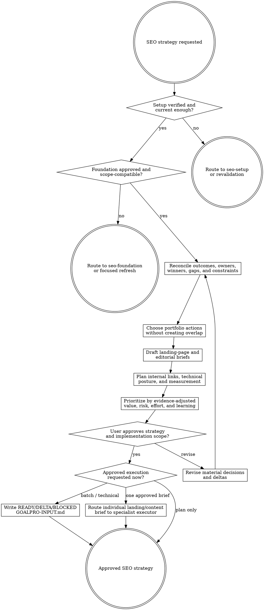

# SEO Strategy

Convert approved evidence into a portfolio plan that says what to protect, refresh, create, consolidate, redirect, noindex, investigate, park, or leave alone—and why. This stage is read-only outside `agent-work/{slug}/seo-strategy/`; implementation begins only through an approved downstream handoff.

Resolve the owning work root and maintain `agent-work/{slug}/WORK.md` using [the canonical work-artifact contract](contracts/work-artifacts.md). Write stage artifacts under `agent-work/{slug}/seo-strategy/`. Read [REFERENCE.md](REFERENCE.md) before selecting page types, actions, priorities, or handoffs.

## Boundaries

- Remain read-only outside this stage. Do not edit source, CMS content, metadata, redirects, links, sitemaps, provider settings, production data, or external systems.
- Do not rediscover the whole competitor/keyword space. Route material scope, market, competitor, demand, cluster, or ownership gaps back to `seo-foundation`.
- Do not accept high volume as sufficient reason for a new URL. A distinct user intent, truthful product/content outcome, SERP page-type fit, owner gap, differentiation, and safe internal-link role must exist.
- Preserve approved page ownership and protected winners. Strategy may propose a change only with stronger compatible evidence, an explicit risk/rollback plan, and user approval.
- Word count, publishing frequency, and URL count are not quality goals. Use evidence-led coverage and organizational capacity.
- Never invent product claims, expertise, testing, customers, prices, search demand, conversion targets, seasonality, or publication dates.
- “Do nothing,” “protect,” “investigate,” and “consolidate” are valid successful recommendations.

## 1. Validate prerequisite artifacts

Find and read the same-slug `seo-setup/SEO-SETUP-STATUS.json` and `seo-foundation/SEO-FOUNDATION.md` plus every detailed artifact the Foundation marks required. An explicitly approved prior Setup may be reused when it matches the current project/canonical site and fragile facts are revalidated.

Validate:

- Setup overall status is `VERIFIED`, required providers/technical evidence are accessible, and no relevant user-only action remains.
- Foundation approval provenance is explicit.
- Product, market, language, engine, device/context, and date scopes are compatible.
- First-party and external windows/sources remain distinguishable.
- Competitor set, clusters, page owners, protected winners, exclusions, and unknowns are present.

If a missing or stale fact can materially change ownership, priority, risk, or page type, route back to the owning stage. Do not fill gaps with intuition.

## 2. Reconcile outcomes, constraints, and current portfolio

Apply [Planpro's product-research lens](contracts/product-research.md). Write `STRATEGY-BRIEF.md` with user and business outcomes, conversion paths, product truth, current architecture, capacity, quality attributes, legal/safety constraints, localization state, delivery constraints, and success/guardrail/failure signals.

Map every approved Foundation cluster and current/proposed owner into `CONTENT-PORTFOLIO.csv`. Preserve current URLs, redirects, noindex state, page roles, traffic evidence, and dependencies.

## 3. Choose one portfolio action per owner or gap

Use only these explicit actions:

- `PROTECT` — preserve the current owner and defined frozen elements.
- `REFRESH` — improve the existing owner without changing its primary intent.
- `CREATE` — add a distinct owner for a proven unserved intent.
- `CONSOLIDATE` — merge overlapping value into the stronger owner.
- `REDIRECT` — retire an obsolete/duplicate URL to an approved relevant owner.
- `NOINDEX` — retain user/product utility without search ownership.
- `REMOVE` — delete when no user, product, or search value remains and dependencies are addressed.
- `INVESTIGATE` — run the cheapest experiment before deciding.
- `PARK` — valid opportunity deferred by readiness, risk, capacity, or evidence.
- `NO ACTION` — evidence supports leaving the current portfolio unchanged.

Every action cites Foundation evidence, user/product outcome, page owner, neighboring intents, risk, dependencies, and invalidation signal. A strategy does not need to recommend `CREATE`.

## 4. Decide landing page, editorial content, or another surface

Use current SERP intent and user journey, not a rigid funnel:

- Choose a product/category/use-case landing page when users seek a product action, solution, tool, platform fit, capability, or transactional/commercial outcome the product can fulfil distinctly.
- Choose a guide/blog/hub article when users seek explanation, diagnosis, comparison, procedure, evidence, examples, or a question answer that deserves a durable editorial owner.
- Choose a tool, directory, support guide, product documentation, app-store surface, or no new page when that better matches the job and SERP.

Mixed intent can require one broad owner plus support content, not two pages targeting the same head term.

## 5. Draft evidence-backed briefs

Write `LANDING-PAGE-BRIEFS.md` and `EDITORIAL-BRIEFS.md`. Each proposed create/refresh action includes:

- stable brief ID, owner URL/action, page role, cluster, primary/supporting intent, market/language, and target user;
- user problem, desired outcome, product/content promise, differentiation, and truthful conversion path;
- source and product-evidence requirements, claims allowed/prohibited, and unknowns;
- search-result/page-type evidence and competitor patterns to adapt or reject;
- information hierarchy or outline based on coverage needs, not target word count;
- internal links, anchor roles, same-cluster support, and optional bridge;
- index/canonical/hreflang/schema/social/metadata posture;
- accessibility, imagery/demo, performance, privacy, legal/safety, and maintenance needs;
- cannibalization check, protected assets, rollout/rollback, and measurement gate;
- recommended executor and acceptance criteria.

Do not draft final prose. Strategy owns the brief and portfolio relationship, not implementation copy.

## 6. Plan internal authority and technical delivery

Write `INTERNAL-LINK-MAP.md` and `MEASUREMENT-PLAN.md`.

The link map identifies source page, destination owner, anchor family, user reason, cluster relationship, template/manual ownership, and removal/migration behavior. It avoids broad anchors pointing to narrow pages and does not create sitewide links solely to manipulate rankings.

The measurement plan records pre-change baseline requirements, compatible provider/query/page/conversion scopes, indexation and crawl checks, leading/guardrail/failure signals, and review windows. Default to a project-appropriate 7/14/28-day observation sequence when evidence can mature on that cadence; change it when crawl volume, seasonality, traffic, or release risk requires another horizon. Do not invent numeric targets.

## 7. Prioritize the roadmap

Write `SEO-ROADMAP.md` with reversible tracer-bullet slices. Rank by evidence-adjusted user/product value and learning, considering demand, current traction, conversion relevance, product readiness, SERP fit, differentiation, authority, protected-winner risk, effort, dependencies, content/claim cost, reversibility, and uncertainty.

Prefer the smallest intervention that can test the strategy: a focused refresh, one brief, one internal-link ring, or one indexation repair before bulk production. Separate code, editorial, design, provider, DNS, legal, and user-only actions.

## 8. Consolidate, review, and approve

Write `SEO-STRATEGY.md` as the consumption index linking the brief, portfolio, page briefs, link map, measurement plan, and roadmap. Include decisions, rejected alternatives, unknowns, freshness rules, and material deltas from Foundation.

Present:

- protected assets and intentional no-change decisions;
- prioritized create/refresh/consolidate/investigate actions;
- proposed landing-page and editorial briefs;
- risks, dependencies, measurement, and rollback;
- material unknowns or decisions.

Ask whether the strategy matches the user's intent and which implementation slices, if any, are approved. Completion of Strategy is not implementation approval.

## 9. Route approved execution

For approved batch, technical, redirect, sitemap, internal-link, or mixed source changes, write `GOALPRO-INPUT.md` using [Goalpro's direct handoff contract](contracts/goalpro-handoff.md). Preserve the slug, cite source artifacts, include independently verifiable “Done when …” criteria, separate external/manual actions, classify quality dimensions, and set `READY`, `NEEDS DELTA CONFIRMATION`, or `BLOCKED` honestly.

For one conversion landing page requiring message/design decisions, recommend `landing-page` with the approved brief; Landing Page owns preview and implementation while preserving Strategy's page owner, intent, claims, and measurement constraints.

For one editorial brief, recommend `seo-content` when installed and approved. Until that specialist exists, route an approved, fully specified brief through Goalpro without pretending Strategy implemented it.

## Artifacts

- `STRATEGY-BRIEF.md` — outcomes, product truth, constraints, delivery, and quality context.
- `CONTENT-PORTFOLIO.csv` — every current/proposed owner, cluster, action, evidence, priority, and state.
- `LANDING-PAGE-BRIEFS.md` — approved or candidate product/search page briefs.
- `EDITORIAL-BRIEFS.md` — approved or candidate guide/blog/hub briefs.
- `INTERNAL-LINK-MAP.md` — source/destination/anchor/user-reason authority plan.
- `MEASUREMENT-PLAN.md` — baselines, sources, windows, signals, guardrails, and rollback triggers.
- `SEO-ROADMAP.md` — prioritized reversible slices and dependencies.
- `SEO-STRATEGY.md` — consolidated approved consumption index.
- `GOALPRO-INPUT.md` — conditional; only for explicitly approved direct implementation scope.
- `NOTES.md` — optional sanitized research or decision notes.

## Done

Finish when prerequisite artifacts are valid; every material cluster/owner has one explicit action; new pages have distinct evidence-backed intent and product value; protected winners and cannibalization rules are preserved; landing/editorial briefs, internal links, technical posture, measurement, rollout, and rollback are complete; alternatives and unknowns are honest; and the user approves the strategy.

State: “I am satisfied the SEO strategy is complete because …” with paths and evidence. If implementation is not approved, stop with the plan. If approved, produce only the appropriate handoff and do not mutate source directly.

## Optional shared Theme Library

When the request contains a material named-theme or palette decision, discover the independently installed `theme-library` skill through the host skill registry. If the host has no registry, resolve `theme-library/SKILL.md` as a sibling of this skill directory (the standard relative location is `../theme-library/SKILL.md`). If found, read it and use embedded mode while keeping artifacts in this skill's stage. If it is not installed, continue the primary workflow and disclose the unavailable palette library only when it materially limits the result. Never rely on repository-level AGENTS or README files for discovery.
