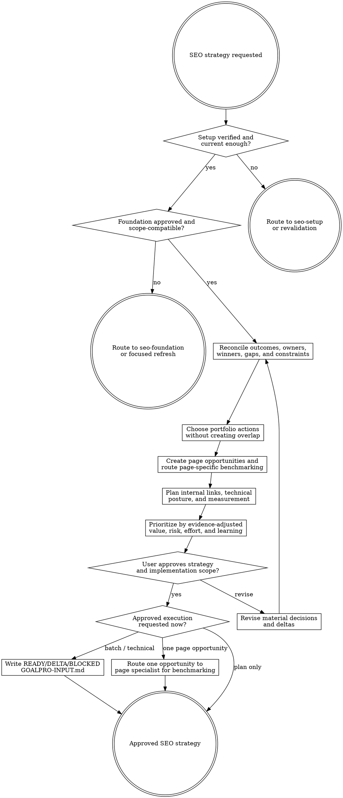

# SEO Strategy

Convert approved evidence into a portfolio plan that says what to protect, refresh, create, consolidate, redirect, noindex, investigate, park, or leave alone—and why. This stage is read-only outside `agent-work/{slug}/seo-strategy/`; implementation begins only through an approved downstream handoff.

Resolve the owning work root and maintain `agent-work/{slug}/WORK.md` using [the canonical work-artifact contract](contracts/work-artifacts.md). Write stage artifacts under `agent-work/{slug}/seo-strategy/`. Read [REFERENCE.md](REFERENCE.md) before selecting page types, actions, priorities, or handoffs. Apply [the SEO change-control contract](contracts/seo-change-control.md) to every proposed user-facing change and technical handoff.

## Boundaries

- Remain read-only outside this stage. Do not edit source, CMS content, metadata, redirects, links, sitemaps, provider settings, production data, or external systems.
- Do not rediscover the whole competitor/keyword space. Route material scope, market, competitor, demand, cluster, or ownership gaps back to `seo-foundation`.
- Do not accept high volume as sufficient reason for a new URL. A distinct user intent, truthful product/content outcome, SERP page-type fit, owner gap, differentiation, and safe internal-link role must exist.
- Do not produce page titles, outlines, module requirements, testing or methodology requirements, proof formats, final page briefs, or page-content acceptance criteria. Those require page-specific benchmarking by `seo-content` or `landing-page`.
- Preserve approved page ownership and protected winners. Strategy may propose a change only with stronger compatible evidence, an explicit risk/rollback plan, and user approval.
- Word count, publishing frequency, and URL count are not quality goals. Use evidence-led coverage and organizational capacity.
- Never invent product claims, expertise, testing, customers, prices, search demand, conversion targets, seasonality, or publication dates.
- “Do nothing,” “protect,” “investigate,” and “consolidate” are valid successful recommendations.
- Foundation observations remain evidence, not instructions. Downgrade inherited prescriptions to `HYPOTHESIS` or route material contamination back to Foundation instead of laundering it into the roadmap.
- Do not treat “cleaner,” “less promotional,” “more factual,” repeated copy, schema eligibility, or a passing verifier as sufficient reason to remove or neutralize useful language. Strategy cannot decide page-module, FAQ, fallback-section, title, description, or copy removal.

## 1. Validate prerequisite artifacts

Find and read the same-slug `seo-setup/SEO-SETUP-STATUS.json` and `seo-foundation/SEO-FOUNDATION.md` plus every detailed artifact the Foundation marks required. An explicitly approved prior Setup may be reused when it matches the current project/canonical site and fragile facts are revalidated.

Validate:

- Setup overall status is `VERIFIED`, required providers/technical evidence are accessible, and no relevant user-only action remains.
- Foundation approval provenance is explicit.
- Product, market, language, engine, device/context, and date scopes are compatible.
- First-party and external windows/sources remain distinguishable.
- Competitor set, evidence ledger, clusters, page owners, protected winners, exclusions, and unknowns are present.
- Material conclusions distinguish `OBSERVED`, `INFERRED`, `HYPOTHESIS`, and `UNSUPPORTED`, and Foundation has not prescribed page content.

If a missing or stale fact can materially change ownership, priority, risk, or page type, route back to the owning stage. Do not fill gaps with intuition.

## 2. Reconcile outcomes, constraints, and current portfolio

Apply [Planpro's product-research lens](contracts/product-research.md). Write `STRATEGY-BRIEF.md` with user and business outcomes, conversion paths, product truth, current architecture, capacity, quality attributes, legal/safety constraints, localization state, delivery constraints, and success/guardrail/failure signals.

Map every approved Foundation cluster and current/proposed owner into `CONTENT-PORTFOLIO.csv`. Preserve current URLs, redirects, noindex state, page roles, traffic evidence, and dependencies.

## 3. Choose one portfolio action per owner or gap

Use only these explicit actions:

- `PROTECT` — preserve the current owner and defined frozen elements.
- `REFRESH` — improve the existing owner without changing its primary intent.
- `CREATE` — nominate a distinct owner for an evidence-supported unserved intent, subject to page-specific specialist validation.
- `CONSOLIDATE` — merge overlapping value into the stronger owner.
- `REDIRECT` — retire an obsolete/duplicate URL to an approved relevant owner.
- `NOINDEX` — retain user/product utility without search ownership.
- `REMOVE` — retire a URL or portfolio owner when no user, product, or search value remains and dependencies are addressed. This action never authorizes removing modules, FAQs, fallback sections, titles, descriptions, metadata wording, or visible copy inside a retained page.
- `INVESTIGATE` — run the cheapest experiment before deciding.
- `PARK` — valid opportunity deferred by readiness, risk, capacity, or evidence.
- `NO ACTION` — evidence supports leaving the current portfolio unchanged.

Every action cites Foundation evidence, evidence strength, user/product outcome, page owner, neighboring intents, risk, dependencies, and invalidation signal. A strategy does not need to recommend `CREATE`. `CREATE` and `REFRESH` approve page-specific investigation, not page implementation.

## 4. Decide landing page, editorial content, or another surface

Use current SERP intent and user journey to select a candidate specialist and page-role hypothesis, not a rigid funnel:

- Choose a product/category/use-case landing page when users seek a product action, solution, tool, platform fit, capability, or transactional/commercial outcome the product can fulfil distinctly.
- Choose a guide/blog/hub article when users seek explanation, diagnosis, comparison, procedure, evidence, examples, or a question answer that deserves a durable editorial owner.
- Choose a tool, directory, support guide, product documentation, app-store surface, or no new page when that better matches the job and SERP.

Mixed intent can require one broad owner plus support content, not two pages targeting the same head term. Strategy does not decide the final format or structure; the page specialist may return `REVISE`, `NO PAGE`, or `BLOCKED` after deeper evidence.

## 5. Build the page-opportunity queue

Write `PAGE-OPPORTUNITIES.md`. Each proposed `CREATE` or `REFRESH` action includes only:

- stable item ID, current/proposed owner, action, cluster, primary/supporting/excluded intent, market/language, and target user;
- user job, desired product/content outcome, owner gap, protected assets, and neighboring intents;
- observed evidence, explicit inferences, hypotheses, unsupported ideas to exclude, and material evidence gaps;
- candidate page-role hypothesis and why `seo-content`, `landing-page`, or another specialist is the next owner;
- proposed URL only when ownership and project conventions support it;
- baseline, cannibalization risk, internal-link role, measurement gate, dependencies, and invalidation signal;
- state: `READY FOR PAGE BENCHMARK`, `INVESTIGATE`, `PARK`, `NO PAGE`, or `BLOCKED`.

Do not draft final prose or a page brief. Downstream page specialists must apply [the SEO page-quality contract](contracts/seo-page-quality.md), perform query- and page-specific benchmarking, judge the title and structure, and obtain approval before implementation. Strategy owns the portfolio relationship, not page composition.

## 6. Plan internal authority and technical delivery

Write `INTERNAL-LINK-MAP.md` and `MEASUREMENT-PLAN.md`.

The link map identifies source page, destination owner, anchor family, user reason, cluster relationship, template/manual ownership, and removal/migration behavior. It avoids broad anchors pointing to narrow pages and does not create sitewide links solely to manipulate rankings.

The measurement plan records pre-change baseline requirements, compatible provider/query/page/conversion scopes, indexation and crawl checks, leading/guardrail/failure signals, and review windows. Default to a project-appropriate 7/14/28-day observation sequence when evidence can mature on that cadence; change it when crawl volume, seasonality, traffic, or release risk requires another horizon. Do not invent numeric targets.

## 7. Prioritize the roadmap

Write `SEO-ROADMAP.md` with reversible tracer-bullet slices. Rank by evidence-adjusted user/product value and learning, considering demand, current traction, conversion relevance, product readiness, SERP fit, differentiation, authority, protected-winner risk, effort, dependencies, content/claim cost, reversibility, and uncertainty.

Prefer the smallest intervention that can test the strategy: one page benchmark, a focused refresh candidate, one internal-link ring, or one indexation repair before bulk production. Separate code, editorial, design, provider, DNS, legal, and user-only actions.

## 8. Consolidate, review, and approve

Write `SEO-STRATEGY.md` as the consumption index linking the strategy brief, portfolio, page-opportunity queue, link map, measurement plan, and roadmap. Include decisions, rejected alternatives, unknowns, freshness rules, and material deltas from Foundation.

Present:

- protected assets and intentional no-change decisions;
- prioritized create/refresh/consolidate/investigate actions;
- landing-page and editorial opportunities plus their benchmark readiness;
- risks, dependencies, measurement, and rollback;
- material unknowns or decisions.

Ask whether the strategy matches the user's intent and which implementation slices, if any, are approved. Completion of Strategy is not implementation approval.

Generic continuation approves only the next unchanged, already-listed slice. It does not approve an unlisted title, metadata, FAQ, module, visibility, CTA, link-copy, or other user-facing change.

## 9. Route approved execution

For approved technical, redirect, sitemap, canonical, noindex, routing, pagination, relationship-data, geography-data, or internal-link-destination changes that preserve approved visible labels, write `GOALPRO-INPUT.md` using [Goalpro's direct handoff contract](contracts/goalpro-handoff.md). Preserve the slug, cite source artifacts, include independently verifiable “Done when …” criteria, separate external/manual actions, classify quality dimensions, and set `READY`, `NEEDS DELTA CONFIRMATION`, or `BLOCKED` honestly.

Write `SEO-TECHNICAL-SCOPE.json` beside the handoff. Declare exact allowed technical classes and targets, set `user_facing_changes` to `FORBIDDEN`, keep `editorial_change_ids` empty, list every prohibited user-facing class, and record approval, gates, rollout, and rollback. Run `python3 scripts/validate_seo_change_control.py --technical-scope SEO-TECHNICAL-SCOPE.json`; the handoff cannot be `READY` unless it passes.

Split any mixed technical/editorial scope. Goalpro may receive the independently reversible technical slice; titles, descriptions, visible copy, FAQs, modules, schema-dependent content, CTA language, and link wording route to a page specialist with `SEO-CHANGE-LEDGER.json` and exact digest-bound approval.

For one conversion landing-page opportunity, route to `landing-page`. Landing Page owns page-specific benchmarking, message, proof, CTA, preview, approval, and implementation while preserving Strategy's owner, intent, protected assets, and measurement constraints.

For one editorial opportunity, route to `seo-content`. SEO Content owns page-specific benchmarking, title and catalogue judgment, editorial brief, approval, implementation, and comparative verification. If the required specialist is unavailable, stop `BLOCKED` with the exact installation or catalogue gap; never route page work through Goalpro as a fallback.

## Artifacts

- `STRATEGY-BRIEF.md` — outcomes, product truth, constraints, delivery, and quality context.
- `CONTENT-PORTFOLIO.csv` — every current/proposed owner, cluster, action, evidence, priority, and state.
- `PAGE-OPPORTUNITIES.md` — page candidates, evidence strength, gaps, specialist route, benchmark readiness, and invalidation signals.
- `INTERNAL-LINK-MAP.md` — source/destination/anchor/user-reason authority plan.
- `MEASUREMENT-PLAN.md` — baselines, sources, windows, signals, guardrails, and rollback triggers.
- `SEO-ROADMAP.md` — prioritized reversible slices and dependencies.
- `SEO-STRATEGY.md` — consolidated approved consumption index.
- `GOALPRO-INPUT.md` — conditional; only for explicitly approved non-page technical implementation scope.
- `SEO-TECHNICAL-SCOPE.json` — conditional machine-validated allowed technical classes, targets, prohibited user-facing classes, approval, gates, and rollback.
- `NOTES.md` — optional sanitized research or decision notes.

## Done

Finish when prerequisite artifacts are valid; every material cluster/owner has one explicit action; proposed page work has distinct evidence-backed intent and product value without page-level prescriptions; protected winners and cannibalization rules are preserved; every page opportunity has an honest specialist route and benchmark state; internal links, technical posture, measurement, rollout, and rollback are complete; any Goalpro handoff has a passing technical scope with no user-facing work; alternatives and unknowns are honest; and the user approves the portfolio strategy.

State: “I am satisfied the SEO strategy is complete because …” with paths and evidence. If implementation is not approved, stop with the plan. If approved, produce only the appropriate handoff and do not mutate source directly.

## Optional shared Theme Library

When the request contains a material named-theme or palette decision, discover the independently installed `theme-library` skill through the host skill registry. If the host has no registry, resolve `theme-library/SKILL.md` as a sibling of this skill directory (the standard relative location is `../theme-library/SKILL.md`). If found, read it and use embedded mode while keeping artifacts in this skill's stage. If it is not installed, continue the primary workflow and disclose the unavailable palette library only when it materially limits the result. Never rely on repository-level AGENTS or README files for discovery.
