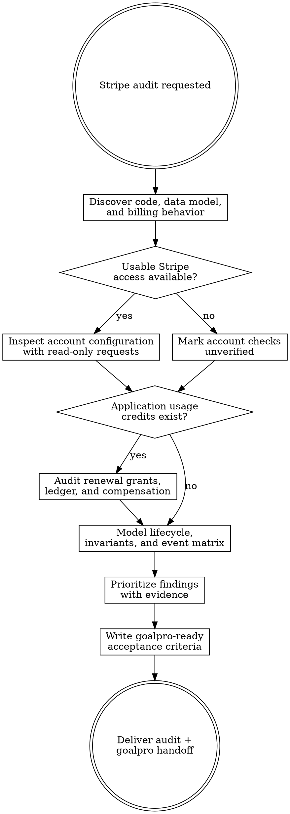

# Stripe Audit

Audit a Next.js Stripe integration against its code, data model, tests, and Stripe account configuration. Remain read-only except for files under `agent-work/{slug}/stripe-audit/`. Hand every implementation to `goalpro` with the same slug.

Resolve the owning work root and maintain the slug index using [the canonical work-artifact contract](contracts/work-artifacts.md).

## Decision tree

## Phase 1 — Establish scope

1. Inspect manifests, Next.js routing mode, Stripe SDK usage, auth, database schema, queues, jobs, tests, environment-variable names, and deployment configuration.
2. Apply [Planpro's product-research lens](contracts/product-research.md). Establish users, billing-account boundary, paid product outcome, acceptable failure/abuse trade-offs, and policy for access, delinquency, cancellation, refunds, disputes, trials, and renewable credits before judging code.
3. Trace Checkout creation, customer creation, portal sessions, webhook receipt, subscription projection, entitlement checks, and access revocation.
4. Determine whether the app maintains application usage credits. Distinguish them from Stripe Billing Credits and document replenishment, rollover, expiry, compensation, and consumption policy as `KNOWN` or `UNKNOWN`.
5. Create `agent-work/{slug}/stripe-audit/` using a kebab-case slug. Never edit application source or external systems.

## Phase 2 — Research current Stripe guidance

Browse current official Stripe documentation before judging behavior. Confirm webhook, Billing, API-version, testing, Radar, and framework guidance relevant to the detected integration. Prefer Stripe documentation and official Stripe samples over secondary sources.

Record consulted pages and the audit date in `AUDIT.md`. Treat the account's API version and actual object shapes as authoritative for that integration.

## Phase 3 — Inspect Stripe configuration

When safe read-only access is available, inspect the matching Stripe account and mode. Follow the credential rules in [REFERENCE.md](REFERENCE.md).

Cross-check products, prices, webhook destinations, subscribed events, API versions, portal settings, Billing behavior, and applicable abuse controls against repository mappings. Sanitize recorded evidence. If access is unavailable, continue with code inspection and mark each account-level check `UNVERIFIED`.

## Phase 4 — Model and audit

Write explicit billing invariants and an event/state matrix before producing findings. Run every applicable section of [REFERENCE.md](REFERENCE.md).

For application usage credits, prove whether each qualifying paid invoice grants the correct amount exactly once under retries and concurrency. Audit replenishment, rollover, expiry, plan changes, refunds, disputes, and reconciliation. Mark the section `NOT APPLICABLE` only after verifying that no credit pool exists.

Cite `file:line`, sanitized Stripe object IDs, configuration evidence, or test evidence for every conclusion. Do not infer correctness from naming alone.

## Phase 5 — Produce the handoff

Create:

- `AUDIT.md` — product and billing policy, scope, evidence, current architecture, prioritized findings, and verified strengths.
- `INVARIANTS.md` — billing, entitlement, and conditional usage-credit guarantees.
- `EVENT-MATRIX.md` — relevant events, transitions, idempotency keys, ordering policy, and compensation.
- `TEST-SCENARIOS.md` — deterministic lifecycle, failure, replay, concurrency, and abuse cases.
- `GOALPRO-INPUT.md` — ordered remediation slices conforming to [Goalpro's direct handoff contract](contracts/goalpro-handoff.md), with Stripe-specific evidence, manual actions, and project gates.
- `NOTES.md` — optional sanitized research notes.

Rank findings `CRITICAL`, `HIGH`, `MEDIUM`, or `LOW` using impact, exploitability, frequency, and repair risk. Separate verified defects from risks and unverified checks.

## Read-only boundary

Never edit source, migrations, tests, environment files, Stripe resources, dashboard settings, or production data. Never print, log, copy, or persist secret values or customer payment data. Read-only API requests are allowed; audit artifacts are allowed.

## Done

Finish only when every reference section is `VERIFIED`, `FINDING`, `NOT APPLICABLE`, or `UNVERIFIED`; every finding has evidence and remediation criteria; account mode is identified or explicitly unknown; and `GOALPRO-INPUT.md` can execute without rediscovering the audit.

State: “I am satisfied this audit is complete because …” with the evidence summary. Record actual approval provenance in `GOALPRO-INPUT.md`; completion of the audit alone is not implementation approval. Offer to invoke Goalpro with the file after the user approves the remediation scope; do not implement directly.

## Optional shared Theme Library

When the request contains a material named-theme or palette decision, discover the independently installed `theme-library` skill through the host skill registry. If the host has no registry, resolve `theme-library/SKILL.md` as a sibling of this skill directory (the standard relative location is `../theme-library/SKILL.md`). If found, read it and use embedded mode while keeping artifacts in this skill's stage. If it is not installed, continue the primary workflow and disclose the unavailable palette library only when it materially limits the result. Never rely on repository-level AGENTS or README files for discovery.
